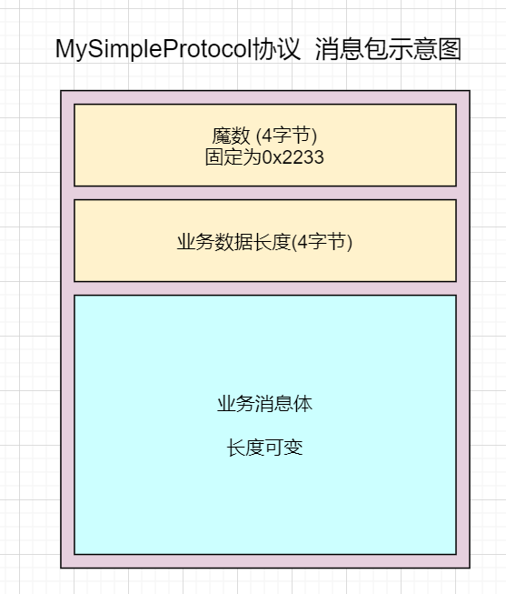

~~# 从零开始实现简易版Netty(十) MyNetty 自定义编解码器解决TCP黏包/拆包问题
## 1. TCP黏包拆包问题介绍
在上一篇博客中，截止lab9版本MyNetty已经实现了包括池化内存容器在内的绝大多数功能。按照计划，lab10也是本系列博客的最后一个迭代中将实现通用的编解码处理器来解决接受数据时的tcp黏包/拆包问题。  
由于本文属于系列博客，读者需要对之前的博客内容有所了解才能更好地理解本文内容。
* lab1版本博客：[从零开始实现简易版Netty(一) MyNetty Reactor模式](https://www.cnblogs.com/xiaoxiongcanguan/p/18939320)
* lab2版本博客：[从零开始实现简易版Netty(二) MyNetty pipeline流水线](https://www.cnblogs.com/xiaoxiongcanguan/p/18964326)
* lab3版本博客：[从零开始实现简易版Netty(三) MyNetty 高效的数据读取实现](https://www.cnblogs.com/xiaoxiongcanguan/p/18979699)
* lab4版本博客：[从零开始实现简易版Netty(四) MyNetty 高效的数据写出实现](https://www.cnblogs.com/xiaoxiongcanguan/p/18992091)
* lab5版本博客：[从零开始实现简易版Netty(五) MyNetty FastThreadLocal实现](https://www.cnblogs.com/xiaoxiongcanguan/p/19005381)
* lab6版本博客：[从零开始实现简易版Netty(六) MyNetty ByteBuf实现](https://www.cnblogs.com/xiaoxiongcanguan/p/19029215)
* lab7版本博客：[从零开始实现简易版Netty(七) MyNetty 实现Normal规格的池化内存分配](https://www.cnblogs.com/xiaoxiongcanguan/p/19084677)
* lab8版本博客：[从零开始实现简易版Netty(八) MyNetty 实现Small规格的池化内存分配](https://www.cnblogs.com/xiaoxiongcanguan/p/19109991)
* lab9版本博客：[从零开始实现简易版Netty(九) MyNetty 实现池化内存的线程本地缓存](https://www.cnblogs.com/xiaoxiongcanguan/p/19148861)
#####
操作系统实现的传输层tcp协议中，向上层的应用保证尽最大可能的(best effort delivery)、可靠的传输字节流，但并不关心实际传输的数据包是否总是符合应用层的要求。   
应用层有时候会在短时间内向对端发送N个业务逻辑上独立的请求，而操作系统tcp层面出于效率的考虑并不会按照应用层的逻辑划分一个一个独立的进行消息的发送，而是会基于当前的网络负载尽可能的多的将消息数据批量发送。这使得我们在EventLoop事件循环中read读取到的数据并不总是完整的，符合应用层逻辑划分的消息数据。  
#####
* **黏包问题：** 假设应用层发送的一次请求数据量比较小(比如0.1kb)，tcp层可能不会在接到应用请求后立即进行传输，而是会稍微等待一小会。
  这样如果应用层在短时间内需要传输多次0.1kb的请求，就可以攒在一起批量传输，传输效率会高很多。
  但这带来的问题就是接收端一次接受到的数据包内应用程序逻辑上的多次请求**黏连**在了一起，需要通过一些方法来将其拆分还原为一个个独立的信息给应用层。
* **拆包问题：** 假设应用层发送的一次请求数据量比较大(比如100Mb)，而tcp层的数据包容量的最大值是有限的，所以应用层较大的一次请求数据会被**拆分**为多个包分开发送。
  这就导致接收端接受到的某个数据包其实并不是完整的应用层请求数据，没法直接交给应用程序去使用，
  而必须等待后续对应请求的所有数据包都接受完成后，才能组装成完整的请求对象再交给应用层处理。
#####
当然，导致黏包拆包的场景远不止上述的那么单一，整体的网络负载变化等都可能导致黏包/拆包的现象。    
**可以说，黏包/拆包问题并不能看做是tcp的问题，而是应用层最终需求与tcp传输层功能不匹配导致的问题。**   
tcp出于传输效率的考虑无法很好的解决这个问题，所以黏包拆包问题最终只能在更上面的应用层自己来处理。  
##### 黏包拆包示意图
接受到的一个数据包中可能同时存在黏包问题和拆包问题(如下图所示)
#####


##### 黏包/拆包问题解决方案
解决黏包/拆包问题最核心的思路是，如何知道一个应用层完整请求的边界。
对于黏包问题，基于边界可以独立的拆分出每一个请求；对于拆包问题，如果发现收到的数据包末尾没有边界，则继续等待新的数据包，逐渐累积直到发现边界后再一并上交给应用程序。
#####
主流的解决黏包拆包的应用层协议设计方案有三种：
#####
|                    | 介绍                                                  | 优点                           | 缺点                                       |
|--------------------|-----------------------------------------------------|------------------------------|------------------------------------------|
| 1.基于固定长度的协议        | 每个消息都是固定的大小，如果实际上小于固定值，则需要填充                        | 简单;易于实现                      | 固定值过大，填充会浪费大量传输带宽；固定值过小则限制了可用的消息体大小      |
| 2.基于特殊分隔符的协议       | 约定一个特殊的分隔符，以这个分割符为消息边界                              | 简单;且消息体长度是可变的，性能好            | 消息体的业务数据不允许包含这个特殊分隔符，否则会错误的拆分数据包。因此兼容性较差 |
| 3.基于业务数据长度编码的协议    | 设计一个固定大小的消息请求头(比如固定16字节、20字节大小)，在消息请求头中包含实际的业务消息体长度 | 消息体长度可变，性能好；对业务数据内容无限制，兼容性也好 | 实现起来稍显复杂                                 |

#####
上述这段关于黏包/拆包问题的内容基本copy自我2年前的关于手写简易rpc框架的博客：[自己动手实现rpc框架(一) 实现点对点的rpc通信](https://www.cnblogs.com/xiaoxiongcanguan/p/17506728.html)。  
只是当时我仅仅是一个对Netty不甚了解的使用者，简单的使用Netty来实现rpc框架中基本的网络通信功能，并通过MessageToByteEncoder/ByteToMessageDecoder来实现通信协议处理黏包拆包问题。   
而现在却尝试着参考Netty的源码，通过自己亲手实现这些编解码器的核心逻辑，来进一步加深对Netty的理解，这种感觉还是挺奇妙的。

## 2. Netty解决黏包/拆包问题的通用编解码器
* 在lab2中我们已经知道，Netty的设计者希望用户在pipeline中添加各式各样的入站和出站的Handler，组合起来共同完成复杂的业务逻辑。  
  对发送的消息进行编码、将接收到的消息进行解码毫无疑问也是业务逻辑的一部分，所以Netty编解码器是以Handler的形式存在的。
* Netty中解决黏包/拆包问题的编解码器是通用的，在实现基本功能的前提下也要给使用者一定的灵活性来定制自己的功能。因此Netty提供了一些基础的父类Handler完成通用的处理逻辑，并同时留下一些抽象的方法交给用户自定义的子类去自定义实现自己的业务逻辑。    
##### 
下面我们通过一个简单但又不失一般性的例子来展示Netty的通用编解码器的用法，并结合源码分析其解决黏包/拆包的具体原理。   
我们首先设计一个基于业务数据长度编码的、非常简单的通信协议MySimpleProtocol，消息帧共分为3个部分，其中前4个字节是一个int类型的魔数0x2233用于解码时校验协议是否匹配，再往后的4个字节则是消息体的长度，最后就是消息体的内容，消息体的内容是EchoMessageFrame对象的json字符串。
##### MySimpleProtocol协议示意图

##### 
```java
public class EchoMessageFrame {
    /**
     * 协议魔数，随便取的
     * */
    public static final int MAGIC = 0x2233;
 
    /**
     * 消息内容，实际消息体的json字符串
     * */
    private String messageContent;

    /**
     * 用于校验解码是否成功的属性
     * */
    private Integer msgLength;
}
```
##### 客户端/服务端
```java
public class ClientDemo {

    public static void main(String[] args) throws IOException {
        DefaultChannelConfig defaultChannelConfig = new DefaultChannelConfig();
        defaultChannelConfig.setInitialReceiveBufferSize(1024); // 设置小一点，方便测试
        defaultChannelConfig.setAllocator(new MyPooledByteBufAllocator()); // 测试池化ByteBuf功能

        MyNioClientBootstrap myNioClientBootstrap = new MyNioClientBootstrap(new InetSocketAddress(8080),new MyChannelPipelineSupplier() {
            @Override
            public MyChannelPipeline buildMyChannelPipeline(MyNioChannel myNioChannel) {
                MyChannelPipeline myChannelPipeline = new MyChannelPipeline(myNioChannel);
                // 解码器，解决拆包、黏包问题
                myChannelPipeline.addLast(new MyLengthFieldBasedFrameDecoder(1024 * 1024, 4, 4));
                // 注册自定义的EchoClientEventHandler
                myChannelPipeline.addLast(new EchoMessageEncoderV2());
                myChannelPipeline.addLast(new EchoMessageDecoderV2());
                myChannelPipeline.addLast(new EchoClientEventHandlerV2());
                return myChannelPipeline;
            }
        }, defaultChannelConfig);

        myNioClientBootstrap.start();
    }
}
```
```java
public class ServerDemo {

    public static void main(String[] args) throws IOException {
        DefaultChannelConfig defaultChannelConfig = new DefaultChannelConfig();
        defaultChannelConfig.setInitialReceiveBufferSize(16); // 设置小一点，方便测试
        defaultChannelConfig.setAllocator(new MyPooledByteBufAllocator()); // 测试池化ByteBuf功能

        MyNioServerBootstrap myNioServerBootstrap = new MyNioServerBootstrap(
            new InetSocketAddress(8080),
            // 先简单一点，只支持childEventGroup自定义配置pipeline
            new MyChannelPipelineSupplier() {
                @Override
                public MyChannelPipeline buildMyChannelPipeline(MyNioChannel myNioChannel) {
                    MyChannelPipeline myChannelPipeline = new MyChannelPipeline(myNioChannel);
                    // 解码器，解决拆包、黏包问题
                    myChannelPipeline.addLast(new MyLengthFieldBasedFrameDecoder(1024 * 1024, 4, 4));
                    // 注册自定义的EchoServerEventHandler
                    myChannelPipeline.addLast(new EchoMessageEncoderV2());
                    myChannelPipeline.addLast(new EchoMessageDecoderV2());
                    myChannelPipeline.addLast(new EchoServerEventHandlerV2());
                    return myChannelPipeline;
                }
            },1,5, defaultChannelConfig);
        myNioServerBootstrap.start();

        LockSupport.park();
    }
}
```

##### Netty通用编码器原理解析
编码器Encoder简单理解就是将逻辑上的一个数据对象，从一种格式转换成另一种格式。Netty作为一个网络通信框架，其中最典型的场景就是将内存中的一个消息对象，转换成二进制的ByteBuf对象发送到对端，所对应的便是MessageToByteEncoder。  
MessageToByteEncoder是一个抽象类，重写了ChannelEventHandlerAdapter的write方法。由于Netty其底层出站时只会处理ByteBuf类型对象(以及FileRegion类型)，MessageToByteEncoder作为一个出站处理器，用于拦截出站的消息，将匹配条件的对象按照一定的规则转换成ByteBuf对象。
##### MyNetty的MyMessageToByteEncoder实现
```java
/**
 * 基本copy自Netty的MessageToByteEncoder类，但做了一些简化
 * */
public abstract class MyMessageToByteEncoder<I> extends MyChannelEventHandlerAdapter {

    private final TypeParameterMatcher matcher;

    public MyMessageToByteEncoder(Class<? extends I> clazz) {
        this.matcher = TypeParameterMatcher.get(clazz);
    }

    @Override
    public void write(MyChannelHandlerContext ctx, Object msg, boolean doFlush, CompletableFuture<MyNioChannel> completableFuture) throws Exception {
        MyByteBuf buf = null;
        try {
            // 判断当前msg的类型和当前Encoder是否匹配
            if (acceptOutboundMessage(msg)) {
                // 类型匹配，说明该msg需要由当前Encoder来编码，将msg转化成ByteBuf用于输出
                @SuppressWarnings("unchecked")
                I cast = (I) msg;
                // 先分配一个ByteBuf出来
                buf = ctx.alloc().heapBuffer();
                try {
                    // 由子类实现的自定义逻辑进行编码，将msg写入到buf中
                    encode(ctx, cast, buf);
                } finally {
                    // 编码完成，尝试将当前被编码完成的消息释放掉
                    MyReferenceCountUtil.release(cast);
                }

                // 将编码后的buf传到后续的outBoundHandler中(比起netty，少了一个空buf的优化逻辑)
                ctx.write(buf, doFlush, completableFuture);

                buf = null;
            } else {
                // 不匹配，跳过当前的outBoundHandler，直接交给后续的handler处理
                ctx.write(msg, doFlush, completableFuture);
            }
        } catch (Throwable e) {
            throw new RuntimeException(e);
        } finally {
            if (buf != null) {
                // buf不为null，说明编码逻辑有异常，提前release掉
                buf.release();
            }
        }
    }

    protected abstract void encode(MyChannelHandlerContext ctx, I msg, MyByteBuf out) throws Exception;

    private boolean acceptOutboundMessage(Object msg) {
        return matcher.match(msg);
    }
}
```
```java
public class EchoMessageEncoderV2 extends MyMessageToByteEncoder<EchoMessageFrame> {

    private static final Logger logger = LoggerFactory.getLogger(EchoMessageEncoderV2.class);

    public EchoMessageEncoderV2() {
        super(EchoMessageFrame.class);
    }

    @Override
    protected void encode(MyChannelHandlerContext ctx, EchoMessageFrame msg, MyByteBuf out) {
        // 写事件从tail向head传播，msg一定是EchoMessage类型

        String messageJson = JsonUtil.obj2Str(msg);
        byte[] bytes = messageJson.getBytes(StandardCharsets.UTF_8);

        // 写入魔数，确保协议是匹配的
        out.writeInt(EchoMessageFrame.MAGIC);
        // LengthFieldBased协议，先写入消息帧的长度
        out.writeInt(bytes.length);
        // 再写入消息体
        out.writeBytes(bytes);

        logger.info("EchoMessageEncoder message to byteBuffer, " +
            "messageJson.length={}, myByteBuf={}",messageJson.length(),out.toString(Charset.defaultCharset()));
    }
}
```
#####
* MessageToByteEncoder中有一个TypeParameterMatcher成员变量，其用于判断write方法所接受到的msg对象是否是所匹配的类型。  
  对于复杂的业务，可以同时在流水线中设置针对不同类型消息对象的MessageToByteEncoder。  
* MessageToByteEncoder中通过allocateBuffer方法基于要编码的消息对象，创建出所需的ByteBuf对象用于承接编码后的二进制数据(allocateBuffer方法可以由子类覆盖)。  
  然后调用子类实现的自定义encode方法进行实际的解码操作。encode方法返回之后，如果ByteBuf对象不为空，则会通过write方法将编码后的ByteBuf对象传递给pipeline中的下一个出站处理器。
* 而在我们自己定义的EchoMessageEncoderV2中可以看到，构造方法中设置为只处理EchoMessageFrame类型的对象。同时在重写的decode方法中将参数EchoMessageFrame消息对象按照我们自己约定的协议进行了编码。  
  首先在消息头中写入固定的4字节协议魔数，然后再接着写入消息体的长度(messageJson.length)，最后将json字符串作为消息体整个写入bytebuf。 
#####
可以看到，在Netty提供了通用的编码器MessageToByteEncoder后，用户在绝大多数情况下仅需要聚焦于如何将一个消息对象按照既定的协议转换成二进制的ByteBuf对象，而不太需要关注ByteBuf对象的创建/释放，也不用考虑消息在pipeline中是如何传递的。
总之，tcp层面的网络应用程序对消息按照特定协议进行编码是不可或缺的，而通用的编码器屏蔽掉了底层的细节，一定程度上简化了Netty使用者在实现编码逻辑时的复杂度。

##### Netty通用编码器原理解析


## 总结


