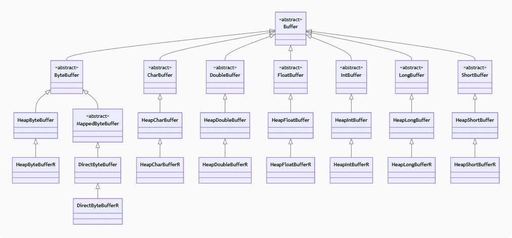

# 从零开始实现简易版Netty(六) MyNetty ByteBuf实现
## 1. jdk Buffer简单介绍
在上一篇博客中，lab5版本的MyNetty中实现了FastThreadLocal，为后续实现池化内存分配功能打下了基础。池化内存分配是netty中非常核心也非常复杂的一个功能，没法在一次迭代中完整的实现，MyNetty打算分为4个迭代逐步的将其实现。  
按照计划，本篇博客中，lab6版本的MyNetty需要实现一个非常基础的，非池化的ByteBuf作为后续迭代的基础。  
由于本文属于系列博客，读者需要对之前的博客内容有所了解才能更好地理解本文内容。
* lab1版本博客：[从零开始实现简易版Netty(一) MyNetty Reactor模式](https://www.cnblogs.com/xiaoxiongcanguan/p/18939320)
* lab2版本博客：[从零开始实现简易版Netty(二) MyNetty pipeline流水线](https://www.cnblogs.com/xiaoxiongcanguan/p/18964326)
* lab3版本博客：[从零开始实现简易版Netty(三) MyNetty 高效的数据读取实现](https://www.cnblogs.com/xiaoxiongcanguan/p/18979699)
* lab4版本博客：[从零开始实现简易版Netty(四) MyNetty 高效的数据写出实现](https://www.cnblogs.com/xiaoxiongcanguan/p/18992091)
* lab5版本博客：[从零开始实现简易版Netty(五) MyNetty FastThreadLocal实现](https://www.cnblogs.com/xiaoxiongcanguan/p/19005381)
#####
在前面的实验中，MyNetty中用来承载消息的容器一直是java中nio包下的ByteBuffer。与FastThreadLocal类似，Netty同样不满足于jdk自带的ByteBuffer，而是基于ByteBuffer实现了性能更好，功能更强大的ByteBuf容器。  
但在学习Netty的ByteBuf容器之前，我们还是需要先了解jdk中的ByteBuffer工作原理。只有在理解了jdk原生的ByteBuffer的实现原理和优缺点后，我们才能更好的理解Netty中ByteBuf，以及ByteBuf的优势。
##### 
jdk中的Buffer是一个巨大的多维层次体系，按照所存储的数据类型可以分为byte、int、short等，按照底层承载数据的内存区域的不同可以分为基于堆内存(heap)的和基于堆外内存(direct)，按照是否仅可读可以分为普通可读可写的buffer和只读buffer。  
Buffer按照类的继承关系将这几个维度以多层的子类继承关系组织起来，其中java.nio.Buffer是最顶层的抽象类。
第二层按照所存储的数据类型可以分为ByteBuffer、IntBuffer和ShortBuffer等直接子类;按照底层承载数据的内存区域可以进一步分为HeapByteBuffer、DirectByteBuffer、HeapIntBuffer等;更进一步的对于只读的Buffer容器又有HeapByteBufferR、DirectByteBufferR、HeapIntBufferR等子类实现(结尾的R是ReadOnly的意思)。  
##### Buffer主要子类示意图

#####
计算机中数据底层基本都是以Byte字节维度存储的，而Int、Short、Double等数据类型都是基于字节的，因此整个Buffer体系中最核心的就是ByteBuffer。   
限于篇幅，本文中将只重点分析最重要的ByteBuffer以及其直接子类HeapByteBuffer的工作原理，相信在理解了整个Buffer体系中最核心的机制后，读者能对jdk的ByteBuffer体系能有一个大致的理解，有利于后续理解Netty的ByteBuf容器。   
### Buffer类
首先我们先看看最顶层的Buffer类，在Buffer类中共定义了四个非常关键的int类型的属性，分别是capacity、limit、position和mark。
* capacity属性代表着当前Buffer容器的可容纳的最大总元素个数，不能为负数并且不可变。capacity=10，对于ByteBuffer代表着最多能存放10个字节的数据；而对于IntBuffer则代表着最多能存放是10个整型的数据。可以简单的将Buffer**逻辑上**视为有着一个长度为capacity的底层数组，数组的类型与当前Buffer的类型一致(实际也可能是用Byte数组模拟Int数组)。
* jdk中的Buffer分为两种模式，一种是写模式，一种是读模式。写模式下只能往Buffer中put写入数据，不能读取数据；读模式下只能从Buffer中get读出数据，不能写入数据。  
  Buffer在刚被创建初始化时，是空的，属于写模式。在写入数据后，可以通过flip方法将Buffer容器切换为读模式(具体的原理下面会分析)。
* position属性在写模式下代表着当前的写指针，下一次写入的数据将会被写入底层数组中index=position的位置；而在读模式下，则代表着当前的读指针，即下一次读取的数据将会是底层数组中index=position的位置。
* limit属性用于校验以防止越界，在写模式下代表着第一个不可写的位置，默认情况下写模式中limit的值等于capacity。  
  而在读模式下，代表着第一个不可读的位置。举个例子，一个capacity=10的ByteBuffer,在写入了8个字节后，limit=8；通过flip方法转为读模式后，limit就由写模式下的10，转变为了8，代表着最多只能读取8个字节。因为再往后读，就相当于数组下标越界了，读取了从未写过的数据。  
* mark属性用于临时记录一下当前position的位置，比如处理拆包黏包问题时可以尝试着向后读取更多的数据，但未获取到完整包时可以通过mark指针退回到初始的位置，等待完整的包来临。  
* 四个属性之间存在着严格的大小关系，即mark <= position <= limit <= capacity。  
  capacity用于控制整个Buffer的大小，任意的读写都不可越过capacity的限制。  
  limit用于规范不可读写的位置，防止越界，其不会超过capacity；其无论是在写模式还是读模式下作为position的边界值，都一定大于或等于position。  
  position用于记录当前的相对读写位置，其无法超过limit。
  mark用于记录当前position的位置，其不会超过position。当limit或者position因为某些原因而缩小，导致其小于当前的mark时，mark会被废弃被还原为初始值-1。
#####
* Buffer类中还提供了三个用于切换容器形态的重要方法，分别是flip、rewind和clear方法。
* flip方法用于在写入完成后，令Buffer转换到读模式。flip操作会将position归零，而limit被设置为之前写模式下的position以避免读取越界。
* rewind方法一般用于在读取数据后，重置读指针以方便重复的读取。rewind操作中只会简单的将position归零，但不修改limit的值。
* clear方法用于清空Buffer容器，重新写入新的数据。clear操作会将position设置为0，而limit设置为等于capacity。设置完成后的指针位置与Buffer刚被创建时一样。
##### 
```java
/**
 * 基本copy自jdk的Buffer类，但做了简化
 * */
public abstract class MyBuffer {

    /**
     * buffer的capacity代表着总容量大小限制，不能为负数并且不可变
     * */
    private int capacity;

    /**
     * buffer的limit标识着第一个不可读或者写的index位置，不能为负数并且不能大于capacity
     * */
    private int limit;

    /**
     * buffer的position标识着下一个读或者写的元素的index位置，不能为负数并且不能大于limit
     * */
    private int position = 0;

    /**
     * buffer的mark是用于reset方法(重置)被调用时，将position的值重试为mark对应下标.
     * mark并不总是被定义，但当它被定义时，它不会为负数，并且不会超过position
     * 如果mark被定义了，则它将会在position或者limit被调整为小于mark时被废弃(变成未定义的状态)
     * 如果mark没有被定义，则在调用reset方法时将会抛出InvalidMarkException
     * */
    private int mark = -1;

    // Used only by direct buffers
    // NOTE: hoisted here for speed in JNI GetDirectBufferAddress
    /**
     * 有两种Buffer，分别基于堆内内存和堆外内存
     * 堆外内存中，这个属性标示堆外内存具体的起始地址, MyNetty中暂时用不到
     * */
    long address;

    MyBuffer(int mark, int pos, int lim, int cap) {       // package-private
        if (cap < 0) {
            // The capacity of a buffer is never negative
            throw new IllegalArgumentException("Negative capacity: " + cap);
        }
        this.capacity = cap;
        setLimit(lim);
        setPosition(pos);
        if (mark >= 0) {
            // The mark is not always defined, but when it is defined it is never negative and is never greater than the position.
            if (mark > pos) {
                throw new IllegalArgumentException("mark > position: (" + mark + " > " + pos + ")");
            }
            this.mark = mark;
        }
    }

    public int getCapacity() {
        return capacity;
    }

    public int getPosition() {
        return position;
    }

    public int getLimit() {
        return limit;
    }

    public int getMark() {
        return mark;
    }

    final void discardMark() {
        mark = -1;
    }

    /**
     * 是否是只读的
     * */
    public abstract boolean isReadOnly();

    public final MyBuffer setLimit(int newLimit) {
        if ((newLimit > capacity) || (newLimit < 0)) {
            throw new IllegalArgumentException();
        }

        // 给limit赋值
        limit = newLimit;
        if (position > newLimit) {
            // 确保position不能大于limit
            position = newLimit;
        }
        if (mark > newLimit) {
            // 如果mark被定义了，则它将会在position被调整为小于mark时被废弃(变成未定义的状态)
            mark = -1;
        }

        return this;
    }

    public final MyBuffer setPosition(int newPosition) {
        if ((newPosition > limit) || (newPosition < 0)) {
            throw new IllegalArgumentException("invalid newPosition=" + newPosition + " limit=" + limit);
        }
        if (mark > newPosition) {
            // 如果mark被定义了，则它将会在limit被调整为小于mark时被废弃(变成未定义的状态)
            mark = -1;
        }
        // 给position赋值
        position = newPosition;
        return this;
    }

    public final MyBuffer mark() {
        // 将mark记录为当前position的位置
        this.mark = this.position;
        return this;
    }

    /**
     * buffer的mark是用于reset方法(重置)被调用时，将position的值重试为mark对应下标.
     * */
    public final MyBuffer reset() {
        int m = mark;
        if (m < 0) {
            // 如果mark没有被定义，则在调用reset方法时将会抛出InvalidMarkException
            throw new InvalidMarkException();
        }
        position = m;
        return this;
    }

    /**
     * 令buffer准备好作为一个新的序列用于channel读操作或者说让channel将数据put进来
     * 设置limit为capacity并且将position设置为0
     *
     * 注意：clear并没有真正的将buffer里的数据完全清零，而仅仅是通过修改关键属性的方式逻辑进行了逻辑上的clear，这样性能更好
     * */
    public final MyBuffer clear() {
        position = 0;
        limit = capacity;
        mark = -1;
        return this;
    }

    /**
     * 令buffer准备好作为一个新的序列用于channel写操作或者说让channel将写进去的数据get走：
     * 设置limit为当前的position的值，并且将position设置为0
     * */
    public final MyBuffer flip() {
        limit = position;
        position = 0;
        mark = -1;
        return this;
    }

    /**
     * 让一个buffer准备好重新读取数据，即在limit不变的情况下，将position设置为0
     * 因为读取操作会不断地推进position的位置，重置position为0，相当于允许读取重头读(类似磁带进行了倒带，即rewind)
     * */
    public final MyBuffer rewind() {
        position = 0;
        mark = -1;
        return this;
    }

    /**
     * 返回当前buffer还剩余可用的元素个数(即limit-position)
     * */
    public final int remaining() {
        int rem = limit - position;
        return Math.max(rem, 0);
    }

    /**
     * 是否还有剩余可用的元素个数
     * */
    public final boolean hasRemaining() {
        return position < limit;
    }

    static void checkBounds(int off, int len, int size) {
        if ((off | len | (off + len) | (size - (off + len))) < 0) {
            throw new IndexOutOfBoundsException();
        }
    }

    final int nextGetIndex() {
        int p = position;
        if (p >= limit) {
            throw new BufferUnderflowException();
        }
        position = p + 1;
        return p;
    }

    final int nextGetIndex(int nb) {
        int p = position;
        if (limit - p < nb){
            throw new BufferUnderflowException();
        }
        position = p + nb;
        return p;
    }

    final int nextPutIndex() {
        int p = position;
        if (p >= limit) {
            // 相比nextGetIndex，抛出的异常不同
            throw new BufferOverflowException();
        }
        position = p + 1;
        return p;
    }

    final int nextPutIndex(int nb) {
        int p = position;
        if (limit - p < nb) {
            throw new BufferOverflowException();
        }
        position = p + nb;
        return p;
    }

    final int checkIndex(int i) {
        if ((i < 0) || (i >= limit)) {
            throw new IndexOutOfBoundsException();
        }
        return i;
    }

    final int checkIndex(int i, int nb) {
        if ((i < 0) || (nb > limit - i)) {
            throw new IndexOutOfBoundsException();
        }
        return i;
    }
}
```
### ByteBuffer类
* ByteBuffer类顾名思义，是承载Byte类型的数据的Buffer容器。前面提到Buffer承载底层数组的内存分为两种类型，一种是位于jvm堆内存的HeapXXXBuffer，一种是位于堆外的直接内存的DirectXXXBuffer。  
  HeapByteBuffer中底层数组直接就是成员变量byte[] hb。而DirectByteBuffer中的底层数组位于堆外，数组的内存起始地址由父类ByteBuffer中的address维护，访问时通过Unsafe方法address与实际的偏移量来访问对应位置的数据。
  在本篇博客中，限于篇幅只介绍基于堆内存的ByteBuffer实现HeapByteBuffer，因为作为Buffer其基本的工作原理上HeapByteBuffer与DirectByteBuffer并没有特别大的不同，都是在底层数组上读写对应的数据。
* ByteBuffer提供了基于各种数据类型的读(get)与写(put)方法，其中分为相对操作与绝对操作之分，绝对操作与相对操作的区别在于多了一个index参数，比如相对操作get()和绝对操作get(int index)。  
  绝对操作很好理解，就是在底层数组指定的index位置读取或者写入对应的数据。而相对操作其实也需要一个index指针，而这个index指针就是前面介绍过的位于Buffer内部的position指针。相对操作在进行了读或者写操作后，会增加或者说推进position的值。  
  绝大多数情况下，我们都是使用相对操作来读写操作Buffer的，因为可以让Buffer内部自行维护读或者写指针，比较方便。
* ByteBuffer因为其存储的是最基础的Byte类型，因此其很容易拓展转换为其它数据类型的Buffer容器。  
  ByteBuffer除了提供byte类型的读写方法外，也提供了getInt、putInt、getShort、putLong等等其它数据类型读写的方法。其底层本质上是将1或N个字节看做一个完整的特定数据类型进行写入或读取。  
  比如通过相对写操作putInt将一个int类型的数据写入Buffer等价于一次写入了4个byte，position自增4。读取操作则是从特定位置开始，将包含自身在内的共四个byte视作一个int类型返回。  
  同时ByteBuffer也提供了诸如asCharBuffer、asIntBuffer等等将自身转换成逻辑上等价的其它类型Buffer的方法方便使用。感兴趣的读者可以自行阅读jdk的对应源码或者相关资料，这里就不再展开了。
##### 大端法与小端法
* 前面我们提到，Buffer对于int或者long等多个byte字节构成的数据，是通过将多个字节合并在一起视为整体来实现的。而实际上这里面存在一个问题，即从前到后的哪个字节代表高位，哪个字节代表低位。如果网络传输等场景下两边的表示方式不一致，则读取到的字节流可能会被错误的解析。  
* 内存地址的示意图一般是从左到右，从低到高排列的。作为普通人来说，看数字时也习惯了高位在左(前)，低位在右(后)的模式(1024，千位在前，个位在后)。这种低位内存的字节代表高位，高位内存的字节代表低位的表示方法叫做大端法。与之相对的，低位内存代表低位，高位内存代表高位的表示方法则被叫做小端法。  
* 读者可能会有疑问，既然大端法符合人们的直观理解，为什么不让所有的软硬件系统都统一使用大端法存储数据呢？免得还要互相之间各种约定，避免转换错误。  
  这是因为小端法在做一些强制类型转换等基础的底层操作时，硬件性能更好。举个例子，有一个占4字节的int数据，想要强制转换成一个short类型。对于小端法而言，只需要从起始位置开始寻址找到两个字节返回即可，因为低位字节代表低位，强转时忽略高位即可。  
  而大端法必须基于起始位置四个字节中的后两个字节才能转换成功。在性能重于一切的底层硬件或操作系统层面，这种效率上的差异不能完全的忽略。所以时至今日，依然有很多的硬件和操作系统使用小端法维护int等类型的数据。  
* 因此，jdk的ByteBuffer中支持指定以小端法或者大端法来存储数据，这样可以在网络传输等需要将内存数据编码为字节流的场景下，让用户能自由的转换为约定好的，统一的表示方式。
#####
```java
/**
 * 基本copy自jdk的ByteBuffer类，但做了简化
 * */
public abstract class MyByteBuffer extends MyBuffer {

    // These fields are declared here rather than in Heap-X-Buffer in order to
    // reduce the number of virtual method invocations needed to access these
    // values, which is especially costly when coding small buffers.
    //
    final byte[] hb;                  // Non-null only for heap buffers
    final int offset;
    boolean isReadOnly;                 // Valid only for heap buffers

    MyByteBuffer(int mark, int pos, int lim, int cap, byte[] hb, int offset) {
        super(mark, pos, lim, cap);

        this.hb = hb;
        this.offset = offset;
    }

    /**
     * 创建一个指定了capacity的堆内ByteBuffer
     * */
    public static MyByteBuffer allocate(int capacity) {
        if (capacity < 0) {
            throw new IllegalArgumentException();
        }

        // 简单起见，只支持基于堆内存的HeapByteBuffer
        return new MyHeapByteBuffer(capacity, capacity);
    }

    /**
     * 相对读操作
     * */
    public abstract byte get();

    /**
     * 绝对读操作
     * */
    public abstract byte get(int index);

    /**
     * 相对写操作
     * */
    public abstract MyByteBuffer put(byte b);

    public final MyByteBuffer put(byte[] src) {
        return put(src, 0, src.length);
    }

    public MyByteBuffer put(byte[] src, int offset, int length) {
        checkBounds(offset, length, src.length);
        if (length > remaining()) {
            throw new BufferOverflowException();
        }
        int end = offset + length;
        for (int i = offset; i < end; i++) {
            // 循环put写入整个字节数组
            this.put(src[i]);
        }
        return this;
    }

    /**
     * 绝对写操作
     * */
    public abstract MyByteBuffer put(int index, byte b);

    /**
     * 相对的批量读操作
     * 将当前buffer的length个字节，写入指定dst数组。写入的起始下标位置是offset
     * */
    public MyByteBuffer get(byte[] dst, int offset, int length) {
        checkBounds(offset, length, dst.length);
        if (length > remaining()) {
            // 所要读取的字节数不能超过当前buffer总的剩余可读取数量
            throw new BufferUnderflowException();
        }
        int end = offset + length;
        for (int i = offset; i < end; i++) {
            dst[i] = get();
        }
        return this;
    }

    /**
     * 相对的批量读操作
     * 将当前buffer中的数据写入指定dst数组。写入的起始下标是0，length为dst的总长度
     * */
    public MyByteBuffer get(byte[] dst) {
        return get(dst, 0, dst.length);
    }

    /**
     * 压缩操作(也算写操作)
     * */
    public abstract MyByteBuffer compact();

    /**
     * 默认是大端
     * */
    boolean bigEndian = true;

    public final ByteOrder order() {
        return bigEndian ? ByteOrder.BIG_ENDIAN : ByteOrder.LITTLE_ENDIAN;
    }

    public final MyByteBuffer order(ByteOrder bo) {
        bigEndian = (bo == ByteOrder.BIG_ENDIAN);

        return this;
    }

    // 简单起见省略掉别的数据类型，仅支持int类型

    public abstract int getInt();

    public abstract int getInt(int index);

    public abstract MyByteBuffer putInt(int value);

    public abstract MyByteBuffer putInt(int index, int value);

    abstract byte _get(int i);                          // package-private
    abstract void _put(int i, byte b);                  // package-private

}
```
```java
/**
 * 基本copy自jdk的HeapByteBuffer，但做了简化
 * */
public class MyHeapByteBuffer extends MyByteBuffer{

    MyHeapByteBuffer(int cap, int lim) {
        super(-1, 0, lim, cap, new byte[cap], 0);
    }

    protected int ix(int i) {
        return i + offset;
    }

    @Override
    public byte get() {
        // 获得position的位置(相对操作，有副作用，会推进position)
        int nextGetIndex = nextGetIndex();
        // 加上offset偏移量获得最终的index值
        int finallyIndex = ix(nextGetIndex);
        return hb[finallyIndex];
    }

    @Override
    public byte get(int index) {
        // 检查index的合法性，必须是0 <= index < limit，避免越界
        checkIndex(index);
        // 加上offset偏移量获得最终的index值
        int finallyIndex = ix(index);
        return hb[finallyIndex];
    }

    @Override
    public MyByteBuffer put(byte b) {
        // 获得position的位置(相对操作，有副作用，会推进position)
        int nextPutIndex = nextPutIndex();
        // 加上offset偏移量获得最终的index值
        int finallyIndex = ix(nextPutIndex);

        // 将b放入对应的index处
        hb[finallyIndex] = b;
        return this;
    }

    @Override
    public MyByteBuffer put(int index, byte b) {
        // 检查index的合法性，必须是0 <= index < limit，避免越界
        checkIndex(index);

        // 加上offset偏移量获得最终的index值
        int finallyIndex = ix(index);

        // 将b放入对应的index处
        hb[finallyIndex] = b;
        return this;
    }

    @Override
    byte _get(int i) {
        return hb[i];
    }

    @Override
    void _put(int i, byte b) {
        hb[i] = b;
    }

    @Override
    public MyByteBuffer compact() {
        // 把底层数组中(position+offset)到(limit+offset)之间的内容整体往前挪，挪到数组起始处(0+offset), 实际内容的长度=remaining
        System.arraycopy(hb, ix(getPosition()), hb, ix(0), remaining());

        // 要理解下面position和limit的变化，需要意识到compact是一次从读模式切换到写模式的操作(之前读完了，就把剩下的还没有读完的压缩整理一下)

        // 压缩后实际内容的长度=remaining,所以压缩完后position，也就是后续开始写的位置就是从remaining开始
        setPosition(remaining());

        // 写模式下，limit当然就变成了capacity了
        setLimit(getCapacity());

        // 压缩后，mark没意义了，就直接丢弃掉
        discardMark();
        return this;
    }

    @Override
    public int getInt() {
        // 相比get方法获得1个字节，getInt一次要读取4个字节，所以position一次性推进4字节
        int nextGetIndex = nextGetIndex(4);
        int finallyIndex = ix(nextGetIndex);

        // 从指定的index处读取4个字节，构造成1个int类型返回(基于bigEndian，决定如何解析这4个字节(大端还是小端))
        return BitsUtil.getInt(this, finallyIndex, bigEndian);
    }

    @Override
    public int getInt(int index) {
        // 检查index的合法性，必须是0 <= index < limit-4，避免越界
        checkIndex(index,4);
        // 加上offset偏移量获得最终的index值
        int finallyIndex = ix(index);

        // 从指定的index处读取4个字节，构造成1个int类型返回(基于bigEndian，决定如何解析这4个字节(大端还是小端))
        return BitsUtil.getInt(this, finallyIndex, bigEndian);
    }

    @Override
    public MyByteBuffer putInt(int value) {
        // 获得position的位置(相对操作，有副作用，会推进position)
        // 相比put方法写入1个字节，putInt一次要读取4个字节，所以position一次性推进4字节

        int nextPutIndex = nextPutIndex(4);
        // 加上offset偏移量获得最终的index值
        int finallyIndex = ix(nextPutIndex);

        // 向指定的index处写入大小为4个字节的1个int数据(基于bigEndian，决定写入字节的顺序(大端还是小端))
        BitsUtil.putInt(this, finallyIndex, value, bigEndian);
        return this;
    }

    @Override
    public MyByteBuffer putInt(int index, int value) {
        // 检查index的合法性，必须是0 <= index < limit-4，避免越界
        checkIndex(index,4);

        // 加上offset偏移量获得最终的index值
        int finallyIndex = ix(index);

        // 向指定的index处写入大小为4个字节的1个int数据(基于bigEndian，决定写入字节的顺序(大端还是小端))
        BitsUtil.putInt(this, finallyIndex, value, bigEndian);
        return this;
    }

    @Override
    public boolean isReadOnly() {
        // 可读/可写
        return false;
    }
}

```
#####
jdk中Buffer的体系是一个非常强大而又复杂的体系，上面介绍的关于Buffer体系的内容只是其中比较核心的部分内容。除此之外还有很多关于Buffer内存映射、零拷贝、切片视图、堆外内存回收等等更多的内容限于篇幅在本文中完全没有涉及。  
但对于帮助读者理解为什么Netty要在jdk的ByteBuffer基础上再封装一个ByteBuf，个人认为这些内容已经足够了。

## 2. Netty ByteBuf介绍


