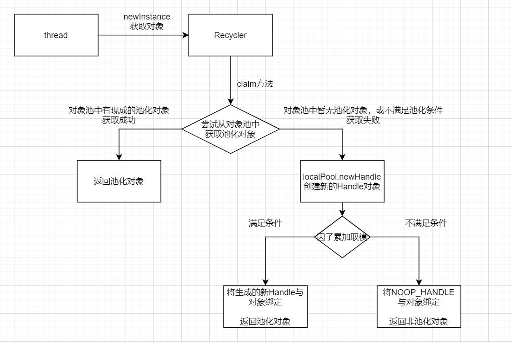

# 从零开始实现简易版Netty(七) MyNetty 实现Normal规格的池化内存分配
## 1. Netty池化内存分配介绍
在上一篇博客中，lab6版本的MyNetty中实现了一个简易的非池化ByteBuf容器，池化内存分配是netty中非常核心也非常复杂的一个功能，没法在一次迭代中完整的实现，MyNetty打算分为4个迭代逐步的将其实现。按照计划，lab7版本的MyNetty需要实现Normal规格的内存分配。  
由于本文属于系列博客，读者需要对之前的博客内容有所了解才能更好地理解本文内容。
* lab1版本博客：[从零开始实现简易版Netty(一) MyNetty Reactor模式](https://www.cnblogs.com/xiaoxiongcanguan/p/18939320)
* lab2版本博客：[从零开始实现简易版Netty(二) MyNetty pipeline流水线](https://www.cnblogs.com/xiaoxiongcanguan/p/18964326)
* lab3版本博客：[从零开始实现简易版Netty(三) MyNetty 高效的数据读取实现](https://www.cnblogs.com/xiaoxiongcanguan/p/18979699)
* lab4版本博客：[从零开始实现简易版Netty(四) MyNetty 高效的数据写出实现](https://www.cnblogs.com/xiaoxiongcanguan/p/18992091)
* lab5版本博客：[从零开始实现简易版Netty(五) MyNetty FastThreadLocal实现](https://www.cnblogs.com/xiaoxiongcanguan/p/19005381)
* lab6版本博客：[从零开始实现简易版Netty(六) MyNetty ByteBuf实现](https://www.cnblogs.com/xiaoxiongcanguan/p/19029215)
#####
在上一篇博客中我们提到，Netty的ByteBuf容器相比jdk的ByteBuffer的最大的一个优势就是实现了池化功能。通过对ByteBuf容器的池化，大幅提高了需要大量创建并回收ByteBuf容器的场景下的性能。  
在Netty中对于ByteBuf的池化分为两部分，一个是**ByteBuf对象本身的池化**，另一个则是**对ByteBuf背后底层数组所使用内存的池化**。  
对于ByteBuf对象的池化，Netty中实现了一个简单的对象池(Recycler类)以支持并发的对象创建与回收，相对简单。而对ByteBuf底层数组使用内存的池化设计则很大程度上参考了jemalloc这一适用于多处理器操作系统内核的内存分配器。   
关于jemalloc的工作原理，官方有两篇经典论文，分别是写于2006年的[A Scalable Concurrent malloc(3) Implementation for FreeBSD](https://www.cnblogs.com/xiaoxiongcanguan/p/18784130)与2011年的[scalable-memory-allocation-using-jemalloc](https://www.cnblogs.com/xiaoxiongcanguan/p/19057710)。
其中2011年的论文中提到，相比起2006年最初版本的jemalloc，新版本的jemalloc做了进一步的优化，大幅提升了jemalloc的性能与易用性。强烈建议读者在开始着手研究Netty池化内存的工作原理细节之前，先阅读这两篇高屋建瓴的关于jemalloc的论文。掌握了核心的设计理念后，再去看细节能起到事半功倍的作用。   
在后续介绍Netty的实现细节时，我也会结合这两篇论文中的内容来进行讲解，个人认为背后的设计理念与实现的细节同样重要，应该争取做到知其然而知其所以然。

## 2. ByteBuf对象池的实现解析
### 2.1 池化的ByteBuf分配器(PooledByteBufAllocator)
为了能够让使用者灵活的控制所创建的ByteBuf是否需要池化，Netty抽象出了ByteBufAllocator这一接口。使用者可以通过其对应的接口来创建ByteBuf，而不用特别关心其底层的实现。
##### MyNetty池化的ByteBuf分配器实现
* 从下面展示的MyPooledByteBufAllocator的源码中可以看到，用于分配池化ByteBuf的功能主要集中在子类的newHeapBuffer方法中。  
  该方法中为当前线程分配一个固定的PoolArena，再通过选中的PoolArena去进行实际的分配。
* 熟悉前面提到的jemalloc论文的读者可以看到，Netty中的PoolArena其实就对应着jemalloc中反复提到的Arena的概念。   
  _"Application threads are assigned arenas in round-robin fashion upon first allocating a small/large object. Arenas are completely independent of each other. They maintain their own chunks, from which they carve page runs for small/large objects."_  
  _"应用线程在首次分配small或large对象时，使用round-robin轮训为其分配一个arena。不同的Arena彼此之间完全独立。Arena维护独属于它自己的Chunk集合，从中切割出连续的页段用于分配small或large对象。"_
* Netty参考jemalloc也实现了Arena与线程的绑定关系，并且通过FastThreadLocal实现了ByteBuf线程缓存的能力。  
  因为Arena与线程是一对多的关系，通过Arena来分配池化内存，必然会因为要变更Arena的内部元数据(trace metadata)而加锁防并发。通过线程级别的池化能力，可以以略微增加内存碎片的代价，减少同步竞争而大幅增加池化内存分配的吞吐量。    
  _"The main goal of thread caches is to reduce the volume of synchronization events."_  
  _"引入线程缓存的主要目的是减少同步事件的量。"_
* MyNetty中分为3个迭代来完成池化ByteBuf的功能，线程缓存的功能被放在了最后一个迭代，也就是lab9中去实现。
  在本篇博客，也就是lab7中，MyNetty聚焦于PoolArena的内部实现，所以直接简单的设置所有线程共用同一个PoolArena。并且与lab6一致，简单起见只实现HeapByteBuf相关的池化，不考虑DirectByteBuf的池化功能。
#####
```java
public abstract class MyAbstractByteBufAllocator implements MyByteBufAllocator{
    // 。。。 已省略无关逻辑
    
    static final int DEFAULT_INIT_CAPACITY = 256;
    static final int DEFAULT_MAX_CAPACITY = Integer.MAX_VALUE;

    static final int CALCULATE_THRESHOLD = 1048576 * 4; // 4 MiB page

    @Override
    public MyByteBuf heapBuffer() {
        // 以默认参数值创建一个heapBuffer
        return newHeapBuffer(DEFAULT_INIT_CAPACITY,DEFAULT_MAX_CAPACITY);
    }

    @Override
    public MyByteBuf heapBuffer(int initialCapacity) {
        return heapBuffer(initialCapacity,DEFAULT_MAX_CAPACITY);
    }

    @Override
    public MyByteBuf heapBuffer(int initialCapacity, int maxCapacity) {
        // 简单起见，不实现netty里空buf优化

        // capacity参数校验
        validate(initialCapacity, maxCapacity);

        return newHeapBuffer(initialCapacity,maxCapacity);
    }
}
```
```java
public class MyPooledByteBufAllocator extends MyAbstractByteBufAllocator{

    private final MyPoolArena<byte[]>[] heapArenas;

    public MyPooledByteBufAllocator() {
        // 简单起见，Arena数量写死为1方便测试，后续支持与线程绑定后再拓展为与处理器数量挂钩
        int arenasNum = 1;

        // 初始化好heapArena数组
        heapArenas = new MyPoolArena.HeapArena[arenasNum];
        for (int i = 0; i < heapArenas.length; i ++) {
            MyPoolArena.HeapArena arena = new MyPoolArena.HeapArena(this);
            heapArenas[i] = arena;
        }
    }

    @Override
    protected MyByteBuf newHeapBuffer(int initialCapacity, int maxCapacity) {
        // 简单起见，Arena数量写死为1方便测试，后续支持与线程绑定后再拓展为与处理器数量挂钩
        MyPoolArena<byte[]> targetArena = heapArenas[0];

        return targetArena.allocate(initialCapacity, maxCapacity);
    }
}
```
##### 2.2 从ByteBuf对象池中获取ByteBuf对象
* PoolArena中实际生成可用的PooledByteBuf的方法中，只做了两件事情。  
  首先是从ByteBuf的对象池中获得一个ByteBuf对象，然后再为这个对象的底层数组分配与所申请大小相匹配的内存。本小节，我们主要探讨前一个操作。
* 获取ByteBuf对象逻辑是在PooledHeapByteBuf.newInstance方法中，通过一个全局的ObjectPool对象池来获得的(RECYCLER.get())。  
  获取到一个可用的ByteBuf对象后，通过PooledHeapByteBuf的reuse方法，将自身内部的读写指针等内部属性都重新初始化一遍，避免被污染。
```java 
public class MyPoolArena{
    // 。。。 已省略无关逻辑
    /**
     * 从当前PoolArena中申请分配内存，并将其包装成一个PooledByteBuf返回
     * */
    MyPooledByteBuf<T> allocate(int reqCapacity, int maxCapacity) {
        // 从对象池中获取缓存的PooledByteBuf对象
        MyPooledByteBuf<T> buf = newByteBuf(maxCapacity);
        // 为其分配底层数组对应的内存
        allocate(buf, reqCapacity);
        return buf;
    }

    public static final class HeapArena extends MyPoolArena<byte[]>{

        @Override
        protected MyPooledByteBuf<byte[]> newByteBuf(int maxCapacity) {
            return MyPooledHeapByteBuf.newInstance(maxCapacity);
        }
    }
}
```
```java
public class MyPooledHeapByteBuf extends MyPooledByteBuf<byte[]>{
    // 。。。 已省略无关逻辑
    
    private static final MyObjectPool<MyPooledHeapByteBuf> RECYCLER = MyObjectPool.newPool(
        new MyObjectPool.ObjectCreator<MyPooledHeapByteBuf>() {
            @Override
            public MyPooledHeapByteBuf newObject(MyObjectPool.Handle<MyPooledHeapByteBuf> handle) {
                return new MyPooledHeapByteBuf(handle, 0);
            }
        });

    MyPooledHeapByteBuf(MyObjectPool.Handle<? extends MyPooledHeapByteBuf> recyclerHandle, int maxCapacity) {
        super(recyclerHandle, maxCapacity);
    }

    public static MyPooledHeapByteBuf newInstance(int maxCapacity) {
        MyPooledHeapByteBuf buf = RECYCLER.get();
        buf.reuse(maxCapacity);
        return buf;
    }
}
```
```java
public abstract class MyPooledByteBuf<T> extends MyAbstractReferenceCountedByteBuf {
    // 。。。 已省略无关逻辑
    
    /**
     * 一个PooledByteBuf在回归对象池后，再重新被拿出来作为一个新的ByteBuf使用。需要进行一系列的重置操作
     * */
    final void reuse(int maxCapacity) {
        // 设置新的maxCapacity
        maxCapacity(maxCapacity);
        // 释放后，再重新被复用，refCnt重置为1
        setRefCnt(1);

        // 读指针，写指针，以及对应的marks指针都设置为0
        this.readerIndex(0);
        this.writerIndex(0);
        discardMarks();
    }
}
```
##### 2.3 ByteBuf简易对象池内部实现解析
下面我们来分析ByteBuf对象池的内部工作原理。作为一个对象池，我们主要关注获取对象与归还对象两部分的逻辑。
##### 获取对象
* 获取对象的逻辑入口在Recycler类的get方法。jemalloc的论文中提到，线程本地缓存在减少同步竞争的同时，也会增加内存碎片，因此netty中不允许线程不加节制的缓存ByteBuf对象。  
  netty允许通过系统参数io.netty.recycler.maxCapacityPerThread来配置每个线程所能缓存的最大ByteBuf对象数量。特别的当其为0时，则代表ByteBuf不使用线程缓存，每次获取都创建一个新的对象。
* 每个线程的本地缓存存储在FastThreadLocal类型的LocalPool中，LocalPool内部持有了一个MessagePassingQueue队列来存放池化对象。  
  MessagePassingQueue是一个线程安全的队列，特别适合于**多写单读**的场景。因为每个线程都只通过独属于线程自己的LocalPool获取池化对象，但最终释放并归还池化对象的线程可以是任意线程，因此使用MessagePassingQueue是性能最佳的。  
  这一点与jemalloc获取与释放池化内存的逻辑是一致的。_“Freed memory is always returned to the arena from which it came, regardless of which thread performs the deallocation.”_
* 通过线程缓存维护池化对象是一种用于提升吞吐量的机制，其并非万能药。在对性能要求不高的场景中，无脑的进行线程缓存会浪费内存。  
  因此，netty中默认只有FastThreadLocalThread这种netty中独有的线程类型才进行缓存，但也可以通过配置系统参数(io.netty.recycler.batchFastThreadLocalOnly=false)允许所有类型的线程都进行缓存。  
* 获取对象时，LocalPool可能为空，不一定能获取到可用的池化对象。这时便需要new一个新的池化对象出来。netty中引入了一个分配因子，在所有的new新对象的申请中，默认只有一小部分(1/8)的请求会生成池化对象，而大部分情况下生成的都是无需池化，即释放时不归还到对象池中的普通对象(NOOP_HANDLE)。  
  **这样做的目的是为了希望在分配对象的吞吐量与内存碎片之间获得一个平衡，让空间与时间的取舍达到一个相对的平衡点。**
##### 归还对象
* 生成池化对象时，会将一个Handle对象通过构造函数注入给池化对象(比如PooledByteBuf)，而后在池化对象被释放时(比如PooledByteBuf的deallocate方法)，通过Handle的recycle方法将该对象归还到所属的对象池中。
#####

#####
```java
/**
 * 参考自Netty 4.1.118的Recycler类，但做了一定的简化
 * */
public abstract class MyRecycler<T> {

    /**
     * 每个线程最多可以池化缓存的对象数量。因为内存是有限的，不能无限制的池化。所以需要用户基于开启的线程数和所池化缓存对象的平均内存大小来设置
     * maxCapacityPerThread也可以被设置为0，来标识不进行池化
     *
     * netty里可以基于构造函数指定，但一般基于系统参数io.netty.recycler.maxCapacityPerThread来控制，简单起见直接写死
     * */
    private final int maxCapacityPerThread = 4096;

    /**
     * netty里可以基于构造函数指定，但一般基于系统参数io.netty.recycler.ratio控制，简单起见直接写死
     * */
    private final int interval = 8;

    /**
     * netty里可以基于构造函数指定，但一般基于系统参数io.netty.recycler.chunkSize控制，简单起见直接写死
     * */
    private final int chunkSize = 32;

    /**
     * 是否只有FastThreadLocal类型的线程才进行byteBuf的池化
     * */
    private static final boolean BATCH_FAST_TL_ONLY = true;

    private final MyFastThreadLocal<LocalPool<T>> threadLocal = new MyFastThreadLocal<LocalPool<T>>() {
        @Override
        protected LocalPool<T> initialValue() {
            return new LocalPool<T>(maxCapacityPerThread, interval, chunkSize);
        }

        @Override
        protected void onRemoval(LocalPool<T> value) throws Exception {
            super.onRemoval(value);
            MessagePassingQueue<DefaultHandle<T>> handles = value.pooledHandles;
            value.pooledHandles = null;
            value.owner = null;
            handles.clear();
        }
    };

    protected abstract T newObject(Handle<T> handle);


    /**
     * 获取池化对象
     * 1. 优先从线程本地对象池LocalPool获取
     *    对象池本身内部很复杂，获取池化对象时一般都要加同步锁防止并发。引入LocalPool的目的是为了尽可能的无锁化，提高效率
     * 2. 每个线程能池化的对象个数是有限的(maxCapacityPerThread控制)
     * 3. 不是所有类型的线程都能持有池化对象（默认配置只有netty的FastThreadLocalThread才行）
     *
     * 第2和3设计的目的都是为了避免过多的池化对象导致占用过多的内存
     * */
    public final T get() {
        if (maxCapacityPerThread == 0) {
            // netty中maxCapacityPerThread是可以动态配置的。如果每个线程池化的个数为0，就不需要进行池化，返回一个持有NOOP_HANDLE的对象做降级兼容（逻辑上是非池化的）。NOOP_HANDLE在回收时recycle方法里什么也不做
            return newObject((Handle<T>) NOOP_HANDLE);
        }

        // 获得当前线程自己独有的threadLocal本地对象池
        LocalPool<T> localPool = threadLocal.get();
        // 从本地对象池中尝试获取一个可用的对象出来
        DefaultHandle<T> handle = localPool.claim();
        T obj;
        if (handle == null) {
            // 为null说明线程本地对象池中拿不出来可用的池化对象
            // 调用newHandle尝试创建一个handle
            handle = localPool.newHandle();
            if (handle != null) {
                // 获取handle句柄成功，由子类实现newObject方法创建需要池化的对象(比如new一个PooledHeapByteBuf对象)
                obj = newObject(handle);
                // 将handle句柄与创建出来的池化对象进行绑定
                handle.set(obj);
            } else {
                // 创建handle句柄失败，返回一个逻辑上非池化的对象(newHandle里控制了创建需要池化的对象的比例)
                obj = newObject((Handle<T>) NOOP_HANDLE);
            }
        } else {
            // 线程本地对象池中可以拿出来一个可用的对象，直接返回
            obj = handle.get();
        }

        return obj;
    }

    private static final class LocalPool<T> implements MessagePassingQueue.Consumer<DefaultHandle<T>>{
        /**
         * 当前LocalPool中队列所缓存的最大handle个数(有batch和pooledHandles两个队列，有并发时好像会略高于这个值)
         * */
        private final int chunkSize;

        private final ArrayDeque<DefaultHandle<T>> batch;
        private volatile Thread owner;
        private volatile MessagePassingQueue<DefaultHandle<T>> pooledHandles;

        /**
         * 创建池化对象的比例(默认是8)
         * */
        private final int ratioInterval;

        /**
         * 配合ratioInterval比例功能的计数器，在newHandle方法中有用到
         * */
        private int ratioCounter;

        @SuppressWarnings("unchecked")
        LocalPool(int maxCapacity, int ratioInterval, int chunkSize) {
            this.ratioInterval = ratioInterval;
            this.chunkSize = chunkSize;

            batch = new ArrayDeque<>(chunkSize);

            Thread currentThread = Thread.currentThread();

            // owner = !BATCH_FAST_TL_ONLY || currentThread instanceof MyFastThreadLocalThread ? currentThread : null;
            if(!BATCH_FAST_TL_ONLY){
                // 配置中指定了不只有FastThreadLocal类型的线程才能池化，说明所有类型的线程都能池化
                owner = currentThread;
            }else{
                // 配置了只有FastThreadLocal类型的线程才能池化，判断一下currentThread的类型
                if(currentThread instanceof MyFastThreadLocalThread){
                    owner = currentThread;
                }else{
                    // 非FastThreadLocalThread类型的线程不能池化
                    owner = null;
                }
            }

            // netty这里有多种配置来设置不同类型的队列，这里简单起见直接写死一种
            // Mpsc即MultiProducerSingleConsumer，多写一读的队列
            // 别的线程在将handle释放时，将其写入该队列中。而owner线程则负责消费读取该队列，将别的线程释放的对象往batch里存
            pooledHandles = (MessagePassingQueue<DefaultHandle<T>>) new MpscChunkedArrayQueue<T>(chunkSize, maxCapacity);

            // 初始化时令ratioCounter = ratioInterval。确保第一次newHandle被调用时，创建的是可被回收的池化对象
            ratioCounter = ratioInterval; // Start at interval so the first one will be recycled.
        }

        /**
         * 从本地对象池中尝试获取一个可池化对象的handle句柄
         * */
        DefaultHandle<T> claim() {
            MessagePassingQueue<DefaultHandle<T>> handles = pooledHandles;
            if (handles == null) {
                // pooledHandles为空，说明持有该LocalPool的线程已经被关闭了，所以被设置为了null(release方法里的逻辑)
                // 没法去缓存池化对象了，返回null
                return null;
            }

            if (batch.isEmpty()) {
                // 本地缓存的对象为空，从handles里面尝试获取一批可池化对象，放到batch队列里(chunkSize控制个数)
                handles.drain(this, chunkSize);
            }

            // 从本地缓存的对象池里获取一个handle句柄
            DefaultHandle<T> handle = batch.pollLast();
            if (null != handle) {
                handle.toClaimed();
            }

            return handle;
        }

        /**
         * 池化对象回收时，尝试将其放回本地对象池中
         * */
        void release(DefaultHandle<T> handle) {
            // 回收时进行状态的判断，避免重复回收，提前发现bug
            handle.toAvailable();

            // owner线程是持有当前localPool对象池的线程
            Thread owner = this.owner;
            if (owner != null && Thread.currentThread() == owner && batch.size() < chunkSize) {
                // 如果是当前线程用完了进行回收，并且batch队列里缓存的池化对象数量小于chunkSize，则将其放回到LocalPool里
                accept(handle);
            } else if (owner != null && isTerminated(owner)) {
                // 如果持有LocalPool的线程已经被杀掉了(isTerminated)，清空当前LocalPool的pooledHandles
                // 防止claim方法里继续去获取池化对象
                this.owner = null;
                pooledHandles = null;
            } else {
                // 释放对象的线程不是持有LocalPool的线程，通过pooledHandles内存队列将其异步的放回到该LocalPool里去
                MessagePassingQueue<DefaultHandle<T>> handles = pooledHandles;
                if (handles != null) {
                    handles.relaxedOffer(handle);
                }
            }
        }

        private static boolean isTerminated(Thread owner) {
            // Do not use `Thread.getState()` in J9 JVM because it's known to have a performance issue.
            // See: https://github.com/netty/netty/issues/13347#issuecomment-1518537895
            // return PlatformDependent.isJ9Jvm() ? !owner.isAlive() : owner.getState() == Thread.State.TERMINATED;

            // 用的java8，简单起见直接判断状态
            return owner.getState() == Thread.State.TERMINATED;
        }

        DefaultHandle<T> newHandle() {
            if (++ratioCounter >= ratioInterval) {
                // 基于ratioInterval创建可回收的池化对象
                ratioCounter = 0; // 重置计数器，实现按比例生成可回收的池化对象
                return new DefaultHandle<>(this);
            }

            // 生成的是不回收的对象(get方法里调用的地方做了判断)
            return null;
        }

        @Override
        public void accept(DefaultHandle<T> tDefaultHandle) {
            // 将可池化的对象handle，放到本地缓存的batch队列里
            batch.addLast(tDefaultHandle);
        }
    }
    
    private static final class DefaultHandle<T> implements Handle<T> {
        private static final int STATE_CLAIMED = 0;
        private static final int STATE_AVAILABLE = 1;
        private static final AtomicIntegerFieldUpdater<DefaultHandle<?>> STATE_UPDATER;
        private volatile int state;
        private final LocalPool<T> localPool;
        private T value;

        static {
            AtomicIntegerFieldUpdater<?> updater = AtomicIntegerFieldUpdater.newUpdater(DefaultHandle.class, "state");
            // noinspection unchecked
            STATE_UPDATER = (AtomicIntegerFieldUpdater<DefaultHandle<?>>) updater;
        }

        DefaultHandle(LocalPool<T> localPool) {
            this.localPool = localPool;
        }

        @Override
        public void recycle(Object object) {
            if (object != this.value) {
                throw new IllegalArgumentException("object does not belong to handle");
            } else {
                // handle句柄被释放时，将其放回到本地缓存LocalPool中
                this.localPool.release(this);
            }
        }

        void toClaimed() {
            assert state == STATE_AVAILABLE;
            STATE_UPDATER.lazySet(this, STATE_CLAIMED);
        }

        T get() {
            return this.value;
        }

        void set(T value) {
            this.value = value;
        }

        void toAvailable() {
            int prev = STATE_UPDATER.getAndSet(this, 1);
            if (prev == 1) {
                throw new IllegalStateException("Object has been recycled already.");
            }
        }
    }


    /**
     * 为什么弄了个子interface？我的理解是类的内部引用起来更方便，也可以在未来进行进一步的拓展(基于4.1.80)，更高版本的弄了个EnhancedHandle
     * */
    public interface Handle<T> extends MyObjectPool.Handle<T> { }

    private static final Handle<?> NOOP_HANDLE = new Handle<Object>() {
        @Override
        public void recycle(Object object) {
            // NOOP
        }

        @Override
        public String toString() {
            return "NOOP_HANDLE";
        }
    };
}
```
```java
/**
 * 基本copy自netty的ObjectPool类
 *
 * 一个轻量级的对象池
 * */
public abstract class MyObjectPool<T> {

    /**
     * 从对象池中获取一个对象
     * 如果对象池中没有一个可以被重用的池化对象，也许会通过newObject(Handle)方法来创建一个对象
     */
    public abstract T get();

    /**
     * 用于通知对象池可以再次重用的句柄(handle)
     */
    public interface Handle<T> {
        /**
         * 如果可能的话，将对象回收并且使其能准备好被复用
         */
        void recycle(T self);
    }

    /**
     * 创建一个新的对象，该对象引用了给定的handle句柄对象.
     * 其一旦可以被重用时，调用Handle#recycle(Object)方法
     */
    public interface ObjectCreator<T> {

        /**
         * Creates an returns a new {@link Object} that can be used and later recycled via
         * {@link Handle#recycle(Object)}.
         *
         * @param handle can NOT be null.
         */
        T newObject(Handle<T> handle);
    }

    /**
     * 使用给定的ObjectCreator，创建一个新的对象池(ObjectPool)
     * 该对象池创建的对象应该被池化
     */
    public static <T> MyObjectPool<T> newPool(final ObjectCreator<T> creator) {
        if (creator == null) {
            throw new NullPointerException("creator");
        }

        return new RecyclerObjectPool<>(creator);
    }


    private static final class RecyclerObjectPool<T> extends MyObjectPool<T> {
        private final MyRecycler<T> recycler;

        RecyclerObjectPool(final ObjectCreator<T> creator) {
            recycler = new MyRecycler<T>() {
                @Override
                protected T newObject(Handle<T> handle) {
                    return creator.newObject(handle);
                }
            };
        }

        @Override
        public T get() {
            return recycler.get();
        }
    }
}
```
## 3. Normal规格的ByteBuf池化实现解析
下面我们开始分析池化内存中最关键的部分，即PooledByteBuf底层数组内存的池化机制。具体的入口在PoolArena的allocate方法中。
#####
```java
/**
 * 参考自netty的PoolArena，但做了大幅简化
 * */
public abstract class MyPoolArena<T>{
    // 。。。 已省略无关逻辑
  
    final MySizeClasses mySizeClasses;
    
    private void allocate(MyPooledByteBuf<T> buf, final int reqCapacity) {
        final MySizeClassesMetadataItem sizeClassesMetadataItem = mySizeClasses.size2SizeIdx(reqCapacity);
  
        switch (sizeClassesMetadataItem.getSizeClassEnum()){
            case SMALL:
                // 暂不支持
                throw new RuntimeException("not support small size allocate! reqCapacity=" + reqCapacity);
            // tcacheAllocateSmall(buf, reqCapacity, sizeIdx);
            case NORMAL:
                tcacheAllocateNormal(buf, reqCapacity, sizeClassesMetadataItem);
                return;
            case HUGE:
                // 超过了PoolChunk大小的内存分配就是Huge级别的申请，每次分配使用单独的非池化的新PoolChunk来承载
                allocateHuge(buf, reqCapacity);
        }
    }
}
```
```java
public class MySizeClassesMetadataItem {

    private int size;
    private SizeClassEnum sizeClassEnum;

    public MySizeClassesMetadataItem(int size, SizeClassEnum sizeClassEnum) {
        this.size = size;
        this.sizeClassEnum = sizeClassEnum;
    }

    public int getSize() {
        return size;
    }

    public SizeClassEnum getSizeClassEnum() {
        return sizeClassEnum;
    }
}
```
```java
public enum SizeClassEnum {
    SMALL,
    NORMAL,
    HUGE,
    ;
}
```
### SizeClasses工作原理解析
从上面的MyNetty的源码实现中可以看到，netty在进行实际的分配前，先基于参数reqCapacity计算出实际应该分配的大小以及规格级别，然后再基于规格级别去执行不同机制的分配操作。  
在jemalloc的论文中提到，jemalloc默认情况将SizeClass规格分为了以下三大类。
* Small: [8], [16, 32, 48, ..., 128], [192, 256, 320, ..., 512], [768, 1024, 1280, ..., 3840]
* Large: [4 KiB, 8 KiB, 12 KiB, ..., 4072 KiB]
* Huge: [4 MiB, 8 MiB, 12 MiB, …]
#####
而netty参考了jemalloc，同样将规格分为了对应的三类，即Small、Normal和Huge。默认情况下，Small与Normal的分界线不是4KB,而是8KB。  
* Huge类型分配：默认情况下大于4MB的PooledByteBuf分配，视为Huge规格。因为其占用空间过大，且实际使用场景很少，所以对于Huge类型的申请，netty不进行内存池化，而是每次都临时的申请新的内存来满足需求，以减少内存碎片。  
* Normal类型分配：默认情况下[8KB，4MB]大小区间内的PooledByteBuf分配，视为Normal规格。netty参考linux内核的伙伴分配算法，通过管理以页(默认1页8KB)为最小单位的连续内存页段(run)的方式进行维护。
* Small类型分配：默认情况下小于8KB的PooledByteBuf分配，被视为Small规格。netty参考linux内核的slab内存分配算法，通过管理一系列固定大小的内存对象槽集合的方式，管理待分配的池化内存。
#####
为什么linux内核和netty都要基于实际申请的内存大小划分规格，并区别对待呢？我们留到下一篇博客介绍完small类型分配工作原理后统一进行分析。   
下面我们基于MyNetty的SizeClasses实现源码来分析一下netty是如何进行规格划分的。  
##### MySizeClasses源码实现
```java
/**
 * 功能与Netty的SizeClasses类似，
 * netty里支持动态配置pageSize和chunkSize来调优，并能够得到合理的伸缩比例，所以实现的比较复杂
 * MySizeClasses这里size的规格全部写死为netty的默认值，简化复杂度
 * */
public class MySizeClasses {

    /**
     * 页大小直接写死，8K
     * */
    private final int pageSize = 8192;

    /**
     * 页大小的log2对数
     * log2(8192) = 13
     * */
    private final int pageShifts = 13;

    /**
     * 一共有多个个Page类型的规格(所有的规格，恰好是pageSize的倍数的就是Page类型的规格，比如8K，16K，24K以此类推)
     * */
    private final int nPageSizes;

    /**
     * chunk大小直接写死，4M
     * */
    private final int chunkSize = 1024 * 1024 * 4;

    /**
     * size低于该值的直接通过16的倍数索引数组(size2idxTab)来快速匹配
     * */
    private final int lookupMaxSize = 4096;

    /**
     * QUANTUM是量子的意思，即最小的规格 是16
     * LOG2_QUANTUM = (log2(16) = 4)
     * */
    private final int LOG2_QUANTUM = 4;

    /**
     * 每一个规格组的大小固定为4，组内每一个size规格的间距是固定的
     * */
    private static final int LOG2_SIZE_CLASS_GROUP = 2;

    private final MySizeClassesMetadataItem[] sizeTable;

    private final MySizeClassesMetadataItem[] size2idxTab;

    private final MySizeClassesMetadataItem[] pageIdx2sizeTab;

    public MySizeClasses() {
        int sizeNum = 69;
        sizeTable = new MySizeClassesMetadataItem[sizeNum];

        // 简单起见，写死size表规格
        // 规格跨度逐渐增加。绝大多数情况下，越小的内存规格，被申请的次数越多，因此更为精确的小规格配合slab分配可以显著减少内部内存碎片
        // 对于较大的规格(比如normal级别的)，如果还是按照几十的间距来设置规格(1k-2k之间就有几十个不同的规格)，就会导致过多的元数据需要维护，产生过多的外部碎片而浪费内存。
        // normal级别的内存通过伙伴算法进行分配，可以在内部内存碎片和外部内存碎片的取舍上得到一个不错的空间效率
        sizeTable[0] = new MySizeClassesMetadataItem(16, SizeClassEnum.SMALL);
        sizeTable[1] = new MySizeClassesMetadataItem(32, SizeClassEnum.SMALL);
        sizeTable[2] = new MySizeClassesMetadataItem(48, SizeClassEnum.SMALL);
        sizeTable[3] = new MySizeClassesMetadataItem(64, SizeClassEnum.SMALL);//组内固定间距16(2^4)

        sizeTable[4] = new MySizeClassesMetadataItem(80, SizeClassEnum.SMALL);
        sizeTable[5] = new MySizeClassesMetadataItem(96, SizeClassEnum.SMALL);
        sizeTable[6] = new MySizeClassesMetadataItem(112, SizeClassEnum.SMALL);
        sizeTable[7] = new MySizeClassesMetadataItem(128, SizeClassEnum.SMALL);//组内固定间距16(2^4)

        sizeTable[8] = new MySizeClassesMetadataItem(160, SizeClassEnum.SMALL);
        sizeTable[9] = new MySizeClassesMetadataItem(192, SizeClassEnum.SMALL);
        sizeTable[10] = new MySizeClassesMetadataItem(224, SizeClassEnum.SMALL);
        sizeTable[11] = new MySizeClassesMetadataItem(256, SizeClassEnum.SMALL);//组内固定间距32(2^5)

        sizeTable[12] = new MySizeClassesMetadataItem(320, SizeClassEnum.SMALL);
        sizeTable[13] = new MySizeClassesMetadataItem(384, SizeClassEnum.SMALL);
        sizeTable[14] = new MySizeClassesMetadataItem(448, SizeClassEnum.SMALL);
        sizeTable[15] = new MySizeClassesMetadataItem(512, SizeClassEnum.SMALL);//组内固定间距64(2^6)

        sizeTable[16] = new MySizeClassesMetadataItem(640, SizeClassEnum.SMALL);
        sizeTable[17] = new MySizeClassesMetadataItem(768, SizeClassEnum.SMALL);
        sizeTable[18] = new MySizeClassesMetadataItem(896, SizeClassEnum.SMALL);
        sizeTable[19] = new MySizeClassesMetadataItem(1024, SizeClassEnum.SMALL);//组内固定间距128(2^7)

        sizeTable[20] = new MySizeClassesMetadataItem(1280, SizeClassEnum.SMALL);
        sizeTable[21] = new MySizeClassesMetadataItem(1536, SizeClassEnum.SMALL);
        sizeTable[22] = new MySizeClassesMetadataItem(1792, SizeClassEnum.SMALL);
        sizeTable[23] = new MySizeClassesMetadataItem(1024 * 2, SizeClassEnum.SMALL);//组内固定间距256(2^8)

        sizeTable[24] = new MySizeClassesMetadataItem((int) (1024 * 2.5), SizeClassEnum.SMALL);
        sizeTable[25] = new MySizeClassesMetadataItem(1024 * 3, SizeClassEnum.SMALL);
        sizeTable[26] = new MySizeClassesMetadataItem((int) (1024 * 3.5), SizeClassEnum.SMALL);
        sizeTable[27] = new MySizeClassesMetadataItem(1024 * 4, SizeClassEnum.SMALL);//组内固定间距512(2^9)

        sizeTable[28] = new MySizeClassesMetadataItem(1024 * 5, SizeClassEnum.SMALL);
        sizeTable[29] = new MySizeClassesMetadataItem(1024 * 6, SizeClassEnum.SMALL);
        sizeTable[30] = new MySizeClassesMetadataItem(1024 * 7, SizeClassEnum.SMALL);
        sizeTable[31] = new MySizeClassesMetadataItem(1024 * 8, SizeClassEnum.NORMAL);//组内固定间距1024(2^10) 大于等于PageSize的都是Normal级别

        sizeTable[32] = new MySizeClassesMetadataItem(1024 * 10, SizeClassEnum.NORMAL);
        sizeTable[33] = new MySizeClassesMetadataItem(1024 * 12, SizeClassEnum.NORMAL);
        sizeTable[34] = new MySizeClassesMetadataItem(1024 * 14, SizeClassEnum.NORMAL);
        sizeTable[35] = new MySizeClassesMetadataItem(1024 * 16, SizeClassEnum.NORMAL);//组内固定间距2048(2^11)

        sizeTable[36] = new MySizeClassesMetadataItem(1024 * 20, SizeClassEnum.NORMAL);
        sizeTable[37] = new MySizeClassesMetadataItem(1024 * 24, SizeClassEnum.NORMAL);
        sizeTable[38] = new MySizeClassesMetadataItem(1024 * 28, SizeClassEnum.NORMAL);
        sizeTable[39] = new MySizeClassesMetadataItem(1024 * 32, SizeClassEnum.NORMAL);//组内固定间距4096(2^12)

        sizeTable[40] = new MySizeClassesMetadataItem(1024 * 40, SizeClassEnum.NORMAL);
        sizeTable[41] = new MySizeClassesMetadataItem(1024 * 48, SizeClassEnum.NORMAL);
        sizeTable[42] = new MySizeClassesMetadataItem(1024 * 56, SizeClassEnum.NORMAL);
        sizeTable[43] = new MySizeClassesMetadataItem(1024 * 64, SizeClassEnum.NORMAL);//组内固定间距8192(2^13)

        sizeTable[44] = new MySizeClassesMetadataItem(1024 * 80, SizeClassEnum.NORMAL);
        sizeTable[45] = new MySizeClassesMetadataItem(1024 * 96, SizeClassEnum.NORMAL);
        sizeTable[46] = new MySizeClassesMetadataItem(1024 * 112, SizeClassEnum.NORMAL);
        sizeTable[47] = new MySizeClassesMetadataItem(1024 * 128, SizeClassEnum.NORMAL);//组内固定间距16384(2^14)

        sizeTable[48] = new MySizeClassesMetadataItem(1024 * 160, SizeClassEnum.NORMAL);
        sizeTable[49] = new MySizeClassesMetadataItem(1024 * 192, SizeClassEnum.NORMAL);
        sizeTable[50] = new MySizeClassesMetadataItem(1024 * 224, SizeClassEnum.NORMAL);
        sizeTable[51] = new MySizeClassesMetadataItem(1024 * 256, SizeClassEnum.NORMAL);//组内固定间距32768(2^15)

        sizeTable[52] = new MySizeClassesMetadataItem(1024 * 320, SizeClassEnum.NORMAL);
        sizeTable[53] = new MySizeClassesMetadataItem(1024 * 384, SizeClassEnum.NORMAL);
        sizeTable[54] = new MySizeClassesMetadataItem(1024 * 448, SizeClassEnum.NORMAL);
        sizeTable[55] = new MySizeClassesMetadataItem(1024 * 512, SizeClassEnum.NORMAL);//组内固定间距65536(2^16)

        sizeTable[56] = new MySizeClassesMetadataItem(1024 * 640, SizeClassEnum.NORMAL);
        sizeTable[57] = new MySizeClassesMetadataItem(1024 * 768, SizeClassEnum.NORMAL);
        sizeTable[58] = new MySizeClassesMetadataItem(1024 * 896, SizeClassEnum.NORMAL);
        sizeTable[59] = new MySizeClassesMetadataItem(1024 * 1024, SizeClassEnum.NORMAL);//组内固定间距131072(2^17)

        sizeTable[60] = new MySizeClassesMetadataItem((int) (1024 * 1024 * 1.25), SizeClassEnum.NORMAL);
        sizeTable[61] = new MySizeClassesMetadataItem((int) (1024 * 1024 * 1.5), SizeClassEnum.NORMAL);
        sizeTable[62] = new MySizeClassesMetadataItem((int) (1024 * 1024 * 1.75), SizeClassEnum.NORMAL);
        sizeTable[63] = new MySizeClassesMetadataItem(1024 * 1024 * 2, SizeClassEnum.NORMAL);//组内固定间距262144(2^18)

        sizeTable[64] = new MySizeClassesMetadataItem((int) (1024 * 1024 * 2.5), SizeClassEnum.NORMAL);
        sizeTable[65] = new MySizeClassesMetadataItem(1024 * 1024 * 3, SizeClassEnum.NORMAL);
        sizeTable[66] = new MySizeClassesMetadataItem((int) (1024 * 1024 * 3.5), SizeClassEnum.NORMAL);
        sizeTable[67] = new MySizeClassesMetadataItem(1024 * 1024 * 4, SizeClassEnum.NORMAL);//组内固定间距524288(2^19)

        // 一个chunk就是4M，超过chunk级别的规格就是Huge类型了,这个是MyNetty额外加的一项
        sizeTable[68] = new MySizeClassesMetadataItem(0, SizeClassEnum.HUGE);

        // 计算一共有多个个Page类型的规格(所有的规格，恰好是pageSize的倍数的就是Page类型的规格，比如8K，16K，24K以此类推)
        int nPageSizes = 0;
        for (MySizeClassesMetadataItem item : sizeTable) {
            int size = item.getSize();
            if (size >= pageSize & size % pageSize == 0) {
                nPageSizes++;
            }
        }
        this.nPageSizes = nPageSizes;

        // 构建lookupMaxSize以下规格的快速查找索引表
        this.size2idxTab = buildSize2idxTab(lookupMaxSize,sizeTable);
        this.pageIdx2sizeTab = newPageIdx2sizeTab(sizeTable, sizeTable.length-1, this.nPageSizes);
    }

    private MySizeClassesMetadataItem[] buildSize2idxTab(int lookupMaxSize, MySizeClassesMetadataItem[] sizeTable) {
        MySizeClassesMetadataItem[] size2idxTab = new MySizeClassesMetadataItem[lookupMaxSize >> LOG2_QUANTUM];

        int size2idxTabIndex = 0;
        int lastQuantumBaseSize = 0;
        for(int i=0; i<sizeTable.length; i++){
            MySizeClassesMetadataItem item = sizeTable[i];

            // 量子基数(size都是QUANTUM(16)的倍数，比如size=16，那就是1；size=32，那就是2 依此类推)
            int quantumBaseSize = item.getSize() >> LOG2_QUANTUM;

            for(int j=lastQuantumBaseSize; j<quantumBaseSize; j++){
                if(size2idxTabIndex < size2idxTab.length){
                    size2idxTab[size2idxTabIndex] = item;
                    size2idxTabIndex++;
                }
            }

            lastQuantumBaseSize = quantumBaseSize;
        }

        return size2idxTab;
    }

    private MySizeClassesMetadataItem[] newPageIdx2sizeTab(MySizeClassesMetadataItem[] sizeTable, int nSizes, int nPSizes) {
        MySizeClassesMetadataItem[] pageIdx2sizeTab = new MySizeClassesMetadataItem[nPSizes];
        int pageIdx = 0;
        for (int i = 0; i < nSizes; i++) {
            MySizeClassesMetadataItem item = sizeTable[i];
            int size = item.getSize();
            if (size >= pageSize && size % pageSize == 0) {
                pageIdx2sizeTab[pageIdx] = item;
                pageIdx++;
            }
        }
        return pageIdx2sizeTab;
    }

    public MySizeClassesMetadataItem size2SizeIdx(int size) {
        if (size == 0) {
            return sizeTable[0];
        }
        if (size > chunkSize) {
            // 申请的是huge级别的内存规格
            return sizeTable[sizeTable.length-1];
        }

        // 简单起见，不支持配置内存对齐(directMemoryCacheAlignment)

        if (size <= lookupMaxSize) {
            // 小于4096的size规格，可以通过以16为基数的索引表，以O(1)的时间复杂度直接找到对应的规格
            // size-1 / MIN_TINY
            return size2idxTab[size - 1 >> LOG2_QUANTUM];
        }

        // 申请规格对应的向上取整的2次幂（比如15，sizeToClosestLog2就是4，代表距离最近的二次幂规格是16）
        int sizeToClosestLog2 = MathUtil.log2((size << 1) - 1);

        // size所在内存规格组编号，每一个组内包含4个规格(LOG2_SIZE_CLASS_GROUP=2),每个组内第4个也是最后一个规格是64的倍数(2^6)
        // 第一个组最后一个规格为64，第二组最后一个规格为64*2=128，第三组最后一个规格为64*4=128*2=256，依次类推，每一组的最后一个规格都是前一组最后一个规格的2倍
        // 所以size在二次幂向上对其后，除以64就能得到其所属的组的编号(log2对数就是直接减6(2+4))
        // lookupMaxSize很大，所以sizeGroupShift肯定大于0
        int sizeGroupShift = sizeToClosestLog2 - (LOG2_SIZE_CLASS_GROUP + LOG2_QUANTUM);;

        // 每个组内有4个规格，所以sizeGroupShift*4后获得对应的组的起始规格下标号
        int groupFirstIndex = sizeGroupShift << LOG2_SIZE_CLASS_GROUP;

        // 组内规格之间固定的间隔(每一组内部有4个规格，而相邻两组之间规格相差2倍，所以除以8就能得到组内的固定间隔)
        int log2Delta = sizeToClosestLog2 - LOG2_SIZE_CLASS_GROUP - 1;

        // size最贴近组内哪一个规格
        // (size - 1 >> log2Delta)得到当前size具体是几倍的log2Delta
        // 组内共(1 << LOG2_SIZE_CLASS_GROUP)=4个规格，因此对4求余数(x为二次幂可以通过&(x-1)的方式优化)，就能得到组内具体的规格项下标
        int mod = size - 1 >> log2Delta & (1 << LOG2_SIZE_CLASS_GROUP) - 1;

        // 最终确定实际对应内存规格的下标
        int finallySizeIndex = groupFirstIndex + mod;
        // 返回最终所匹配到的规格信息
        return sizeTable[finallySizeIndex];
    }

    public MySizeClassesMetadataItem sizeIdx2size(int sizeIdx) {
        return sizeTable[sizeIdx];
    }

    /**
     * 申请pages个连续页时，向上规格化后所对应的规格
     * */
    public int pages2pageIdx(int pages) {
        return pages2pageIdxCompute(pages, false);
    }

    /**
     * 申请pages个连续页时，向下规格化后所对应的规格
     * */
    public int pages2pageIdxFloor(int pages) {
        return pages2pageIdxCompute(pages, true);
    }

    public int getPageSize() {
        return pageSize;
    }

    public int getNPageSizes() {
        return nPageSizes;
    }

    public int getPageShifts() {
        return pageShifts;
    }

    public int getChunkSize() {
        return chunkSize;
    }

    /**
     * 和size2SizeIdx逻辑几乎一样，也是基于有规律的pageIdx2sizeTab表来快速定位对应规格
     * */
    private int pages2pageIdxCompute(int pages, boolean floor) {
        // 将申请的总页数 乘以 页大小 得到总共需要申请的size之和
        int pageSize = pages << pageShifts;
        if (pageSize > chunkSize) {
            // 申请的是huge级别的内存规格
            return this.pageIdx2sizeTab.length;
        }

        // 申请规格对应的向上取整的2次幂（比如8100，sizeToClosestLog2就是13，代表距离最近的二次幂规格是8192）
        int sizeToClosestLog2 = MathUtil.log2((pageSize << 1) - 1);

        // pageSize所在内存规格组编号，每一个组内包含4个规格(LOG2_SIZE_CLASS_GROUP=2),单位起步是页级别(PAGE_SHIFTS)
        int sizeGroupShift;
        if(sizeToClosestLog2 < LOG2_SIZE_CLASS_GROUP + pageShifts){
            // 说明是第一组内的规格
            sizeGroupShift = 0;
        }else{
            sizeGroupShift = sizeToClosestLog2 - (LOG2_SIZE_CLASS_GROUP + pageShifts);
        }

        // 每个组内有4个规格，所以sizeGroupShift*4后获得对应的组的起始规格下标号
        int groupFirstIndex = sizeGroupShift << LOG2_SIZE_CLASS_GROUP;

        // 组内规格之间固定的间隔(每一组内部有4个规格)
        int log2Delta;
        if(sizeToClosestLog2 < LOG2_SIZE_CLASS_GROUP + pageShifts + 1){
            // 前两个group的组内间隔都是8K
            log2Delta = pageShifts;
        }else{
            // 后面每个组的组内间隔，相比前一个组都大两倍
            log2Delta = sizeToClosestLog2 - LOG2_SIZE_CLASS_GROUP - 1;
        }

        // pageSize最贴近组内哪一个规格
        // (pageSize - 1 & deltaInverseMask)得到当前pageSize具体是几倍的log2Delta
        // 组内共(1 << LOG2_SIZE_CLASS_GROUP)=4个规格，因此对4求余数(x为二次幂可以通过&(x-1)的方式优化)，就能得到组内具体的规格项下标
        int deltaInverseMask = -1 << log2Delta;
        int mod = (pageSize - 1 & deltaInverseMask) >> log2Delta & (1 << LOG2_SIZE_CLASS_GROUP) - 1;

        int pageIdx = groupFirstIndex + mod;

        if (floor && pageIdx2sizeTab[pageIdx].getSize() > pages << pageShifts) {
            // 默认都是向上取整的，如果floor=true，且当前向上取整的size规格确实大于pages对应的size，则返回前一个规格
            return pageIdx-1;
        }else{
            return pageIdx;
        }
    }
}
```
