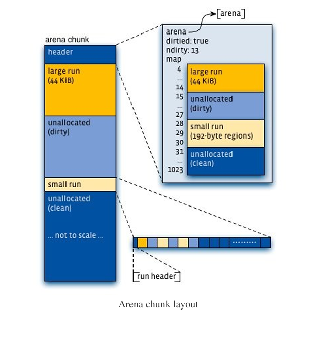
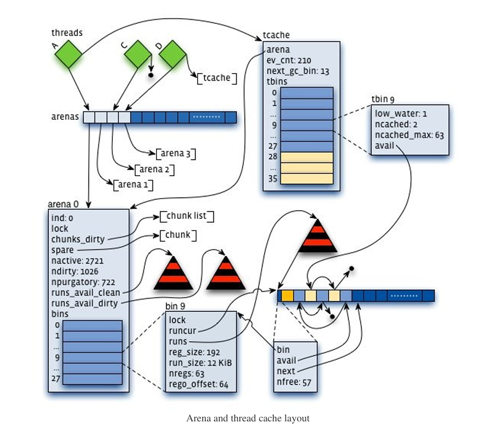
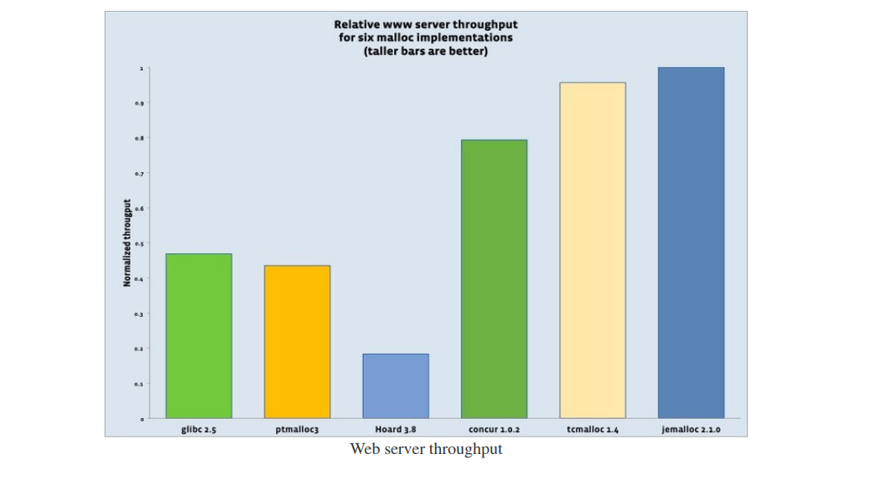

# Scalable memory allocation using jemalloc(使用jemalloc的可拓展内存分配)

##### 作者： Jason Evans <jasone@FreeBSD.org> Monday, January 3, 2011

#####
The Facebook website comprises a diverse set of server applications, most of which run on dedicated machines with 8+ CPU cores and 8+ GiB of RAM.   
These applications typically use POSIX threads for concurrent computations, with the goal of maximizing throughput by fully utilizing the CPUs and RAM.   
This environment poses some serious challenges for memory allocation, in particular:
#####
* Allocation and deallocation must be fast. Ideally, little memory allocation would be required in an application's steady state, 
  but this is far from reality for large dynamic data structures based on dynamic input. 
  Even modest allocator improvements can have a major impact on throughput.
* The relation between active memory and RAM usage must be consistent. In other words, practical bounds on allocator-induced fragmentation are critical. 
  Consider that if fragmentation causes RAM usage to increase by 1 GiB per day, an application that is designed to leave only a little head room will fail within days.
* Memory heap profiling is a critical operational aid. If all goes according to plan, leak detection and removal is a development task. 
  But even then, dynamic input can cause unexpected memory usage spikes that can only be characterized by analyzing behavior under production loads.
#####
Facebook网站由一系列不同的服务端应用程序构成，其中绝大多数应用程序都运行在有着至少8个核心CPU并且大于等于8GB内存的专用机器上。  
这些应用程序通常使用POSIX线程进行并发的计算，目的是通过最大限度的使用CPU和RAM内存以达到最大的吞吐量。  
这种环境对内存分配带来了一些严峻的挑战，特别是：
#####
* 内存的分配与释放必须够快。理想情况下，应用在稳定状态下应该只进行少量的内存分配，但因为要处理基于动态输入而构建的大型动态数据结构，因此实际情况与理想情况相差甚远。  
  即使对内存分配器进行一点微小的改变，也会对内存分配的吞吐量产生重大影响。
* 实际用户使用的内存与RAM的使用量之间的关系必须保持一致。换句话说，限制分配器实际所产生的内存碎片大小是至关重要的。  
  试想，如果内存分配所产生的内存碎片每天增长1GB，那么一个在设计时只预留了少量冗余内存空间的应用程序将在几天内崩溃。  
* 堆内存分析是一个非常关键的运维辅助工具。理论上，内存泄漏的探测与修复应该是一项在开发阶段完成的任务。  
  但即便如此，动态的输入依然会造成内存使用量预期外的激增，只有分析生产负载下的实际应用行为才能准确解决相关的内存泄漏问题。

#####
In 2009, existing memory allocators met at most two of these three requirements, so we added heap profiling to jemalloc and made many optimizations, such that jemalloc is now strong on all three counts.  
The remainder of this post surveys jemalloc's core algorithms and data structures before detailing numerous Facebook-motivated enhancements, 
followed by a real-world benchmark that compares six memory allocators under a production Web server load.

#####
在2009年，已有的jemalloc内存分配器只能满足上述三种需求种的两种，因此我们为jemalloc做了很多的优化，其中就包括为jemalloc增加堆内存分析的能力，现在jemalloc能很好的满足上述的三种需求了。  
本文的剩余部分将首先对jemalloc的核心算法和数据结构进行概述，然后详细讲解Facebook基于实际需求而推动的诸多优化措施，最后再展示一个真实世界的基准测试(benchmark)，该基准测试在一个来自生产环境服务器的负载下对6种不同的内存分配器进行了横向对比。

### Core algorithms and data structures
#####
The C and C++ programming languages rely on a very basic untyped allocator API that consists primarily of five functions: malloc(), posix_memalign(), calloc(), realloc(), andfree().   
Many malloc implementations also provide rudimentary introspection capabilities, like malloc_usable_size().   
While the API is simple, high concurrent throughput and fragmentation avoidance require considerable internal complexity.   
jemalloc combines a few original ideas with a rather larger set of ideas that were first validated in other allocators.   
Following is a mix of those ideas and allocation philosophy, which combined to form jemalloc.  
#####
C和C++语言依赖于一个非常基础的无类型的分配器API，其主要包含了5个函数：malloc(), posix_memalign(), calloc(), realloc(), andfree()。
很多malloc的实现也提供了基本的内省能力，例如malloc_usable_size()。  
虽然API使用上很简单，但为了实现高的并发吞吐量和尽可能的避免内存碎片，malloc其内部的实现是非常复杂的。  
jemalloc将少数独创的理念与一些早已在其它内存分配器中得到验证的理念结合了起来。
接下来将一一介绍这些思想和分配的哲学，正是它们的有机结合才造就了jemalloc。

#####
* Segregate small objects according to size class, and **prefer low addresses during re-use**. 
  This layout policy originated in phkmalloc , and is the key to jemalloc's predictable low fragmentation behavior.
* **Carefully choose size classes** (somewhat inspired by Vam). If size classes are spaced far apart, objects will tend to have excessive unusable trailing space (internal fragmentation).  
  As the size class count increases, there will tend to be a corresponding increase in unused memory dedicated to object sizes that are currently underutilized (external fragmentation).
* **Impose tight limits on allocator metadata overhead**. Ignoring fragmentation, jemalloc limits metadata to less than 2% of total memory usage, for all size classes.
* **Minimize the active page set**. Operating system kernels manage virtual memory in terms of pages (usually 4 KiB per page), so it is important to concentrate all data into as few pages as possible. 
  phkmalloc validated this tenet, at a time when applications routinely contended with active pages being swapped out to hard disk, though it remains important in the modern context of avoiding swapping altogether.
* **Minimize lock contention**. jemalloc's independent arenas were inspired by lkmalloc, but as time went on, tcmalloc made it abundantly clear that it's even better to avoid synchronization altogether, 
  so jemalloc also implements thread-specific caching.
* **If it isn't general purpose, it isn't good enough**. When jemalloc was first incorporated into FreeBSD, 
  it had serious fragmentation issues for some applications, and the suggestion was put forth to include multiple allocators in the operating system,
  the notion being that developers would be empowered to make informed choices based on application characteristics. 
  The correct solution was to dramatically simplify jemalloc's layout algorithms, in order to improve both performance and predictability. 
  Over the past year, this philosophy has motivated numerous major performance improvements in jemalloc, and it will continue to guide development as weaknesses are discovered.
#####
* 按照规格等级将小对象隔离存放，并且在**重用时优先使用低地址位置的内存**。这一布局策略源于phkmalloc，同时也是jemaaloc实现可预测的低内存碎片分配的关键。
* **精心设计规格等级**(部分灵感来自于Vam)。如果不同规格等级之间差距过大，对象尾部将会产生过多的不可使用的空间(内部碎片)。
  而随着规格等级数量的增加(译者注：规格等级过多、排布过密)，又会导致专门服务于某一使用率较低的规格大小的内存空间闲置(外部碎片)。
* **严格的控制分配器元数据的空间开销**。在忽略内存碎片的情况下，jemelloc限制用于管理所有规格等级的元数据使用量必须低于总内存使用的2%。
* **最小化活动页集合**。操作系统内核以页为单位管理虚拟内存(通常一页为4Kb大小)，因此将所有的数据尽可能的集中在少数的页中是非常重要的。
  phkmalloc在应用需要频繁将活动页交换到磁盘的时代就早已验证过了这一规则的正确性。而在如今应用彻底禁用交换机制的前提下，这一规则依然重要。
* **优秀的设计必须足够通用**。当jemalloc被初次集成进FreeBSD操作系统时，有一些应用在使用jemalloc时遭遇了严重的内存碎片问题，有人提议操作系统应该同时包含多种不同类型的内存分配器，
  寄希望于开发者能够基于它们的应用特性去选择最合适的内存分配器。
  正确的解决方案是大幅的简化jemalloc的布局算法，目的是同时提升jemalloc的性能和可预测性。过去的一年中，这一设计理念推动了jemalloc实现了多个重要的性能优化，随着未来jemalloc中更多的缺陷被发现，这一思想将持续指导jemalloc的发展。

#####
Jemalloc implements three main size class categories as follows (assuming default configuration on a 64-bit system):
#####
以下是jemalloc在64位操作系统默认配置的三大尺寸分类：
#####
* **Small**: [8], [16, 32, 48, ..., 128], [192, 256, 320, ..., 512], [768, 1024, 1280, ..., 3840]
* **Large**: [4 KiB, 8 KiB, 12 KiB, ..., 4072 KiB]
* **Huge**: [4 MiB, 8 MiB, 12 MiB, …]

#####
Virtual memory is logically partitioned into chunks of size 2^k (4 MiB by default).
As a result, it is possible to find allocator metadata for small/large objects (interior pointers) in constant time via pointer manipulations, 
and to look up metadata for huge objects (chunk-aligned) in logarithmic time via a global red-black tree.
#####
虚拟内存在Chunk内按照2次幂进行逻辑分区(Chunk默认大小为4MB)。
因此，可以通过指针运算以常数时间复杂度找到small和large对象(内部指针)的分配器元数据，并且能够通过一个全局的红黑树以对数时间复杂度查找到huge对象(基于Chunk对齐)的分配器元数据。
#####
Application threads are assigned arenas in round-robin fashion upon first allocating a small/large object.
Arenas are completely independent of each other. They maintain their own chunks, from which they carve page runs for small/large objects. 
Freed memory is always returned to the arena from which it came, regardless of which thread performs the deallocation.
#####
应用线程在首次分配small或large对象时，使用round-robin轮训为其分配一个arena。  
不同的Arena彼此之间完全独立。Arena维护独属于它自己的Chunk集合，从中切割出连续的页段用于分配small或large对象。  
内存被释放时总是被归还到其一开始所属的Arena中，而与执行deallocation释放内存的线程无关。

#####

#####
Each arena chunk contains metadata (primarily a page map), followed by one or more page runs.
Small objects are grouped together, with additional metadata at the start of each page run, 
whereas large objects are independent of each other, and their metadata reside entirely in the arena chunk header.
Each arena tracks non-full small object page runs via red-black trees (one for each size class), 
and always services allocation requests using the non-full run with the lowest address for that size class.
Each arena tracks available page runs via two red-black trees — one for clean/untouched page runs, and one for dirty/touched page runs. 
Page runs are preferentially allocated from the dirty tree, using lowest best fit.
#####
每一个Arena中的chunk都包含了元数据(主要是一个页映射表)，后面接着是一个或多个连续页内存段(page runs)。    
small规格的对象按照规格进行分组存放，在每一个内存段的开头带有额外的元数据，而large规格的对象则彼此独立存放，并且其元数据被完整的存放在chunk的头部。  
每一个Arena通过一个红黑树来追踪每一个未满的存放small规格对象的连续页内存段(每个small规格级别都对应一个红黑树)，
并且总是使用每个规格的未满内存段中最低的地址来满足应用程序的内存分配请求。  
每一个Arena都通过两颗红黑树来追踪可用的连续页内存段——一个用于维护干净的/未被使用的连续页内存段，而另一个用于维护脏的/已被使用的连续页内存段。  
优先从维护脏页的树中使用最少使用为优的策略分配连续内存段。  

#####

#####
Each thread maintains a cache of small objects, as well as large objects up to a limited size (32 KiB by default).
Thus, the vast majority of allocation requests first check for a cached available object before accessing an arena.
Allocation via a thread cache requires no locking whatsoever, whereas allocation via an arena requires locking an arena bin (one per small size class) and/or the arena as a whole.
#####
每一个线程都维护了一个small对象的缓存，并且也维护了一个大小受限的large对象缓存(默认32KB)。  
因此，绝大多数内存分配请求都会在访问Arena之前检查缓存中是否存在可用的已缓存对象。  
通过线程缓存进行分配不需要任何的加锁操作，而通过一个Arena进行分配则需要进行加锁，small规格的分配需要锁住其中的一个小区域，而large类型的分配则可能需要锁住整个Arena。

#####
The main goal of thread caches is to reduce the volume of synchronization events.
Therefore, the maximum number of cached objects for each size class is capped at a level that allows for a 10-100X synchronization reduction in practice. 
Higher caching limits would further speed up allocation for some applications, but at an unacceptable fragmentation cost in the general case. 
To further limit fragmentation, thread caches perform incremental "garbage collection" (GC), where time is measured in terms of allocation requests.
Cached objects that go unused for one or more GC passes are progressively flushed to their respective arenas using an exponential decay approach.
#####
引入线程缓存的主要目的是减少同步事件的量。  
因此，缓存对象的最大数量被限制在实际上将同步事件数量减少10-100倍的量。
更大的缓存对象的数量虽然能进一步的提升一些应用的分配速度，但是在一般情况下带来了不可接受的内存碎片开销。  
为了进一步限制内存碎片，线程缓存执行增量的垃圾回收(GC)机制，其执行时间通过分配请求的次数来衡量。  
采用指数衰减算法，将经历过一次或者更多次GC后依然未被使用的被缓存对象逐步的将其刷新回到对应所属的Arena中。  

### Facebook-motivated innovations
#####
In 2009, a Facebook engineer might have summarized jemalloc's effectiveness by saying something like, 
"jemalloc's consistency and reliability are great, but it isn't fast enough, plus we need better ways to monitor what it's actually doing."
#####
如果是在2009年，一个Facebook的工程师可能会这样总结jemalloc的性能，"jemalloc的有着很高的稳定性和可靠性，但是不够快，同时我们还需要更好的方式去监控其实际的行为"。

### Speed
We addressed speed by making many improvements. Here are some of the highlights:  
* **We rewrote thread caching**. Most of the improved speed came from reducing constant-factor overheads (they matter in the critical path!), 
  but we also noticed that tighter control of cache size often improves data locality, which tends to mitigate the increased cache fill/flush costs. 
  Therefore we chose a very simple design in terms of data structures (singly linked LIFO for each size class) and size control (hard limit for each size class, plus incremental GC completely independent of other threads).
* **We increased mutex granularity**, and restructured the synchronization logic to drop all mutexes during system calls. 
  jemalloc previously had a very simple locking strategy — one mutex per arena — 
  but we determined that holding an arena mutex during mmap(),munmap(), or madvise() system calls had a dramatic serialization effect, especially for Linux kernels prior to 2.6.27. 
  Therefore we demoted arena mutexes to protect all operations related to arena chunks and page runs,
  and for each arena we added one mutex per small size class to protect data structures that are typically accessed for small allocation/deallocation. 
  This was an insufficient remedy though, so we restructured dirty page purging facilities to drop all mutexes before calling madvise(). 
  This change completely solved the mutex serialization problem for Linux 2.6.27 and newer.
* We **rewrote dirty page purging** such that the maximum number of dirty pages is proportional to total memory usage, rather than constant. 
  We also segregated clean and dirty unused pages, rather than coalescing them, in order to preferentially re-use dirty pages and reduce the total dirty page purging volume. 
  Although this change somewhat increased virtual memory usage, it had a marked positive impact on throughput.
* We **developed a new red-black tree implementation** that has the same low memory overhead (two pointer fields per node), but is approximately 30% faster for insertion/removal.
  This constant-factor improvement actually mattered for one of our applications.
  The previous implementation was based on left-leaning 2-3-4 red-black trees, and all operations were performed using only down passes.
  While this iterative approach avoids recursion or the need for parent pointers, 
  it requires extra tree manipulations that could be avoided if tree consistency were lazily restored during a subsequent up pass. 
  Experiments revealed that optimal red-black tree implementations must do lazy fix-up. 
  Furthermore, fix-up can often terminate before completing the up pass, and recursion unwinding is an unacceptable cost in such cases. 
  We settled on a non-recursive left-leaning 2-3 red-black tree implementation that initializes an array of parent pointers during the down pass, 
  then uses the array for lazy fix-up in the up pass, which terminates as early as possible.
#####
我们通过许多改进措施提高了jemalloc的速度。以下是部分重点的措施：
* 我们**重写了线程缓存**。绝大多数性能的提升来自于减少常量级的性能开销(这对性能提升非常重要!),同时我们也注意到更严格的控制缓存的规格通常能改善数据的(CPU缓存)局部性,从而有效抵消缓存填充与刷新成本的增加而带来的影响。  
  因此我们选择了极其简单的数据结构设计(为每一个规格级别构建一个后进先出(LIFO)的链表)，与规模控制方式(严格的限制每一个规格，并配合完全独立于其它线程的渐进式的GC)。
* 我们通过**提高互斥锁的粒度**，并且重构了同步逻辑以实现在系统调用期间释放所有的互斥锁。jemelloc在此之前有一个非常简单的加锁策略——为每一个Arena分配一个互斥锁
  但是我们发现在执行mmap()、munmap()或madvise()等系统调用期间持有Arena的互斥锁会产生严重的序列化问题，在2.6.27版本之前的Linux内核中尤其严重。  
  因此我们将Arena级别的互斥锁降级为仅保护关于Chunk和连续页内存段的操作，同时为Arena中的每一个small规格增加一个独立的互斥锁，以保护频繁进行的small规格分配/释放的数据结构。  
  然而这一改进并不充分，因此我们重构了脏页的清理机制，以实现在调用madvise()之前释放所有的互斥锁。这一改进彻底解决了Linux 2.6.27及更高版本的互斥锁的序列化问题。
* 我们**重写了脏页清理机制**，使得脏页的最大数量与最大的内存使用量成正比，而非之前的固定值。  
  我们将干净的页与未使用的脏页进行了分离，而不是将它们合并，从而做到优先重用脏页并降低脏页清理的总量。尽管这项改动略微的增加了虚拟内存的使用量，但却显著提高了吞吐量。
* 我们**发明了一个新的红黑树实现方式**，(与之前的实现相比)其在保持同等的低内存开销的同时(每个节点仅需两个指针变量)，插入和删除操作的性能却快了大约30%。这一常量级的优化对我们的一个应用带来了实实在在的提升。  
  之前的实现基于左倾的2-3-4红黑树，并且所有的操作都只通过下行遍历(down passes)完成。  
  虽然这种迭代方式避免了递归或需要其双亲指针，但它需要进行额外的树结构调整，如果采用后续上行遍历(up pass)进行延迟的一致性恢复则可以避免这一额外的树结构调整。实验表明，最优的红黑树实现必须采用延迟修复机制(lazy fix-up).
  另外，修复过程可以在上行遍历完成前结束，并且递归展开在这种情况下的开销大到无法接受。  
  最终我们确定了非递归的左倾2-3红黑树的实现方案，在下行遍历期间初始化其双亲节点数组，随后利用该数组在上行遍历中进行延迟的修复，并尽可能早的结束修复流程。

### Introspection(反省)
#####
Jemalloc has always been able to print detailed internal statistics in human-readable form at application exit,
but this is of limited use for long-running server applications, so we exposed malloc_stats_print() such that it can be called repeatedly by the application. 
Unfortunately this still imposed a parsing burden on consumers, so we added the mallctl*() API, patterned after BSD's sysctl() system call, to provide access to individual statistics. 
We reimplemented malloc_stats_print() in terms of mallctl*() in order to assure full coverage, 
and over time we also extended this facility to provide miscellaneous controls, such as thread cache flushing and forced dirty page purging.
#####
jemalloc总是能够在应用程序退出时以人类可读的格式打印内部的统计详情，但对于长时间运行的服务器应用程序作用有限，所以我们暴露了malloc_stats_print()接口，其允许应用程序反复调用。  
不幸的是，这依然需要消费者承担解析的负担，所以我们参考BSD的sysctl()这一系统调用而增加了mallctl*()这一API，以提供访问单独统计信息的能力。  
为了确保完全的覆盖，我们基于mallctl*()重新实现了malloc_stats_print()，并且我们也逐步的拓展这一功能以提供各种各样的控制能力，例如线程缓存的刷新以及强制的脏页清理。

#####
Memory leak diagnosis poses a major challenge, especially when live production conditions are required to expose the leaks. 
Google's tcmalloc provides an excellent heap profiling facility suitable for production use, and we have found it invaluable. 
However, we increasingly faced a dilemma for some applications, in that only jemalloc was capable of adequately controlling memory usage, 
but only tcmalloc provided adequate tools for understanding memory utilization. 
Therefore, we added compatible heap profiling functionality to jemalloc. This allowed us to leverage the post-processing tools that come with tcmalloc.
#####
内存泄露诊断构成了巨大的挑战，特别是只有生产条件下才能暴露的泄露场景。  
Google的tcmalloc提供了非常优秀的适用于生产环境的堆内存分析工具，其价值已经得到了我们的验证。  
然而，我们日益面临了一个两难的困境，对于一些应用只有使用jemalloc才有能力充分的控制其内存使用量，但只有tcmalloc提供了完善的工具内存分析工具。  
因此，我们为jemalloc增加了兼容tcmalloc的堆内存分析工具。这使得我们能够继续使用tcmalloc中的后续处理工具。

### Experimental(实验性的)
#####
Research and development of untried algorithms is in general a risky proposition; the majority of experiments fail.
Indeed, a vast graveyard of failed experiments bears witness to jemalloc's past, despite its nature as a practical endeavor.
That hasn't stopped us from continuing to try new things though.
Specifically, we developed two innovations that have the potential for broader usefulness than our current applications.
* Some of the datasets we work with are huge, far beyond what can fit in RAM on a single machine.
  With the recent increased availability of solid state disks (SSDs), it is tempting to expand datasets to scale with SSD rather than RAM.
  To this end we added the ability to explicitly map one or more files, rather than using anonymous mmap().
  Our experiments thus far indicate that this is a promising approach for applications with working sets that fit in RAM, 
  but we are still analyzing whether we can take sufficient advantage of this approach to justify the cost of SSD.
* The venerable malloc API is quite limited: malloc(), calloc(), realloc(), and free(). 
  Over the years, various extensions have been bolted on, like valloc(),memalign(), posix_memalign(), recalloc(), and malloc_usable_size(), just to name a few. 
  Of these, only posix_memalign() has been standardized, and its bolton limitations become apparent when attempting to reallocate aligned memory. 
  Similar issues exist for various combinations of alignment, zeroing, padding, and extension/contraction with/without relocation.
  We developed a new *allocm() API that supports all reasonable combinations. For API details, see the jemalloc manual page. 
  We are currently using this feature for an optimized C++ string class that depends on reallocation succeeding only if it can be done in place. 
  We also have imminent plans to use it for aligned reallocation in a hash table implementation, which will simplify the existing application logic.
#####
研究和发展未经验证的算法通常是一个有风险的提议；大多数实验都以失败告终。  
尽管jemalloc从本质上来说是一项注重实践的尝试，但其发展历程中由无数失败尝试所构成的庞大"墓地"正是这一事实的见证。但这并未令我们停止不断尝试新事物的步伐。
具体来说，我们发明了两个创新性的技术，其潜在的应用范围远超我们目前的应用。
* 我们所处理的一些数据集非常庞大，其规模远超单台机器的RAM大小。随着固态硬盘(SSD)的不断普及，可以考虑使用SSD来代替RAM以拓展所处理数据集的规模。  
  为此，我们增加了一个显式映射一个或多个文件的功能，以代替匿名的mmap()。  
  截止目前，我们的实验表明对于RAM可以容纳工作集的应用，这是一条有很好发展前景的技术路线，但我们依然在分析其是否带来了足够的优势以抵消使用SSD(而非RAM)的开销。
* 传统的malloc API功能非常有限：仅有malloc(), calloc(), realloc(),和free().
  这些年来，业界不断地打各种补丁以拓展其能力，包括但不限于valloc(),memalign(), posix_memalign(), recalloc()和malloc_usable_size()。  
  这些拓展中仅有posix_memalign()被标准化了，但当重新分配对齐的内存时，这种补丁式的局限性便暴露无遗。类似的问题也存在于对齐，归零，填充以及拓展/收缩(重定位/非重定位)等各种功能组合使用的场景。  
  为此，我们开发了一套全新的*allocm() API以支持所有合理的功能组合。API的详情可以参考jemalloc的使用手册。  
  我们正在使用这一特性来优化C++的String类，String类要求仅就地完成重分配才成功。
  我们也计划近期在hash table的实现中使用这一全新的API来完成对齐内存的重分配，这将简化已有的应用逻辑。

### Successes at Facebook(Facebook的成功案例)
#####
Some of jemalloc's practical benefits for Facebook are difficult to quantify. 
For example, we have on numerous occasions used heap profiling on production systems to diagnose memory issues before they could cause service disruptions,
not to mention all the uses of heap profiling for development/optimization purposes. 
More generally, jemalloc's consistent behavior has allowed us to make more accurate memory utilization projections, 
which aids operations as well as long term infrastructure planning.
All that said, jemalloc does have one very tangible benefit: it is fast.
#####
jemalloc给Facebook带来的一些实质性收益难以完全量化。
例如，我们曾多次在生产环境的系统中使用堆内存分析来诊断内存问题，从而避免该问题导致服务中断，更不用说在使用堆内存分析来开发或优化应用。  
总的来说，因为jemalloc其高一致的行为使得我们能够更加准确的预测内存的使用率，这对运营和长期的基础设施计划都很有利。  
除此之外，jemalloc最实实在在的一个优势就是：它很快。

#####
Memory allocator microbenchmark results are notoriously difficult to extrapolate to real-world applications (though that doesn't stop people from trying).
Facebook devotes a significant portion of its infrastructure to machines that use HipHop to serve Web pages to users.
Although this is just one of many ways in which jemalloc is used at Facebook, it provides a striking real-world example of how much allocator performance can matter. 
We used a set of six identical machines, each with 8 CPU cores, to compare total server throughput. 
The machines served similar, though not identical, requests, over the course of one hour. 
We sampled at four-minute intervals (15 samples total), measured throughput as inversely related to CPU consumption, and computed relative averages. 
For one machine we used the default malloc implementation that is part of glibc 2.5,
and for the other five machines we used the LD_PRELOAD environment variable to load ptmalloc3, Hoard 3.8, concur1.0.2, tcmalloc 1.4, and jemalloc 2.1.0. 
Note that newer versions of glibc exist (we used the default for CentOS 5.2), and that the newest version of tcmalloc is 1.6,
but we encountered undiagnosed application instability when using versions 1.5 and 1.6.
#####
内存分配器的微基准测试的结果通常难以有效指导真实世界中的应用程序(尽管从未阻止人们去尝试)。
Facebook投入了很大一部分的基础设施资源给使用HipHop技术向用户提供网页服务的机器。
尽管这只是jemalloc在Facebook的多种应用场景之一，但它作为一个来自真实世界的例证，充分展示了分配器性能产生的关键影响。
我们使用了6台配置完全相同的机器，每台都拥有8核的CPU，进行服务器总吞吐量的对比。
这些机器在一个小时内处理了相似但并不完全相同的请求。
我们以4分钟为间隔进行采样(共15个样本)，通过CPU开销的逆相关性来衡量吞吐量，以及计算相对的平均值。  
其中一台机器使用glibc2.5默认的malloc实现，其它五台机器则通过使用LD_PRELOAD环境变量分别加载ptmalloc3、Hoard 3.8、concur1.0.2、tcmalloc 1.4和jemalloc 2.1.0。
注意到，虽然已经有更新版本的glibc(我们使用CentOS 5.2的默认版本)，并且最新版本的tcmalloc是1.6，但由于使用1.5和1.6版本时出现无法诊断的应用稳定性问题，所以均使用了较低的版本。

#####

#####
Glibc derives its allocator from ptmalloc, so their performance similarity is no surprise. 
The Hoard allocator appears to spend a great deal of time contending on a spinlock, possibly as a side effect of its blowup avoidance algorithms.
The concur allocator appears to scale well, but it does not implement thread caching, so it incurs a substantial synchronization cost even though contention is low. 
tcmalloc under-performs jemalloc by about 4.5%.
#####
Glibc的内存分配器源自ptmalloc，所以两者性能相似并不令人感到意外。 
Hoard分配器似乎花费了大量时间在自旋锁的竞争上，这可能是其防膨胀算法的副作用。  
Concur分配器虽然表现出良好的扩展性，但由于未实现线程缓存功能，即便竞争程度较低仍会产生显著的同步开销。  
而tcmalloc的性能表现较jemalloc低约4.5%。  

#####
The main point of this experiment was to show the huge impact that allocator quality can have, as in glibc versus jemalloc, 
but we have performed numerous experiments at larger scales, using various hardware and client request loads,
in order to quantify the performance advantage of jemalloc over tcmalloc. 
In general we found that as the number of CPUs increases, the performance gap widens.
We interpret this to indicate that jemalloc will continue to scale as we deploy new hardware with ever-increasing CPU core counts.
#####
本实验的主要目的在于展示分配器质量所能产生的巨大影响，正如glibc与jemalloc的对比所示，  
但我们还开展了几次更大规模的实验，采用不同硬件配置和客户端请求负载，以量化jemalloc相对于tcmalloc的性能优势。  
总的来说：随着CPU数量的增加，jemelloc相比tcmalloc的性能差距会持续增加。
基于此，我们认为随着未来部署拥有更多CPU核心的新硬件，jemalloc仍能保持非常优秀的扩展性。

### Future work(未来的工作)
#####
Jemalloc is now quite mature, but there remain known weaknesses, most of which involve how arenas are assigned to threads.
Consider an application that launches a pool of threads to populate a large static data structure,
then reverts to single-threaded operation for the remainder of execution.
Unless the application takes special action to control how arenas are assigned (or simply limits the number of arenas),
the initialization phase is apt to leave behind a wasteland of poorly utilized arenas (that is, high fragmentation).
Workarounds exist, but we intend to address this and other issues as they arise due to unforeseen application behavior.
#####
jemalloc目前已经相当成熟，但还存在一些已知的缺陷，其中多数都涉及arena与线程的绑定机制。  
假设某个应用程序启动线程池来填充一个大型的静态数据结构，然后再剩余执行时间内恢复到单线程运行模式。  
除非应用程序采用特殊的动作来控制arena的分配(或者简单的限制arena的数量)，否则在初始化阶段可能留下大量利用率低下的arena(这就是高度的碎片化)。
现有的应对方案虽能缓解此问题，但我们计划从根本上解决这一缺陷及其他因不可预见的应用行为所引发的问题。

### Acknowledgements(致谢)
#####
Although the vast majority of jemalloc was written by a single author, many others at Facebook,Mozilla, the FreeBSD Project, and elsewhere have contributed both directly and indirectly it its success. 
At Facebook the following people especially stand out: Keith Adams, Andrei Alexandrescu,Jordan DeLong, Mark Rabkin, Paul Saab, and Gary Wu.
#####
翻译：略