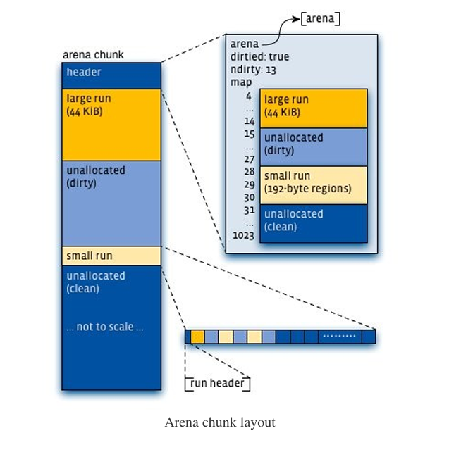
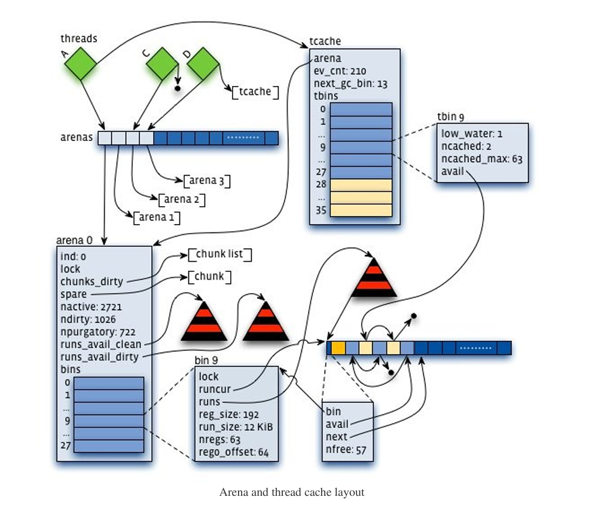

# Scalable memory allocation using jemalloc(使用jemalloc的可拓展内存分配)

##### 作者： Jason Evans <jasone@FreeBSD.org> Monday, January 3, 2011

#####
The Facebook website comprises a diverse set of server applications, most of which run on dedicated machines with 8+ CPU cores and 8+ GiB of RAM. 
These applications typically use POSIX threads for concurrent computations, with the goal of maximizing throughput by fully utilizing the CPUs and RAM. 
This environment poses some serious challenges for memory allocation, in particular:
#####
* Allocation and deallocation must be fast. Ideally, little memory allocation would be required in an application's steady state, 
  but this is far from reality for large dynamic data structures based on dynamic input. 
  Even modest allocator improvements can have a major impact on throughput.
* The relation between active memory and RAM usage must be consistent. In other words, practical bounds on allocator-induced fragmentation are critical. 
  Consider that if fragmentation causes RAM usage to increase by 1 GiB per day, an application that is designed to leave only a little head room will fail within days.
* Memory heap profiling is a critical operational aid. If all goes according to plan, leak detection and removal is a development task. 
  But even then, dynamic input can cause unexpected memory usage spikes that can only be characterized by analyzing behavior under production loads.
#####
In 2009, existing memory allocators met at most two of these three requirements, so we added heap profiling to jemalloc and made many optimizations, such that jemalloc is now strong on all three counts.  
The remainder of this post surveys jemalloc's core algorithms and data structures before detailing numerous Facebook-motivated enhancements, 
followed by a real-world benchmark that compares six memory allocators under a production Web server load.

### Core algorithms and data structures
The C and C++ programming languages rely on a very basic untyped allocator API that consists primarily of five functions: malloc(), posix_memalign(), calloc(), realloc(), andfree().   
Many malloc implementations also provide rudimentary introspection capabilities, likemalloc_usable_size().   
While the API is simple, high concurrent throughput and fragmentation avoidance require considerable internal complexity.   
jemalloc combines a few original ideas with a rather larger set of ideas that were first validated in other allocators.   
Following is a mix of those ideas and allocation philosophy, which combined to form jemalloc.  
#####
* Segregate small objects according to size class, and **prefer low addresses during re-use**. This layout
  policy originated in phkmalloc , and is the key to jemalloc's predictable low fragmentation behavior.
* **Carefully choose size classes** (somewhat inspired by Vam). If size classes are spaced far apart, objects will tend to have excessive unusable trailing space (internal fragmentation).  
  As the size class count increases, there will tend to be a corresponding increase in unused memory dedicated to object sizes that are currently underutilized (external fragmentation).
* **Impose tight limits on allocator metadata overhead**. Ignoring fragmentation, jemalloc limits metadata to less than 2% of total memory usage, for all size classes.
* **Minimize the active page set**. Operating system kernels manage virtual memory in terms of pages (usually 4 KiB per page), so it is important to concentrate all data into as few pages as possible. 
  phkmalloc validated this tenet, at a time when applications routinely contended with active pages being swapped out to hard disk, though it remains important in the modern context of avoiding swapping altogether.
* **Minimize lock contention**. jemalloc's independent arenas were inspired by lkmalloc, but as time went on, tcmalloc made it abundantly clear that it's even better to avoid synchronization altogether, 
  so jemalloc also implements thread-specific caching.
* **If it isn't general purpose, it isn't good enough**. When jemalloc was first incorporated into FreeBSD, 
  it had serious fragmentation issues for some applications, and the suggestion was put forth to include multiple allocators in the operating system,
  the notion being that developers would be empowered to make informed choices based on application characteristics. 
  The correct solution was to dramatically simplify jemalloc's layout algorithms, in order to improve both performance and predictability. 
  Over the past year, this philosophy has motivated numerous major performance improvements in jemalloc, and it will continue to guide development as weaknesses are discovered

#####
Jemalloc implements three main size class categories as follows (assuming default configuration on a 64-bit system):
* **Small**: [8], [16, 32, 48, ..., 128], [192, 256, 320, ..., 512], [768, 1024, 1280, ..., 3840]
* **Large**: [4 KiB, 8 KiB, 12 KiB, ..., 4072 KiB]
* **Huge**: [4 MiB, 8 MiB, 12 MiB, …]

#####
Virtual memory is logically partitioned into chunks of size 2k (4 MiB by default). As a result, it is possible to find allocator metadata for small/large objects (interior pointers) in constant time via pointer manipulations, 
and to look up metadata for huge objects (chunk-aligned) in logarithmic time via a global red-black tree.

#####
Application threads are assigned arenas in round-robin fashion upon first allocating a small/large object.
Arenas are completely independent of each other. They maintain their own chunks, from which they carve page runs for small/large objects. 
Freed memory is always returned to the arena from which it came, regardless of which thread performs the deallocation.

#####

#####
Each arena chunk contains metadata (primarily a page map), followed by one or more page runs.
Small objects are grouped together, with additional metadata at the start of each page run, 
whereas large objects are independent of each other, and their metadata reside entirely in the arena chunk header.
Each arena tracks non-full small object page runs via red-black trees (one for each size class), 
and always services allocation requests using the non-full run with the lowest address for that size class.
Each arena tracks available page runs via two red-black trees — one for clean/untouched page runs, and one for dirty/touched page runs. 
Page runs are preferentially allocated from the dirty tree, using lowest best fit.

#####

#####
Each thread maintains a cache of small objects, as well as large objects up to a limited size (32 KiB by default).
Thus, the vast majority of allocation requests first check for a cached available object before accessing an arena.
Allocation via a thread cache requires no locking whatsoever, whereas allocation via an arena requires locking an arena bin (one per small size class) and/or the arena as a whole.

#####
The main goal of thread caches is to reduce the volume of synchronization events.
Therefore, the maximum number of cached objects for each size class is capped at a level that allows for a 10-100X synchronization reduction in practice. 
Higher caching limits would further speed up allocation for some applications, but at an unacceptable fragmentation cost in the general case. 
To further limit fragmentation, thread caches perform incremental "garbage collection" (GC), where time is measured in terms of allocation requests.
Cached objects that go unused for one or more GC passes are progressively flushed to their respective arenas using an exponential decay approach.

#####