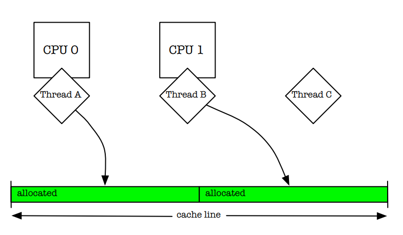
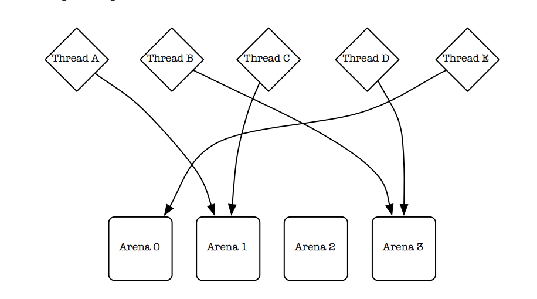
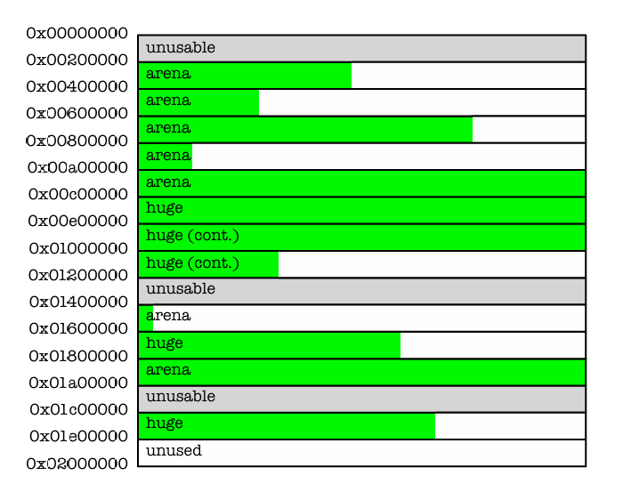
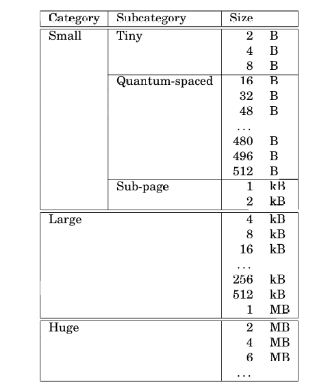
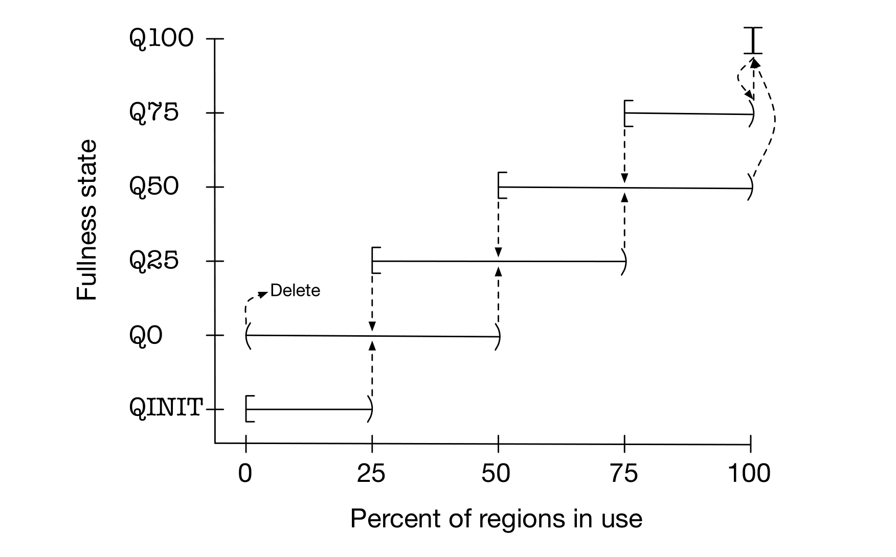
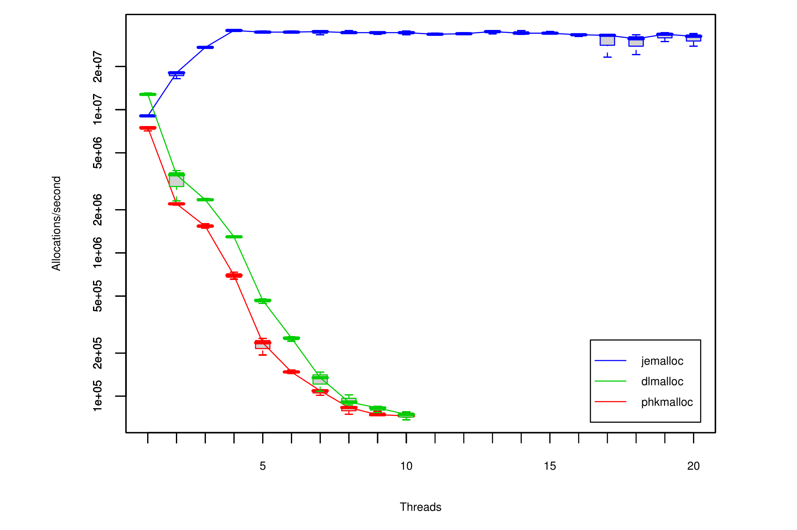
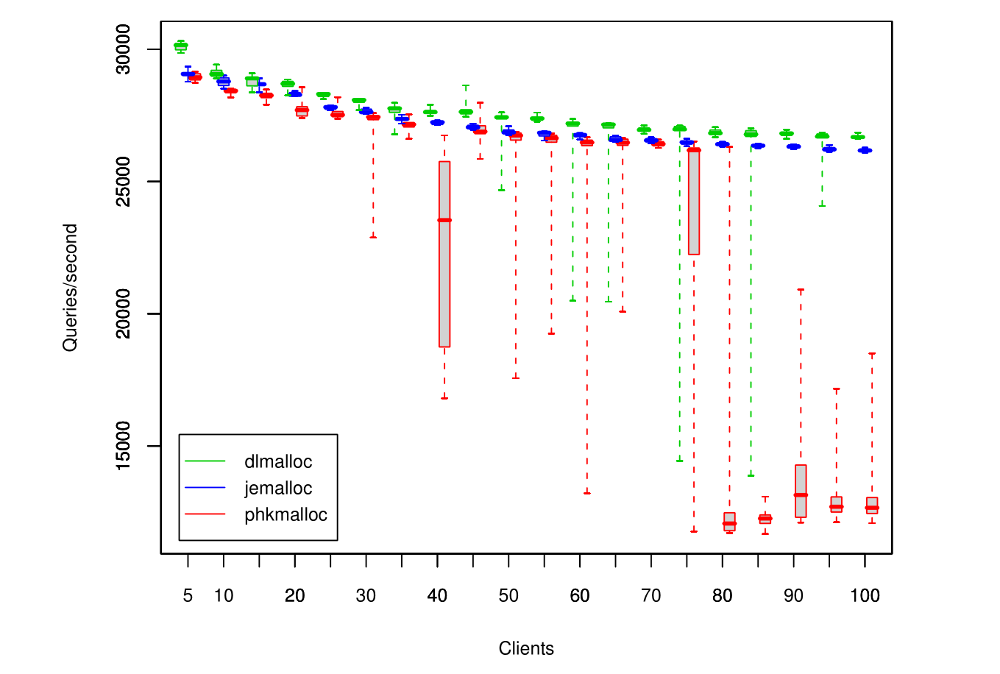
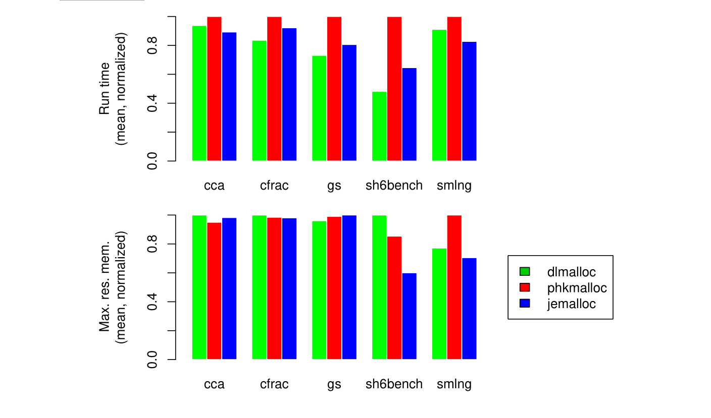
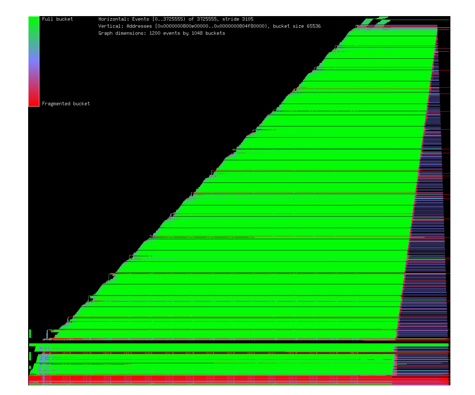

# AScalable Concurrent malloc(3) Implementation for FreeBSD (基于FreeBSD的可伸缩的并发malloc(3)实现)

##### 作者：Jason Evans <jasone@FreeBSD.org>  April 16, 2006

### Abstract（摘要）
#####
The FreeBSD project has been engaged in ongoing work to provide scalable support for multi-processor computer systems since version 5.   
Sufficient progress has been made that the C library’s malloc(3) memory allocator 
is now a potential bottleneck for multi-threaded applications running on multi processor systems.   
In this paper, I present a new memory allocator that builds on the state of the art to provide scalable concurrent allocation for applications.  
Benchmarks indicate that with this allocator, memory allocation for multi-threaded applications scales well as the number of processors increases. 
At the same time, single-threaded allocation performance is similar to the previous allocator implementation.
#####
FreeBSD项目自第5版以来一直致力于为多处理器的计算机硬件系统提供可拓展的支持。(备注：这里的可拓展性可以理解为规模变大的情况下性能没有明显下降，下同)  
对于在多处理器系统中运行的多线程应用程序,在经过各方面的优化后，目前C库中的malloc(3)内存分配器已成为了一个潜在的性能瓶颈。  
在本论文中，我将展示一种新的内存分配器，其基于当前最先进的技术，旨在为应用程序提供可拓展的并发内存分配能力。  
基准测试中显示，使用了此分配器后，随着处理器数量的增加，多线程应用的内存分配性能具有更好的伸缩性。同时，单线程环境下的性能也与之前的分配器实现差不多。  

### Introduction（介绍）
#####
FreeBSD’s previous malloc(3) implementation by Kamp (1998), commonly referred to as phkmalloc, has long been considered one of the best available,   
and has fared well in published comparisons (Feng and Berger, 2005; Berger et al., 2000; Bohra and Gabber, 2001).   
However, it was designed at a time when multi-processor systems were rare, and support for multi-threading was spotty.   
The FreeBSD project is engaged in an ongoing effort to provide scalable performance on SMP systems,   
and has made sufficient progress that malloc(3) had become a scalability bottleneck for some multi-threaded applications.   
This paper presents a new malloc(3) implementation, informally referred to here as jemalloc.  
#####
FreeBSD之前的malloc(3)实现的作者是Kamp(1998)，通常将被称为phkmalloc，长期以来一直被认为是最优秀的内存分配器之一，并且其在已经发表的对比中成绩优异 (Feng and Berger, 2005; Berger et al., 2000; Bohra and Gabber, 2001)。   
然而，它是在多处理器系统还比较少见，并且对多线程支持不够完善的时代被设计出来的。  
FreeBSD项目致力于为对称多处理器系统(SMP Symmetric Multi-Processing)提供可拓展性，并已取得了长足的进展，以至于当前的malloc(3)已成为某些多线程应用程序其可扩展性的瓶颈。    
这篇博客带来了一个新的malloc(3)实现，在这里非正式的将其称为jemalloc。  

#####
On the surface, memory allocation and deallocation appears to be a simple problem   
that merely requires a bit of bookkeeping in order to keep track of in-use versus available memory.   
However, decades of research and scores of allocator implementations have failed to produce a clearly superior allocator.  
In fact, the best known practices for measuring allocator performance are remarkably simplistic, as are the summary statistics for measured performance.   
Wilson et al. (1995) provide an excellent review of the state of the art as of a decade ago.   
Multi-processors were not a significant issue then, but otherwise the review provides a thorough summary of the issues that face modern allocators.   
Following are brief mentions of various issues that particularly impact jemalloc,   
but no attempt is made to discuss all of the issues that must be considered when designing an allocator.  
#####
从表面上看，内存的分配和释放似乎是一个简单的问题，其仅仅需要进行一些记录以追踪使用中的和可用的内存。  
然而，在数十年的研究中，众多的分配器实现中并没有产生一个相比其它实现有着明显优势的分配器。  
事实上，衡量分配器性能的最佳实践极为简单，测量性能的统计指标也同样简单。  
Wilson等人(于1995年)对十年前的技术进行了精彩的报告。  
在当时，多处理器并不是一个值得注意的问题，但除此之外，该报告全面总结了现代的分配器所面临的问题。  
以下简要提及了对jemelloc有重大影响的问题，但并不试图全面的讨论在设计分配器时所要考虑的所有问题。  

#####
Allocator performance is typically measured via some combination of application execution time and average or peak application memory usage.   
It is not sufficient to measure the time consumed by the allocator code in isolation.  
Memory layout can have a significant impact on how quickly the rest of the application runs, due to the effects of CPU cache, RAM, and virtual memory paging.   
It is now commonly accepted that synthetic traces are not even adequate for measuring the effects of allocation policy on fragmentation (Wilson et al., 1995).   
The only definitive measures of allocator performance are attained by measuring the execution time and memory usage of real applications.   
This poses challenges when qualifying the performance characteristics of allocators.   
Consider that an allocator might perform very poorly for certain allocation patterns, but if none of the benchmarked applications manifest any such patterns,   
then the allocator may appear to perform well, despite pathological performance for some work loads.   
This makes testing with a wide variety of applications important.   
It also motivates an approach to allocator design that minimizes the number and severity of degenerate edge cases.  
#####
分配器的性能通常由应用程序的执行时间和应用程序内存使用率的平均值或峰值的某种组合来测量。  
单纯的仅测量分配器代码的执行时间是不够的。  
内存布局对应用程序其余部分的运行速度有着显著的影响，这是因为受到了CPU高速缓存，RAM以及虚拟内存分页的影响。  
目前普遍认为人工生成的内存追踪序列(synthetic traces)甚至不足以衡量内存分配策略对碎片化的影响(Wilson et al., 1995)。  
衡量分配器性能唯一权威的方法就是测量真实运行的应用程序性的实际执行时间和内存使用情况。  
这也为准确评估分配器的性能特征带来了挑战。  
需要考虑到内存分配器的性能可能在某种特定分配模式下表现的很差，但如果在基准测试应用中并未出现过这种模式，那么这个分配器尽管实际上在一些工作负载模式下有着严重的性能缺陷，其表面上的测试结果依然很好。  
因此，使用多种多样的应用程序来进行测试是很重要的。  
这也促使我们在分配器设计时尽量减少异常极端场景的数量，并在极端场景下尽量减轻其对性能的影响。  

#####
Fragmentation can be thought of in terms of internal fragmentation and external fragmentation.  
Internal fragmentation is a measure of wasted space that is associated with individual allocations, due to unusable leading or trailing space.   
External fragmentation is a measure of space that is physically backed by the virtual memory system, yet is not being directly used by the application.  
These two types of fragmentation have distinct characteristic impacts on performance, depending on application behavior.   
Ideally, both types of fragmentation would be minimal, but allocators have to make some tradeoffs that impact how much of each type of fragmentation occurs.  

#####
内存碎片化可以从内部碎片和外部碎片两个方面来理解。  
内部碎片是衡量单次内存分配中由于不可用的头部或尾部空间导致的、被浪费掉的空间的指标。  
外部碎片是衡量已经被虚拟内存系统实际分配，但却并未被应用程序直接使用的空间的指标。  
这两类碎片对性能有着不同特征的影响，其取决于应用程序的行为。  
理想情况下，这两种内存碎片都应该尽可能的少，但(真实场景下)内存分配器必须进行权衡，而这将影响到每种碎片产生的严重程度。  

#####
RAM has become dramatically cheaper and more plentiful over the past decade, so whereas phk malloc was specially optimized to minimize the working set of pages,   
jemalloc must be more concerned with cache locality, and by extension, the working set of CPU cache lines.   
Paging still has the potential to cause dramatic performance degradation (and jemalloc doesn’t ignore this issue),  
but the more common problem now is that fetching data from RAM involves huge latencies relative to the performance of the CPU.  

#####
在过去的十年中，RAM正变得越来越便宜，鉴于phk内存分配器对于最小工作集进行了特别的优化(备注：尽量避免缺页中断，将内存页从磁盘中换出)，  
jemalloc必须更多的考虑缓存的局部性，进而针对CPU高速缓存行的工作集进行优化。  
虽然分页机制下(缺页中断)仍然可能造成性能断崖式的下降(jemalloc并没有忽视这一问题)，但现在更普遍的问题是相比于目前CPU的执行速度，CPU从RAM中获取数据有着巨大的延迟。  

#####
An allocator that uses less memory than another does not necessarily exhibit better cache locality,  
since if the application’s working set does not fit in cache, performance will improve if the working set is tightly packed in memory.   
Objects that are allocated close together in time tend also to be used together,  
so if the allocator can allocate objects contiguously, there is the potential for locality improvement.   
In practice, total memory usage is a reasonable proxy for cache locality;   
jemalloc first tries to minimize memory usage, and tries to allocate contiguously only when it doesn’t conflict with the first goal.  

#####
一个使用更少内存的分配器并不一定比其它分配器展现出更好的CPU缓存局部性，因为如果应用程序的工作集无法完整的放入CPU缓存，那么将工作集紧凑的放在内存中反而能提高性能。    
在相近的时间内一起分配的对象通常也会一起被使用，如果分配器能够连续的分配对象，那将可能提高(CPU缓存的)局部性。    
在实践中，总的内存使用率是一个合理的衡量CPU缓存局部性的间接指标; jemalloc将减少内存使用率作为首要目标，同时仅在不与首要目标冲突时，试图进行连续的分配。   

#####
Modern multi-processor systems preserve a coherent view of memory on a per-cache-line basis.   
If two threads are simultaneously running on separate processors and manipulating separate objects that are in the same cache line,   
then the processors must arbitrate ownership of the cache line (Figure 1).  
This false cache line sharing can cause serious performance degradation.   
One way of fixing this issue is to pad allocations, but padding is in direct opposition to the goal of packing objects as tightly as possible;  
it can cause severe internal fragmentation.   
jemalloc instead relies on multiple allocation arenas to reduce the problem,   
and leaves it up to the application writer to pad allocations in order to avoid false cache line sharing in performance-critical code,   
or in code where one thread allocates objects and hands them off to multiple other threads.  

#####
现代的多处理器系统提供了一个基于缓存行的一致性内存视图。   
如果两个运行在不同处理器上的线程其同时操作位于同一缓存行上的不同对象，那么处理器必须仲裁该缓存行的所有权(如图1所示)。  
这种缓存行的伪共享会造成性能严重的下降。  
解决这种问题的一种方法是缓存行填充，但填充与尽可能的紧密打包对象这一目标产生了直接的冲突，他可能会产生大量的内部碎片。  
jemalloc依赖于多分配区域(multiple allocation arenas)来减轻该问题，  
并将决定是否填充分配的责任留给应用程序的作者以避免在性能至关重要的代码(performance-critical code)中出现伪共享问题,  
或者在某一个线程分配对象并将其传递给多个其它线程的代码中避免该问题。  

##### 图1

#####
One of the main goals for this allocator was to reduce lock contention for multi-threaded applications running on multi-processor systems.   
Larson and Krishnan (1998) did an excellent job of presenting and testing strategies.   
They tried pushing locks down in their allocator, so that rather than using a single allocator lock, each free list had its own lock.  
This helped some, but did not scale adequately, despite minimal lock contention.   
They attributed this to “cache sloshing” – the quick migration of cached data among processors during the manipulation of allocator data structures.  
Their solution was to use multiple arenas for allocation, and assign threads to arenas via hashing of the thread identifiers(Figure 2).   
This works quite well, and has since been used by other implementations (Berger et al.,2000; Bonwick and Adams, 2001).   
jemalloc uses multiple arenas, but uses a more reliable mechanism than hashing for assignment of threads to arenas.  

#####
jemelloc分配器的一个主要的目标是减少在多处理器系统上的多线程应用程序的锁竞争。  
Larson and Krishnan (1998) 在提出(锁竞争)议题以及对其进行的测试工作中做的非常出色。  
他们试图减少他们分配器中的锁的粒度，其不再使用单一的分配器锁，而是为每一个空闲列表(free list)分配一把锁。  
这一做法有一定的作用，尽管其最小化了锁竞争，但其没有足够的可拓展性。(备注：难以在更多的线程和处理器后保持性能的稳定)   
他们将其归因于“缓存抖动”(cache sloshing)——即在操作分配器的数据结构时，被CPU缓存的数据在多个处理器中快速的迁移的现象。  
他们的解决方案是使用多个分配区域，并基于线程标识符的哈希值将线程分配到不同的区域中(如图2所示)。  
这一方案效果非常好，并且已经被其他实现所采用(Berger et al.,2000; Bonwick and Adams, 2001)。  
jemalloc同样采用了多区域的机制，但在将线程分配给不同的区域时，使用了一种比基于hash分配更可靠的机制。  

##### 图2

#####
Larson and Krishnan (1998) hash thread identifiers in order to permanently assign threads to arenas.   
This is a pseudo-random process, so there is no guarantee that arenas will be equally utilized.  
#####
Larson 和 Krishnan（1998）通过对线程标识符进行哈希运算，将线程永久分配到不同的分配区域（arenas）。  
这是一个伪随机过程，因此无法保证各个区域会被均匀利用。  

#####
The rest of this paper describes the primary jemalloc algorithms and data structures,   
presents benchmarks that measure performance and scalability of multi-threaded applications on a multiprocessor system,   
as well as performance and memory usage of single-threaded applications, and discusses measurement of memory fragmentation.  

#####
本文的剩余部分将主要讨论jemalloc的算法和数据结构，展现jemalloc在多处理器系统中多线程应用程序的基准测试性能和可拓展性，  
以及其在单线程应用程序的性能和内存使用率，并探讨内存碎片化的测量方法。  

### Algorithms and data structures(算法和数据结构）
#####
FreeBSD supports run-time configuration of the allocator via the /etc/malloc.conf symbolic link,  
the MALLOC OPTIONS environment variable, or the malloc options global variable.   
This provides for a low-overhead, non-intrusive configuration mechanism, which is useful both for debugging and performance tuning.   
jemalloc uses this mechanism to support the various debugging options that phkmalloc supported,   
as well as to expose various performance-related parameters.  

#####
FreeBSD支持通过/etc/malloc.conf符号链接，MALLOC OPTIONS环境变量或者malloc全局变量选项在运行时配置所要启用的分配器。   
这提供了一种低开销，非侵入式的配置机制，对debug调试和性能调优都很有用。  
jemalloc使用这一机制既支持了phkmalloc已有的多种debug调试选项，也开放了一系列与性能相关的参数配置。   

#####
Each application is configured at run-time to have a fixed number of arenas.   
By default, the number of arenas depends on the number of processors:   

**Single processor:** Use one arena for all allocations. There is no point in using multiple arenas,   
  since contention within the allocator can only occur if a thread is preempted during allocation.  
**Multiple processors:** Use four times as many arenas as there are processors. By assigning threads   
to a set of arenas, the probability of a single arena being used concurrently decreases.   

The first time that a thread allocates or deallocates memory, it is assigned to an arena.  
Rather than hashing the thread’s unique identifier, the arena is chosen in round-robin fashion,   
such that arenas are guaranteed to all have had approximately the same number of threads assigned to them.  
Reliable pseudo-random hashing of thread identifiers (in practice, the identifiers are pointers) is notoriously difficult,  
which is what eventually motivated this approach.   
It is still possible for threads to contend with each other for a particular arena, but on average,   
it is not possible to do initial assignments any better than round-robin assignment.   
Dynamic re-balancing could potentially decrease contention, but the necessary bookkeeping would be costly,   
and would rarely be sufficiently beneficial to warrant the overhead.  

#####
每个应用程序会在运行时配置有固定数量的区域(Arena)。  
默认情况下，arena的数量取决于处理器的数量：  

**单处理器：** 所有的应用程序都使用一个arena。使用多个arena毫无意义，因为分配器内部的竞争仅仅出现在分配内存的过程中线程被抢占的时候。  
**多处理器：** 使用的arena的数量是处理器数量的4倍。通过将线程分配到一个arena集合上，将降低单个arena被并发使用的可能性。  
  
线程首次分配或释放内存时，会被分配到一个arena中。   
内存区域的选择使用round-robin的方式，而不是基于内存唯一标识符的哈希值决定，从而确保所有arena所分配到的线程数量大致相同。  
对线程标识符进行伪随机的哈希(在实践中，标识符是指针)是出了名的困难，这促使我们最终使用基于round-robin的分配方法。    
当前的分配方法依然会让不同的线程在一个特定的arena上产生竞争，但总体而言，在初始的分配阶段中，没有比round-robin更好的分配方式了。   
动态的重平衡或许能较少竞争，但其必要的元数据记录、追踪(bookkeeping)开销很大，其带来的收益不足以抵消其产生的额外开销。  

#####
Thread-local storage(TLS) is important to the efficient implementation of round-robin arena assignment,   
since each thread’s arena assignment needs to be stored somewhere.   
Non-PIC code and some architectures do not support TLS, so in those cases, the allocator uses thread identifier hashing.   
The thread-specific data(TSD) mechanism that is provided by the pthreads library(Butenhof, 1997) would be a viable alternative to TLS,  
except that FreeBSD’s pthreads implementation allocates memory internally, which would cause infinite recursion if TSD were used by the allocator.  

#####
线程本地存储(TLS)对于实现高效的round-robin arena分配至关重要，因为每一个线程所分配到的arena需要被存储到某个地方。  
非位置独立的(Non-PIC)代码和一些架构不支持线程本地存储，因此在这种情况下，jemalloc分配器基于线程标识符的哈希值来分配arena。  
由pthread库(Butenhof, 1997)所提供的线程私有数据(thread-specific data TSD)的机制本可作为TLS的替代方案，  
但FreeBSD的pthreads实现内部会进行自动的内存分配，如果分配器使用了TSD则将会导致无限的递归。(备注：pthread和jemalloc分配器互相依赖了)  

#####
All memory that is requested from the kernel via sbrk(2) or mmap(2) is managed in multiples of the “chunk” size,  
such that the base addresses of the chunks are always multiples of the chunk size(Figure3).  
This chunk alignment of chunks allows constant-time calculation of the chunk that is associated with an allocation.  
Chunks are usually managed by particular arenas,and observing those associations is critical to correct function of the allocator.  
The chunk size is 2MB by default.  

#####
所有通过内核的sbrk(2)或者mmap(2)申请的内存均以“chunk”大小的整数倍来管理。这使得所有内存chunk块的基地址总是chunk大小的整数倍。(如图3所示)    
这些chunk内存块按照chunk大小的维度进行对齐，使得与某个chunk相关联的chunk块可以在分配时在常数时间内被计算出来。  
chunk通常用特定的arena管理，而维护这些chunk块的关联关系对于分配器的正常工作非常重要。chunk的大小默认是2MB。  

#####
Figure3：Chunks are always the same size,and start at chunk-aligned addresses.   
Arenas carve chunks into smaller allocations, but huge allocations are directly backed by one or more contiguous chunks.  
#####
图3：Chunk都有着固定的大小，并且以chunk维度进行地址对齐。   
Arena会将chunk分割为更小的分配单元，但huge级别的内存分配将直接以一个或多个连续的chunk来支持。  

#####
Allocation size classes fall into three major categories: small, large, and huge.  
All allocation requests are rounded up to the nearest size class boundary.   
Huge allocations are larger than half of a chunk, and are directly backed by dedicated chunks.  
Metadata about huge allocations are stored in a single red-black tree.  
Since most applications create few if any huge allocations, using a single tree is not a scalability issue.  

#####
内存分配的大小(size)主要分为三种类别：小型(small),大型(large)，以及巨型(huge)。  
所有的内存分配请求(的大小)都会向上取整到最接近的size类型的边界。  
huge类型的分配其大小超过了chunk大小的一半，并且直接由专用的chunk来支持。  
huge类型分配的元数据被存储在一个红黑树中。  
由于大多数应用极少，甚至不会进行任何的huge类型的分配，使用单个红黑树并不会出现可拓展性的问题。  

#####
For small and large allocations, chunks are carved into page runs using the binary buddy algorithm.  
Runs can be repeatedly split in half to as small as one page, but can only be coalesced in ways that reverse the splitting process.  
Information about the states of the runs is stored as a page map at the beginning of each chunk.  
By storing this information separately from the runs, pages are only ever touched if they are used.   
This also enables the dedication of runs to large allocations, which are larger than half of a page, but no larger than half of a chunk.  

#####
对于small和large类型的分配，chunk将通过二进制伙伴(binary buddy)算法被切割为页面(page)。  
连续的page可以不断的被一分为二，直到被分割为最小规格的page，但page的合并只能按照拆分时的逆过程进行。  
关于连续页块的状态以页表(page map)的形式存储在每一个chunk的起始位置。  
通过将这些连续page的信息与page本身分开存储，page将只在真正被使用时才会被访问。  
这种设计也能够使得连续的页用于large类型的分配，这种分配的请求大于半页(half of a page),但是不超过chunk的一半。  

#####
Small allocations fall into three subcategories: tiny, quantum-spaced, and sub-page.   
Modern architectures impose alignment constraints on pointers, depending on data type.   
malloc(3) is required to return memory that is suitably aligned for any purpose.   
This worst case alignment requirement is referred to as the quantum size here (typically 16 bytes).   
In practice, power-of-two alignment works for tiny allocations since they are incapable of containing objects that are large enough to require quantum alignment.  
Figure 4 shows the size classes for all allocation sizes.  

#####
small类型的分配进一步分成三种子类型：tiny(微小)，quantum-spaced(量子)和sub-page(子页)。  
现代的架构中基于数据类型对指针施加了关于对齐的约束。  
malloc(3)必须返回正确对齐的内存以适应于任何用途。  
最严格的情况(worst case)下的对齐要求我们称之为量子大小(quantum size)，通常是16字节。  
实际上，二次幂大小的分配适用于tiny类型的分配，因为他们所包含的对象大小不足以达到quantum量子对齐所需的规模。  
图4展示了所有分配大小的类型。  

#####
Figure 4: Default size classes, assuming runtime defaults, 4 kB pages and a 16 byte quantum.  

#####
图4：默认的size类别，假设运行时使用默认配置，那么page的大小是4kB，而量子规模大小为16字节。  

#####
It would be simpler to have no subcategories for small allocations by doing away with the quantum-spaced size classes.  
However, most applications primarily allocate objects that are smaller than 512 bytes,  
and quantum spacing of size classes substantially reduces average internal fragmentation.  
The larger number of size classes can cause increased external fragmentation,   
but in practice, the reduced internal fragmentation usually more than offsets increased external fragmentation.  

#####
通过取消掉量子大小的类型，不再为small设置子类型会更简单。   
然而，大多数应用主要分配的对象都小于512字节，通过按照quantum类型来划分内存能够显著的减少平均内存碎片。    
更多数量的类别会造成外部碎片的增多，但实际上，所减少的内部碎片通常足以抵消增多的外部碎片。   

#####
Small allocations are segregated such that each run manages a single size class.   
A region bitmap is stored at the beginning of each run, which has several advantages over other methods:  
*  The bitmap can be quickly scanned for the first free region, which allows tight packing of in-use regions.  
*  Allocator data and application data are separate. This reduces the likelihood of the application corrupting allocator data.   
   This also potentially increases application data locality, since allocator data are not intermixed with application data.  
*  Tiny regions can be easily supported. This would be more difficult if, for example, a free list were embedded in the free regions.  

#####
small类型的分配通常使用一个连续的内存段来管理某个单独大小的类型。  
每个连续内存段的起始处都有一个用于存储bitmap的区域，相比其它方法有着许多优点：    
* bitmap能够被快速的扫描以找到第一个空闲区域，从而实现已使用区域的紧密排列。   
* 将分配器的数据与应用程序的数据分离。这减少了应用程序破坏分配器数据的可能性。  
  这也可能提高了应用程序数据的局部性，因为分配器的数据没有与应用程序的数据混杂在一起。  
* 能更加简单的支持tiny级别的分区。其它的方式要做到这一点将会更加困难，比如举个例子，在空闲区域中嵌入空闲列表(free list)。  
  
#####
There is one potential issue with run headers: they use space that could otherwise be directly used by the application.   
This could cause significant external fragmentation for size classes that are larger than the run header size.   
In order to limit external fragmentation, multi-page runs are used for all but the smallest size classes.   
As a result, for the largest of the small size classes (usually 2 kB regions), external fragmentation is limited to approximately 3%.  

#####
关于内存段的头部有一个潜在的问题：它们所使用的空间本可以直接的被应用程序所使用。  
当内存段所对应管理的大小类别大于内存段头部(元数据)大小时，将会造成严重的外部碎片问题。  
为了抑制外部碎片问题，除了最小的类别之外，其余大小的类别均使用多页连续内存(multi-page)的方式进行管理。  
因此，对于small类别中最大的规格(通常是2kb的区域)，外部碎片率被限制在3%左右。  

#####
Since each run is limited in how many regions it can manage, there must be provisions for multiple runs of each size class.   
At any given time, there is at most one “current” run for each size class.   
The current run remains current until it either completely fills or completely empties.  
Consider though that it would be possible for a single malloc/free to cause the creation/destruction of a run if there were no hysteresis mechanism.  
To avoid this, runs are categorized according to fullness quartile, and runs in the QINIT category are never destroyed.  
In order for a run to be destroyed, it must first be promoted to a higher fullness category (Figure 5).  

#####
因为每一个内存段可管理的区域是有限的，所以必须为每一个大小类别提供设置多个内存段(multiple runs)的能力。  
在任一时刻，每个大小类别最多只能有一个当前内存段(“current” run)用于分配。  
当前内存段(current run)将一直保持current状态，直到其被完全填满或者被完全清空。  
但需要注意，如果没有磁滞机制(hysteresis mechanism),单次的malloc/free操作就可能造成内存段(run)的创建/销毁。  
为了避免这个问题，内存段会根据使用率划分为4类(备注：每25%区间一个类别，比如25-50，50-75这样)，并且QINIT类别的内存段将永远不会被销毁。  
若要销毁某个内存段，则首先必须将其提升到使用率更高的级别(图5)。  

#####
Fullness categories also provide a mechanism for choosing a new current run from among non-full runs.   
The order of preference is: Q50, Q25, Q0, then Q75. Q75 is the last choice because such runs may be almost completely full;   
routinely choosing such runs can result in rapid turnover for the current run.  

#####

基于使用率的分类也提供了一种机制，用于从非满载的内存段(non-full runs)中选择新的当前内存段(current run)。  
优先级顺序为：Q50(50%-75%使用率)、Q25(25%-50%使用率)、Q0(0%-25%使用率)，最后是Q75(75%-100%使用率)。  
Q75之所以作为末选，是因为此类内存段可能已接近满载；若常规性选择此类段，将导致当前内存段（current run）的频繁切换。  

#####
Figure 5: Runs are categorized according to fullness, and transition between states as fullness increases/decreases past various thresholds.  
Runs start in the QINIT state, and are deleted when they become empty in the Q0 state.  

#####
图5：内存段基于使用率进行分类，并且在使用率增加或减少而跨越不同阈值区间时转换状态。    
内存段初始时是QINIT状态，并在Q0状态下变为完全空闲(become empty)时会才被删除掉。  

### Experiments(实验)
#####
In order to quantify the scalability of jemalloc as compared to phkmalloc,   
I ran two multi-threaded benchmarks and five single-threaded benchmarks on a four-processor system (dual-dual Opteron 275), using FreeBSD-CURRENT/amd64 (April 2006).  
I investigated several other thread-safe allocators before performing the benchmarks,   
but ultimately only included Doug Lea’s dlmalloc, due to various portability issues.   
I modified dlmalloc, version 2.8.3, so that I was able to integrate it into a custom libc that included libc-based spinlock synchronization,   
just as phkmalloc and jemalloc use.   
All benchmarks were invoked using the LD_PRELOAD loader mechanism in order to choose which allocator implementation was used.   
libthr was used rather than libpthread for all benchmarks,   
since there was a thread switching performance issue in libpthread that had not been resolved as of the time this paper was written.  

#####
为了量化jemalloc相较于phkmalloc的可拓展性，我在一台4核处理器系统 (双路双核 Opteron 275)上运行了两个多线程的基准测试以及五个单线程的基准测试，使用的操作系统为FreeBSD-CURRENT/amd64 (April 2006)。  
我曾在进行基准测试之前研究了其它几个线程安全的内存分配器，但由于各种可移植性的问题，最后仅保留了Doug Lea的dlmalloc分配器作为对比对象。  
我修改了2.8.3版本的dlmalloc，使得我能够将其集成到一个自定义的libc中，这个libc包含了基于libc的自旋锁同步机制，其和phkmalloc和jemalloc所使用的一样。  
所有的基准测试都通过LD_PRELOAD加载机制启动，目的是能在启动时选择所使用的分配器实现。  
所有基准测试均使用libthr而不是libpthread线程库，因为在这篇论文编写时，libpthread库中存在的线程切换性能问题尚未得到解决。  

#####
It should be noted that dlmalloc is not intended as a scalable allocator for threaded programs.  
It is included in all benchmarks for completeness, but the primary reason for including it in these experiments was for the single-threaded benchmarks.  

#####
需要注意的是，dlmalloc并不是针对多线程程序设计的具有高可拓展性的分配器。  
出于完整性的考虑，dlmalloc被包含在了所有的基准测试中，但在这些实验中的主要目的还是为了做单线程条件下的基准测试。  

### Multi-threaded benchmarks(多线程基准测试)
##### malloc-test
malloc-test is a microbenchmark that was created by Lever and Boreham (2000) to measure the upper bound on allocator scalability for multi-threaded applications.   
The benchmark executes a tight allocation/deallocation loop in one or more threads.   
On a multi-processor system, allocator throughput will ideally scale linearly as the number of threads increases to match the number of processors,   
then remain constant as the number of threads continues to increase. Figure 6 shows the results.  

#####
malloc-test是一个由Lever和Boreham (2000)开发的一个小型基准测试工具，用于测量内存分配器在多线程应用程序中的可拓展性上限。  
malloc-test的基准测试在一个或多个线程中执行一个紧凑的(备注: 不包含额外逻辑的)分配(allocation)/销毁循环(deallocation)循环。  
在一个多处理器系统中，分配器最理想的吞吐量应该随着线程数的增加而线性的增长，直到线程数与处理器的数量相同，在此之后随着线程数量的继续增加，吞吐量应该保持不变。图6展示了基准测试的结果。  

#####

#####
Figure 6: Allocator throughput, measured in allocations/second, for increasing numbers of threads.   
Each run performs a total of 40,000,000 allocation/deallocation cycles, divided equally among threads, creating one 512-byte object per cycle.   
All configurations are replicated three times, and the results are summarized by box plots,   
where the central lines denote the medians and the whiskers represent the most extreme values measured.  

#####
图6：分配器的随着线程数量增加的吞吐量(以分配次数/每秒进行衡量)。  
每一轮测试总共执行40000000次分配/销毁的循环，将其平均分配给所有的线程，每一轮循环中都创建一个512字节的对象。  
所有的测试均重复运行三次，结果以箱线图形式汇总，图中的中央的粗线(central lines)表示中位数，须线(Whisker)则代表测得的极值。  

#####
phkmalloc and dlmalloc suffer severe performance degradation if more than one thread is used,   
and performance continues to degrade dramatically as the number of threads increases.   
No results are presented for more than ten threads for these allocators, due to to the extremely long run times required.  

#####
当使用了一个以上的线程时，phkmalloc和dlmalloc的性能会严重的下降，并且随着线程数量的增多，性能会持续且显著的恶化。  
这些分配器在超过10个线程以上的结果没有在图中展示出来，因为所需要的运行时间极其的长。  

#####
jemalloc scales almost perfectly up to four threads, then remains relatively constant above four threads, with an interesting exception above sixteen threads.   
jemalloc uses sixteen arenas by default on a four-processor system, so contention is minimal until at least seventeen threads are running.  
Above sixteen threads, some threads contend over arenas, and once the other threads finish,  
those that are contending for arenas exhibit worst case performance until they complete.  

#####
jemalloc在4个线程以内时有着非常完美的拓展性，然后在超过4个线程后保持了一个相对稳定的性能，但在超过16个线程时有一个值得注意的异常。  
jemalloc在4核处理器系统中默认使用了16个arena，所以在线程数少于17个前，线程间的竞争非常的小(minimal)。  
当线程数超过16个时，一些线程会对arena产生竞争，并且一旦其它线程执行完成，这些在arena上竞争的线程将表现出最差的性能，直到它们执行完成。  

### super-smack
#####
The second multi-threaded benchmark uses a database load testing tool called Super Smack (http://vegan.net/tony/supersmack/), version 1.3,   
that runs one or more client threads that access a server — MySQL 5.0.18 in this case.   
Super Smack comes with two pre-configured load tests, and I used one of them (select-key.smack).   
Each run of super-smack performed approximately 200,000 queries, divided equally among client threads.  

#####
第二个多线程基准测试使用的是一个被叫做Super Smack(http://vegan.net/tony/supersmack/)的数据库负载测试工具，所使用的版本是1.3，  
该工具运行一个或多个客户端线程来访问服务器，在本案例中服务器使用的是MySQL 5.0.18。  
Super Smack自带两种预先配置好的负载测试方案，而我选择了其中的一种(select-key.smack)。  
每一轮运行中super-smack会执行大约200000个请求，将其平均的分配给每个客户端线程去执行。  

#####
Results are summarized in Figure 7. When jemalloc is used, performance degrades gracefully as the number of client threads increases,   
and variability is low, especially for worst case performance.  
When phkmalloc is used, median performance is typically about the same as for jemalloc, but worst case performance variability is extreme.   
Additionally, there is a sudden dramatic drop in performance between 75 and 80 client threads.   
dlmalloc performs well on average, but as with phkmalloc, worst case variability is extreme.  

#####
实验的结果汇总在图7中。当jemalloc被使用时，服务器的性能随着客户端线程的增加而平缓的下降，且波动很小，在最坏的情况下性能特别的稳定。    
当phkmalloc被使用时，性能的中位数与jemalloc相差无几，但最坏情况下的性能波动非常大。  
此外，当客户端线程数达到75到80时，(使用phkmalloc的)服务器的性能会突然出现断崖式下跌。  
dlmalloc的平均性能比phkmalloc更好，但在最坏情况下的性能波动也同样非常大。  

#####

#####
Figure 7: MySQL query throughput, measured in queries/second, for increasing numbers of client threads.   
A total of approximately 100,000 queries are performed during each run, divided evenly among client threads.  
All configurations are replicated ten times, and the results are summarized by box plots.  

#####
图7：Mysql的查询吞吐量，qps随着客户端线程数量增加的变化情况。  
在每轮测试中总共执行大约100000次查询，平均分配给各个客户端线程执行。  
所有的测试均重复执行了10次，最终结果通过箱线图的形式汇总。  

### Single-threaded benchmarks(单线程基准测试)
#####
I performed benchmarks of five single-threaded programs. These benchmarks should be taken with a grain of salt in general,   
since I had to search pretty far and wide to find repeatable tests that showed significant run time differences.  
The run times of most real programs simply do not depend significantly on malloc performance.   
Additionally, programs that make heavy use of networks or filesystems tend to be subject to high variability in run times,   
which requires many replicates when assessing significance of results.   
As a result, there is an inherent selection bias here, and these benchmarks should not be interpreted to be representative of any particular class of programs.  

#####
我对5个单线程程序进行了基准测试。这些基准测试的结果总体上需要以保留的态度看待，为了能够找到揭示应用程序在使用不同分配器时运行时间存在较大差异、且可重复的测试程序，我费劲心思的寻找了很长时间。  
大多数的真实应用其花费的运行时间与分配器的性能没太大的关系。  
另外，一些重度依赖网络或文件系统的程序，其运行时间有着较大的波动性，其需要反复的测试以揭示结果中(不同分配器造成的运行时间差异上)的显著性。  
因此，这里有着固有的选择偏差，这些基准测试结果不应被视为适用于所有的应用。  

#####
Figure 8 summarizes the results for the single-threaded benchmarks. More details about the benchmarks follows.  

#####
图8汇总了单线程应用的基准测试结果。关于基准测试的更多细节将在下文展示。  

#####

#####
Figure 8: Scaled run time and maximum resident memory usage for five single-threaded programs.  
Each graph is linearly scaled such that the maximum value is 1.0.  

#####
图8：关于5种单线程程序的标准运行时间和最大的常驻内存使用量。  
每个小图均采用线性缩放，使其最大值为1.0。  

##### cca
cca is a Perl script that makes heavy use of regular expressions to extract cpp logic from C code,  
and generate various statistics and a PostScript graph of the cpp logic.   
For these experiments, I concatenated all .c and .h files from FreeBSD’s libc library, and used the resulting file as input to cca.  
I used version 5.8.8 of Perl from the ports tree, and compiled it to use the system malloc.   
Following is a summary of three replicates (also see Figure 8):  

#####
cca是一个Perl脚本，其大量使用正则表达式以从C程序代码中提取出CPP的逻辑，并生成各种类型的统计数据和一个展示Cpp逻辑的PostScript图表。  
在这项实验中，我将来自FreeBSD的libc库中的所有.c和.h文件合并，并将合并后的文件作为cca的输入。    
我使用了来自ports tree的Perl 5.8.8版本，并将其编译为使用系统的malloc。  
以下是三次重复试验的摘要(也可参见图8):  

#####
| cca                   | dlmalloc              | phkmalloc | jemalloc          |
|-----------------------|-----------------------|-----------|-------------------|
| Run time (mean)       | 72.88 s               | 77.73 s   | 69.37 s           |
| Max. res. mem. (mean) | 11244 kB              | 10681 kB  | 11045 kB          |

##### cfrac
#####
cfrac is a C program that factors large numbers.   
It is included with the Hoard memory allocator(http://www.cs.umass.edu/˜emery/hoard/).   
I used 47582602774358115722167492755475367767 as input.     
Following is a summary of ten replicates (also see Figure 8):  

#####
cfrac是一个用C语言编写的程序，专门用于对大整数进行因数分解。  
该程序由Hoard内存分配器一同提供(http://www.cs.umass.edu/˜emery/hoard/)。  
我使用了47582602774358115722167492755475367767作为输入。  
以下是10测重复试验的结果摘要(也可参见图8):  

#####
| cfrac                 | dlmalloc               | phkmalloc  | jemalloc           |
|-----------------------|------------------------|------------|--------------------|
| Run time (mean)       | 9.57 s                 | 11.45 s    | 10.55 s            |
| Max. res. mem. (mean) | 2105 kB                | 2072 kB    | 2064 kB            |

##### gs
gs (GhostScript) is a PostScript interpreter. I used AFPL GhostScript 8.53 from the ports tree.     
I used a 37 MB input file, and ran gs as:    
**_gs -dBATCH -dNODISPLAY PS3.ps_**    
Following is a summary of three replicates (also see Figure 8):  

#####
gs（GhostScript）是一个PostScript解释器。我使用了来自ports tree的AFPL GhostScript 8.53 版本。  
我使用了一个37MB大小的输入文件，并以下列命令运行gs:    
**_gs -dBATCH -dNODISPLAY PS3.ps_**    
下面是3次重复实验的结果摘要(也可参见图8):  

#####
| gs                    | dlmalloc | phkmalloc  | jemalloc           |
|-----------------------|----------|------------|--------------------|
| Run time (mean)       | 31.06 s  | 42.48 s    | 34.24 s            |
| Max. res. mem. (mean) | 15001 kB | 15464 kB   | 15616 kB           |

#####
gs overwhelmingly allocates either 240-byte objects or large objects, since it uses a custom allocator internally.   
As a result, this benchmark stresses performance of large object allocation.   
phkmalloc appears to suffer system call overhead due to the large memory usage fluctuations,  
whereas the other allocators have more hysteresis built in, which reduces the total number of system calls.   
jemalloc does not perform quite as well as dlmalloc because of the additional overhead of managing runs, as opposed to merely calling mmap().  
#####
gs绝大多数情况下分配的都是240字节的对象或者大对象，因为它使用了自己内部自定义的分配器。  
因此，该基准测试着重考察大对象分配时的性能。  
phkmalloc似乎因为内存使用量的大幅波动而承受了(更大的)系统调用开销，而其它分配器有着更多的滞后机制，所以减少了系统调用的总次数。  
jemelloc的性能比dlmalloc稍差，这是因为jemelloc需要管理连续内存段而有着额外的开销，而dlmalloc只需要调用mmap。  

##### sh6bench
sh6bench is a microbenchmark by MicroQuill, available for download from their website (http://www.microquill.com/).   
This program repeatedly allocates groups of equal-size objects, retaining some portion of the objects from each cycle, and freeing the rest, in various orders.   
The number of objects in each group is larger for small objects than for large objects, so that there is a bias toward allocating small objects.  

#####
sh6bench是由MicroQuill开发的小型基准测试工具，可以从它们的官网上下载(http://www.microquill.com/)。  
该程序在测试中重复的分配相同大小的对象组；在每一轮测试中保留其中一部分对象，并将其余的对象释放掉，释放对象的顺序有很多种，  
每一组中的小对象比大对象的数量要多，因此该测试主要针对小对象的分配。   

#####
I modified sh6bench to call memset() immediately after each malloc() call, in order to assure that all allocated memory was touched.   
For each run, sh6bench was configured to do 2500 iterations, for object sizes ranging from 1 to 1000.   
Following is a summary of ten replicates (also see Figure 8):  

#####
我修改了sh6bench的实现，在每次malloc()调用后立即调用memset()，目的是确保所有分配出来的内存均会被实际的访问。  
每一轮测试中，sh6bench被配置为执行2500次，其中对象的大小在1到1000字节之间。  
下面是10次重复实验的结果摘要(也可参见图8):  

#####
| sh6bench              | dlmalloc  | phkmalloc | jemalloc            |
|-----------------------|-----------|-----------|---------------------|
| Run time (mean)       | 3.35 s    | 6.96 s    | 4.50 s              |
| Max. res. mem. (mean) | 105467 kB | 90047 kB  | 63314 kB            |

#####
The fact that allocations aren’t actually used for anything in this microbenchmark penalizes jemalloc as compared to dlmalloc.   
jemalloc has to touch the per-run region bitmap during every allocation/deallocation, so if the application does not make significant use of the allocation,   
jemalloc suffers decreased cache locality.   
In practice, it is unrealistic to allocate memory and only access it once. jemalloc can actually improve cache locality for the application,   
since its bitmap does not spread out regions like the region headers do for dlmalloc.  

#####
在此微基准测试中，由于分配的内存并未被实际使用，因此jemalloc的性能略逊于dlmalloc。  
jemelloc在每一次分配/释放内存时都必须访问每个区域中的位图元数据，因而如果应用程序没有充分使用所分配的内存，jemelloc的缓存局部性会有所下降。  
实际上，被分配的内存仅仅被访问一次是不现实的。jemalloc实际上可以提升应用程序的缓存局部性，因为它的位图元数据没有像dlmalloc的区域头那样导致内存区域的分散。  

#####
As mentioned in the introduction, synthetic traces are not very useful for measuring allocator performance, and sh6bench is no exception.   
It is difficult to know what to make of the huge differences in memory usage among the three allocators.  

#####
综上所述，内存追踪序列(synthetic traces)对于衡量分配器的性能不是特别的有用，对于sh6bench来说也不例外。  
很难弄清楚导致这三种内存分配器在内存使用量上的巨大差异的原因。  

##### smlng
smlng is an Onyx (http://www.canonware.com/onyx/) program.   
It implements an SML/NG parser and optimizer, for the ICFP 2001 Programming Contest (http://cristal.inria.fr/ICFP2001/prog-contest/).   
I used a single-threaded build of Onyx-5.1.2 for this benchmark.   
For input, I repeatedly concatenated various SML/NG examples and test cases to create a 513 kB file.   
Following is a summary of ten replicates (also see Figure 8):  

#####
smlng是一个基于Onyx(http://www.canonware.com/onyx/)的程序。  
其实现了一个SML/NG解释器和优化器，用于参加ICFP 20001编程大赛(http://cristal.inria.fr/ICFP2001/prog-contest/)。  
我基于Onyx-5.1.2构建了一个单线程版本的smlng，用于本次基准测试。  
我通过重复的拼接多个SML/NG的示例和测试用例生成了一个513KB的文件作为输入。  
下面是10次重复实验的结果摘要(也可参见图8):  

#####
| smlng                 | dlmalloc   | phkmalloc   | jemalloc            |
|-----------------------|------------|-------------|---------------------|
| Run time (mean)       | 12.65 s    | 13.89 s     | 11.49 s             |
| Max. res. mem. (mean) | 71987 kB   | 93320 kB    | 65772 kB            |

#####
jemalloc appears to use less memory than phkmalloc because the predominantly used size classes are not all powers of two: 16, 48, 96, and 288.   
jemalloc also appears to do a good job of recycling regions as memory use fluctuates,   
whereas dlmalloc experiences some external fragmentation due to the allocation pattern.  

#####
jemalloc似乎比phkmalloc使用了更少的内存，因为通常大多数情况下所使用的大小类别并不都是2次幂：例如16, 48, 96, and 288.   
jemelloc也在内存使用量波动时能高效的回收内存区域，而dlmalloc则因为其所使用的特定内存分配模式而遭遇了一些外部碎片的问题。  

### Analysis(分析)

#####
Exhaustive benchmarking of allocators is not feasible, and the benchmark results should not be interpreted as definitive in any sense.   
Allocator performance is highly sensitive to application allocation patterns,   
and it is possible to construct microbenchmarks that show any of the three allocators tested here in either a favorable or unfavorable light, at the benchmarker’s whim.  
I made every attempt to avoid such skewing of results, but my objectivity should not be assumed by the reader.  
That said, the benchmarks should be sufficient to convince the reader of at least the following:  
* jemalloc’s run time performance scales well for multi-threaded programs running on multi-processor systems.  
* jemalloc exhibits similar performance to phkmalloc and dlmalloc for single-threaded programs, both in terms of run time and memory usage.  

#####
对内存分配器进行特别详尽的基准测试是不可行的，并且基准测试的结果在任何情况下都不应该视为决定性的。  
内存分配器的性能对应用程序的分配模式高度敏感，测试者完全可以按照自己的偏好设计微基准测试，以使得本文所提到的三种分配器的测试成绩的好坏符合自身要求。  
我已竭力避免得到有偏差的结果，但读者不应该假定我是足够客观的。  
尽管如此，这些基准测试至少足以让读者确信以下几点：  
* jemelloc在多处理器系统上运行的多线程程序中性能有着很好的拓展性。  
* jemelloc在单线程程序中有着和phkmalloc、dlmalloc非常相近的运行性能和内存使用率。  

#####
In point of fact, jemalloc performed very well for the presented benchmarks,   
and I have found no reasons to suspect that jemalloc would perform substantially worse than phkmalloc or dlmalloc for anything but specially crafted microbenchmarks.  

#####
事实上，jemalloc在基准测试中表现的非常好，  
除了处心积虑设计的(针对jemelloc，令其表现很差的)微基准测试外，没有理由怀疑jemalloc的性能会在正常场景下显著的逊色于phkmalloc或dlmalloc。  

#####
None of the benchmarks were designed to measure performance under memory pressure.  
Such benchmarks would be of interest, but I did not include them here mainly   
because phkmalloc has been shown to perform well under memory pressure (Kamp, 1998; Feng and Berger, 2005),   
and jemalloc uses sufficiently similar algorithms that it should exhibit similar performance.  

#####
所有基准测试在设计时都没有考虑到内存不充足的场景。  
这些基准测试固然有意义，但我没有将其纳入考量主要基于两点，一是研究表明phkmalloc在内存不充足时有着很好的表现(Kamp, 1998; Feng and Berger, 2005),  
二是jemalloc使用了与phkmalloc非常相似的算法，因此其在内存不充足的场景下应该表现出与phkmalloc相似的性能。  

#####
Fragmentation was quite difficult to analyze, since it is mainly a qualitative issue, and standard tools only provide quantitative metrics.   
Maximum resident memory usage results are only moderately useful when analyzing fragmentation,  
since differences between allocators indicate differences in fragmentation at the point of maximum memory utilization.  
Obviously, an allocator could cause much worse data locality for the application without having a substantial impact on maximum resident memory usage.  

#####
关于碎片化的问题之所以难以分析，主要是因为其本质上属于定性问题，而标准的工具只能提供定量的指标。    
在分析碎片化问题时，最大常驻内存使用量只能作为一个适度参考的指标，因为该指标在不同分配器中的差异仅仅表明了内存使用率达到最大值时的碎片化程度的不同。  
显然，一个分配器能够恶化应用数据的局部性，同时不会对最大常驻内存使用量产生重大影响。  

#####
In order to better understand fragmentation, 
I wrote a program that processes kdump(1) output that was generated by using the “U” malloc(3) option in conjunction with ktrace(1).  
An example graph is shown in Figure 9. With this program I was able to observe the effects of various layout policies,   
and as a result jemalloc uses memory much more effectively than in earlier development versions.  

#####
为了更好地理解碎片化问题，我编写了一个程序用于解析使用malloc(3)的"U"选项与ktrace(1)生成的kdump(1)输出结果。  
图9展示了一个示例图表。借助该程序，我能够观察不同内存布局策略的效果，从而令jemalloc在内存的使用上比早期开发的版本更加高效。  

#####
Understanding allocator performance for various allocation patterns is a constant challenge.  
Mechanisms for gaining insight into what the allocator is actually doing are important both during allocator development and application development.   
To this end, jemalloc outputs detailed statistics at exit if optional code is enabled at libc compile time, and if the “P” malloc(3) option is specified.   
Following is output from running the cca benchmark.  
Detailed interpretation is left to the reader who is interested enough to read the allocator source code.   
However, most of the statistics should have obvious meanings after having read this paper.  

#####
理解分配器在不同分配模式下的性能，始终是一个严峻的挑战。  
建立深入观察分配器实际行为的机制，对于分配器与应用程序的开发都非常重要。  
为此，如果在libc编译时启用了设置或者指定了malloc(3)的"P"选项，那么jemalloc会在程序退出时输出详细的统计信息。  
以下是运行cca基准测试的输出。  
更加细致的解读留给对分配器源码有足够兴趣的读者自行完成。  
不过，绝大多数的统计指标在阅读了本文后应该是不言自明的。  

#####

#####

#####
Figure 9: Graph of memory usage on amd64 when running the smlng benchmark.   
Each position along the horizontal axis represents a snapshot of memory at an instant in time,   
where time is discretely measured in terms of allocation events.   
Each position along the vertical axis represents a memory range, and the color indicates what proportion of that memory range is in use.  

#####
图9：在amd64平台上运行smlng基准测试时的内存使用情况图表。  
横坐标上的每个位置对应一个瞬时的内存快照，此处离散的时间单位为分配事件发生的次数。  
纵坐标上的每个位置对应一段内存地址区间，颜色深浅则反映该区间内内存的实际使用比例。  

### Discussion(讨论)
#####
One of the constant frustrations when developing jemalloc was the observation that even seemingly innocuous additional features,   
such as the maintenance of a per-arena counter of total allocated memory, or any division, caused measurable performance degradation.   
The allocator started out with many more features than it ended up with.   
Removed features include:  
*  malloc stats np(). Just adding a per-arena counter of total allocated memory has a measurable performance impact.  
   As a result, all statistics gathering is disabled by default at build time.  
   Since the availability of statistics isn’t a given, a C API isn’t very useful.  
*  Various sanity checks. Even simple checks are costly, so only the absolute minimum checks that are necessary for API compliance are implemented by default.  

#####
在开发jemalloc的过程中，有一个问题持续的困扰着我，即使引入了一些看似对性能无损的额外功能，例如为每个arena维护一个已分配总内存的计数器或是任意的除法操作，都会导致可被观测到的性能下降。  
因此相比于设计之初，jemelloc分配器在最终完成时所保留的特性更少。  
被移除的功能包括：  
* 分配器状态统计api接口 np()。仅仅为每个arena维护一个已分配总内存的计数器就会造成可被观测到的性能下降。  
  因此，在构建时默认会禁用所有统计信息收集的功能。    
  而由于统计数据的可用性无法得到保证，提供一个C语言API的意义并不大。    
* 各种健壮性校验。即便是最简单的校验开销也很大，因此在默认情况下，只有那些确保API被合法使用所必须的最基本校验被保留了下来。  

#####
On a more positive note, the runtime allocator configuration mechanism has proven to be highly flexible, without causing a significant performance impact.  

#####
但是从更积极的角度来看，运行时的分配器配置机制已经被证明具有高度的灵活性，并且没有造成显著的性能影响。  

#####
Allocator design and implementation has strong potential as the subject of career-long obsession, and indeed there are people who focus on this subject.   
Part of the allure is that no allocator is superior for all possible allocation patterns,   
so there is always fine tuning to be done as new software introduces new allocation patterns.   
It is my hope that jemalloc will prove adaptable enough to serve FreeBSD for years to come.   
phkmalloc has served FreeBSD well for over a decade; jemalloc has some big shoes to fill.  

#####
内存分配器的设计与实践极有可能成为开发者需要毕生研究的课题，事实上，确实存在一群聚焦于该课题的群体。    
其吸引力部分来源于这样一个事实：即不存在一种在所有的内存分配模式下都有着明显优势的内存分配器，  
因此当新的软件引入了新的内存分配模式时，总是要对这个新的分配模式进行针对性的优化。    
我希望jemalloc能够展现出足够的适应性，在未来几年持续的为FreeBSD服务。  
phkmalloc已经很好的为FreeBSD服务了十年以上；因此我对jemelloc寄予了厚望。  

### Availability(可用性)
The jemalloc source code is part of FreeBSD’s libc library, and is available under a two-clause BSD-like license.   
Source code for the memory usage graphing program that was used to generate Figure 9 is available upon request, as are the benchmarks.  

#####
jemalloc的源代码已经被纳入了FreeBSD的libc库，并且被允许基于two-clause BSD-like许可证使用。  
生成图9中内存使用率图的程序源代码和其配套的基准测试均可在线下载。  

### Acknowledgments(致谢)
Many people in the FreeBSD community provided valuable help throughout this project, not all of whom are listed here.   
Kris Kennaway performed extensive stability and performance testing for several versions of jemalloc, which uncovered numerous issues.   
Peter Wemm provided optimization expertise.   
Robert Watson provided remote access to a four-processor Opteron system, which was useful during early benchmarking.   
Mike Tancsa donated computer hardware when my personal machine fell victim to an electrostatic shock.   
The FreeBSD Foundation generously funded my travel so that I could present this work at BSDcan 2006.   
Aniruddha Bohra provided data that were used when analyzing fragmentation.   
Poul-Henning Kamp provided review feedback that substantially improved this paper.  
Finally, Rob Braun encouraged me to take on this project, and was supportive throughout.  

###
翻译：略  

### References(引用)
略  

