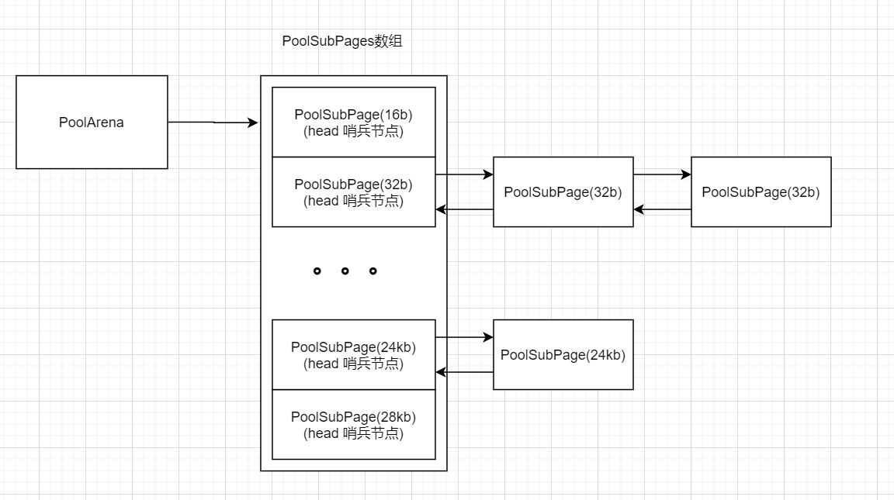

# 从零开始实现简易版Netty(八) MyNetty 实现Small规格的池化内存分配
## 1. Netty Small规格池化内存分配介绍
在上一篇博客中，lab7版本的MyNetty实现了PooledByteBuf对象的池化以及Normal规格的池化内存管理，并结合jemalloc的论文详细分析了其背后的设计理念。  
按照计划，lab8版本的MyNetty需要实现Small规格的内存分配。  
由于本文属于系列博客，读者需要对之前的博客内容有所了解才能更好地理解本文内容。
* lab1版本博客：[从零开始实现简易版Netty(一) MyNetty Reactor模式](https://www.cnblogs.com/xiaoxiongcanguan/p/18939320)
* lab2版本博客：[从零开始实现简易版Netty(二) MyNetty pipeline流水线](https://www.cnblogs.com/xiaoxiongcanguan/p/18964326)
* lab3版本博客：[从零开始实现简易版Netty(三) MyNetty 高效的数据读取实现](https://www.cnblogs.com/xiaoxiongcanguan/p/18979699)
* lab4版本博客：[从零开始实现简易版Netty(四) MyNetty 高效的数据写出实现](https://www.cnblogs.com/xiaoxiongcanguan/p/18992091)
* lab5版本博客：[从零开始实现简易版Netty(五) MyNetty FastThreadLocal实现](https://www.cnblogs.com/xiaoxiongcanguan/p/19005381)
* lab6版本博客：[从零开始实现简易版Netty(六) MyNetty ByteBuf实现](https://www.cnblogs.com/xiaoxiongcanguan/p/19029215)
* lab7版本博客：[从零开始实现简易版Netty(七) MyNetty 实现Normal规格的池化内存分配](https://www.cnblogs.com/xiaoxiongcanguan/p/19084677)
#####
在lab7的博客中提到，Netty中Normal规格的池化内存分配是参考自操作系统内核的伙伴算法实现的。  
通过将内存块视为一批大小相同的页，在分配时按照所申请的大小将多个连续的内存页逻辑上组合成一个内存段以满足需求，并在回收时尽可能的将此前因为分配而被切割的、彼此直接相邻的小内存段合并为更大、更完整的内存段。  
### Small规格的内存分配，使用伙伴算法是否合适？
在开始分析Small规格池化内存分配的实现细节之前，先思考一个问题：对于Small规格的内存分配，继续延用伙伴算法是否合适？伙伴算法的优缺点是什么呢？ 
##### 伙伴算法的优缺点
* 优点：以页为基础单位进行分配，相比于实际所申请的大小(规范化之前的大小)，对于Normal规格中较小级别的申请所浪费的内部碎片，最多不会超过1页(比如极端情况实际申请3页+1b，最终分配4页)。而对于Normal规格中较大规格的申请(比如2MB+1b)，平均所浪费的内部碎片占所申请的大小比例依然较小。  
* 缺点：分配时对连续内存段的拆分以及释放时对连续内存段的合并操作，逻辑较为复杂，存在一定的时间开销和锁同步开销。同时，runAvail数组等维护信息的元数据占用了一定的空间，产生了一些外部碎片。  
##### 使用伙伴算法实现Small规格内存分配的缺点
Normal规格的阈值为28Kb，这意味着在绝大多数应用中针对Small规格的内存申请次数会远多于Normal规格。  
如果使用伙伴算法，以16b这一最小分配级别作为管理单元，在面对高出几个数量级的分配/回收申请下，对连续内存段的拆分以及合并操作的开销对吞吐量的影响会被指数级放大。  
同时，runAvail数组等元数据也会因为Small规格的大小排布过密，相比Normal规格，所占用的空间也会异常的多。  
于此同时，使用伙伴算法实现28KB以下，且大多数都是16b、32b这种极小级别的内存申请，其节约的内部碎片也小的可怜(实际申请17b，最终分配32b，在最极端的情况下最多也就节约15b的内部空间)。
#####
可以发现，如果使用伙伴算法实现Small规格的内存分配，其性能开销、锁的同步开销都大的惊人，同时对于单次分配所节约出来的内部碎片，甚至不足以抵消其对应追踪元数据所额外占用的空间。  
因此Netty参考操作系统内核，针对申请的容量相对更小、申请更加频繁的Small规格池化内存分配，不使用伙伴算法，而是在Normal规格分配能力的基础上采用slab算法实现Small规格的池化内存分配管理功能。

## 2. MyNetty Small规格池化内存分配实现
下面我们开始分析Netty的Small规格池化内存分配的实现原理。
### 2.1 Slab算法介绍
slab算法是操作系统内核中专门用于小对象内存分配的算法。slab算法最核心的设计思想是内存对象池。  
* slab为具有相同大小的内存块对象预先创建对应的对象池，对象池通常由伙伴算法中所管理的连续内存页段组成。与伙伴算法中将Chunk切割为一个个相同的页类似，对象池将底层的连续内存段切割为N个相同大小的对象槽以供分配。  
* 当申请对应大小的内存进行分配时，直接将对象池中的某一个槽对应的内存分配出去，并在元数据中将对应的槽从空闲状态标记为已使用；而在回收内存时，则简单的将之前所分配出去的对象槽还原为空闲态。  
  就像一个装网球的盒子，里面有N个网球整齐的排布，当用户想要用球时(分配内存)，就从盒子中拿一个分配给用户，当用户使用完后(释放内存)，就放回到之前对应的格子中(不能错放)。
* 一个对象池能够缓存的对象数量是有限的，因此用于某一特定大小级别的对象池可以有多个。对象池有三种状态，完全空闲(装满了网球的盒子)，部分空闲(部分网球已被分配的盒子)和已满(空盒子)。    
  申请内存分配时，优先从部分空闲状态的slab对象池中分配；并且在内存吃紧时自动的回收掉完全空闲，无人使用的对象池。随着slab对象的不断申请和回收，对象池也会在这几种状态中不断地变化。
#####

#####
相比伙伴算法，slab算法的优缺点同样明显。  
* 优点：进行内存的分配与释放时，无需考虑内存块的拆分与拼接，直接修改对应槽的状态即可，时间性能非常好，修改元数据时需要防并发处理的临界区也很小。  
  因为对象槽的大小与对应的申请的规格完全匹配，不会出现因为空闲内存不连续而导致较大级别内存申请无法分配的问题。  
* 缺点：每一种大小级别都需要单独的创建对象池，在大小级别设置较多的场景中，会创建大量的对象池。  
  由于对象池是预先分配的设计，在对象池刚被创建，或对象池使用率不高的场景中，预先缓存却不被实际使用的对象槽会浪费大量的空间。  
可以看到，slab算法相比伙伴算法，其时间复杂度更优，但空间复杂度较差。  
但slab算法空间复杂度较差的问题，在所缓存对象普遍较小的场景下，问题并不严重。因此slab算法作为小对象的内存分配管理算法时，能够做到扬长避短，只需浪费少量的内存空间，便可非常高效的完成小对象内存的分配与回收。  

### 2.2 Netty Small规格内存分配功能入口
与Normal规格的内存分配的入口一样，Small规格的内存分配入口同样是PoolArena的allocate方法，唯一的区别在于所申请的实际大小。在被SizeClasses规范化计算后，如果被判定为是较小的Small规格的内存分配，则会执行tcacheAllocateSmall方法。  
* tcacheAllocateSmall使用到了PoolArena中一个关键的成员属性poolSubPages数组。  
  PoolSubPages数组的大小与SizeClasses中规范化后的Small规格大小的数量相同(默认存在16b，32b，... 24kb，28kb等规格大小，共39项)，每一个Small规格都对应一个PoolSubPage链表，该链表可以将其看做是对应规格的PoolSubPage的对象池(PoolSubPage是Small规格分配的核心数据结构，在下一节再分析)。
* 在进行分配时，基于规范化后的规格，去PoolSubPages中找到对应的链表，检查其中是否有可用的PoolSubPage。  
  数组中的PoolSubPage链表的头节点是默认存在的哨兵节点，如果发现head.next==head，则说明链表实际是空的，因此需要新创建一个空的PoolSubPage用于分配。  
  与内核中使用伙伴算法为slab算法分配连续内存段一样，Netty中也通过Normal规格分配来为Small规格的PoolSubPage分配其底层的连续内存段。  
  而如果PoolSubPage链表不为空，则直接从中取出逻辑头结点的PoolSubPage(head.next)进行Small规格的分配。
* 用于分配的PoolSubPage在被创建出来后，便会被挂载到对应规格的PoolSubPage链表中，当PoolSubPage已满或者因为内存释放而完全空闲时，会被从PoolSubPage链表中摘除。  
  特别的，当PoolSubPage链表中存在新节点后，后续将至少保证链表中至少存在一个可用的PoolSubPage节点，即使该节点是完全空闲状态也不会被回收掉。具体的细节会在PoolSubPage的分析环节中结合源码展开讲解。
##### PoolSubPage数组结构图

##### 
```java
public abstract class MyPoolArena<T> {
	// ...... 已省略无关逻辑

    final MyPooledByteBufAllocator parent;
    final MySizeClasses mySizeClasses;
    private final MyPoolSubPage<T>[] myPoolSubPages;
    private final ReentrantLock lock = new ReentrantLock();

    public MyPoolArena(MyPooledByteBufAllocator parent) {
        // ...... 
        
        // 初始化用于small类型分配的SubPage双向链表head节点集合，每一个subPage的规格都会有一个对应的双向链表
        // 参考linux内核的slab分配算法，对于小对象来说，区别于伙伴算法的拆分/合并，而是直接将申请的内存大小规范化后，将相同规格的内存块同一管理起来
        // 当需要分配某个规格的小内存时，直接去对应的SubPage链表中找到一个可用的分片，直接进行分配
        // 不需要和normal那样在分配时拆分，释放时合并；虽然会浪费一些内存空间(内部碎片)，但因为只适用于small的小内存分配所以浪费的量很少
        // 同时small类型的分配的场景又是远高于normal的，以空间换时间(大幅提高分配速度，但只浪费了少量的内存)
        int nSubPages = this.mySizeClasses.getNSubPage();
        this.myPoolSubPages = new MyPoolSubPage[nSubPages];
        for(int i=0; i<nSubPages; i++){
            MyPoolSubPage<T> myPoolSubPageItem = new MyPoolSubPage<>(i);
            // 初始化时，令每一个PoolSubPage的头结点单独构成一个双向链表(头尾指针都指向自己)
            myPoolSubPageItem.prev = myPoolSubPageItem;
            myPoolSubPageItem.next = myPoolSubPageItem;
            this.myPoolSubPages[i] = myPoolSubPageItem;
        }

       // ......
    }

    /**
     * 从当前PoolArena中申请分配内存，并将其包装成一个PooledByteBuf返回
     * */
    MyPooledByteBuf<T> allocate(int reqCapacity, int maxCapacity) {
        // 从对象池中获取缓存的PooledByteBuf对象
        MyPooledByteBuf<T> buf = newByteBuf(maxCapacity);
        // 为其分配底层数组对应的内存
        allocate(buf, reqCapacity);
        return buf;
    }

    private void allocate(MyPooledByteBuf<T> buf, int reqCapacity) {
        MySizeClassesMetadataItem sizeClassesMetadataItem = mySizeClasses.size2SizeIdx(reqCapacity);
        switch (sizeClassesMetadataItem.getSizeClassEnum()){
            case SMALL:
                // small规格内存分配
                tcacheAllocateSmall(buf, reqCapacity, sizeClassesMetadataItem);
                return;
            case NORMAL:
                // normal规格内存分配
                tcacheAllocateNormal(buf, reqCapacity, sizeClassesMetadataItem);
                return;
            case HUGE:
                // 超过了PoolChunk大小的内存分配就是Huge级别的申请，每次分配使用单独的非池化的新PoolChunk来承载
                allocateHuge(buf, reqCapacity);
        }
    }

    private void tcacheAllocateSmall(MyPooledByteBuf<T> buf, final int reqCapacity, final MySizeClassesMetadataItem sizeClassesMetadataItem) {
        MyPoolSubPage<T> head = this.myPoolSubPages[sizeClassesMetadataItem.getTableIndex()];
        boolean needsNormalAllocation;
        head.lock();
        try {
            final MyPoolSubPage<T> s = head.next;
            // 如果head.next = head自己，说明当前规格下可供分配的PoolSubPage内存段不存在，需要新分配一个内存段(needsNormalAllocation=true)
            needsNormalAllocation = (s == head);
            if (!needsNormalAllocation) {
                // 走到这里，head节点下挂载了至少一个可供当前规格分配的使用的PoolSubPage，直接调用其allocate方法进行分配
                long handle = s.allocate();
                // 分配好，将对应的handle与buf进行绑定
                s.chunk.initBufWithSubpage(buf, null, handle, reqCapacity);
            }
        } finally {
            head.unlock();
        }

        // 需要申请一个新的run来进行small类型的subPage分配
        if (needsNormalAllocation) {
            lock();
            try {
                allocateNormal(buf, reqCapacity, sizeClassesMetadataItem);
            } finally {
                unlock();
            }
        }
    }

    MyPoolSubPage<T> findSubpagePoolHead(int sizeIdx) {
        return myPoolSubPages[sizeIdx];
    }

    private void allocateNormal(MyPooledByteBuf<T> buf, int reqCapacity, MySizeClassesMetadataItem sizeIdx) {
        // 优先从050的PoolChunkList开始尝试分配，尽可能的复用已经使用较充分的PoolChunk。如果分配失败，就尝试另一个区间内的PoolChunk
        // 分配成功则直接return快速返回
        if (q050.allocate(buf, reqCapacity, sizeIdx)){
            return;
        }
        if (q025.allocate(buf, reqCapacity, sizeIdx)){
            return;
        }
        if (q000.allocate(buf, reqCapacity, sizeIdx)){
            return;
        }
        if (qInit.allocate(buf, reqCapacity, sizeIdx)){
            return;
        }
        if (q075.allocate(buf, reqCapacity, sizeIdx)){
            return;
        }

        // 所有的PoolChunkList都尝试过了一遍，都没能分配成功，说明已经被创建出来的，所有有剩余空间的PoolChunk空间都不够了(或者最初阶段还没有创建任何一个PoolChunk)

        // MyNetty对sizeClass做了简化，里面的规格都是写死的，所以直接从sizeClass里取
        int pageSize = this.mySizeClasses.getPageSize();
        int nPSizes = this.mySizeClasses.getNPageSizes();
        int pageShifts = this.mySizeClasses.getPageShifts();
        int chunkSize = this.mySizeClasses.getChunkSize();

        // 创建一个新的PoolChunk，用来进行本次内存分配
        MyPoolChunk<T> c = newChunk(pageSize, nPSizes, pageShifts, chunkSize);
        c.allocate(buf, reqCapacity, sizeIdx);
        // 新创建的PoolChunk首先加入qInit(可能使用率较高，add方法里会去移动到合适的PoolChunkList中(nextList.add))
        qInit.add(c);
    }
}
```
##### PoolChunk实现Small规格分配
前面提到，在PoolArena中的PoolSubPages数组中尝试寻找对应规格的可用PoolSubPage时，如果发现当前并没有可用的PoolSubPage节点，则需要新创建一个PoolSubPage节点。  
而新的PoolSubPage节点底层的内存空间，需要由PoolChunk中维护的连续内存段来承载，因此其中许多逻辑都与Normal规格的分配类似，但一些关键的不同点需要注意。  
* PoolChunk处理PoolSubPage分配的入口同样是allocate方法，在allocateSubpage方法的实际分配操作前，会通过PoolSubPage头结点中的lock方法将对应规格的链表进行加锁，避免并发调整相关的元数据结构与链表拓扑。  
* PoolSubPage既然是使用连续内存段来承载内存空间，那么其大小同样是以Page页为单位，是页大小的整数倍。那么分配时，具体应该分配多大的内存段呢?  
  jemalloc的论文中提到，内存分配管理中最重要的一点就是尽量减少内存碎片。因此，Netty中为PoolSubPage分配的连续内存页段大小，取决于页大小与PoolSubPage对应small规格大小的最小公倍数(calculateRunSize方法)。    
  一般情况下，small规格的申请会比较多，对应规格的PoolSubPage会被完全用完。这一设计使得在PoolSubPage被完全分配时其底层内存能够被100%的使用，空间利用率更高，内部碎片更少。
* 在计算出所需的连续内存段大小后，便与Normal规格内存分配一样，尝试从当前PoolChunk中切割出一块符合要求的连续内存段(如果无法分配，则返回-1分配失败，重新找过一个PoolChunk)。  
  切割出的连续内存段与新创建的PoolSubPage对象进行绑定，在PoolSubPage的构造方法中，会将自己挂载到到对应规格的双向链表中。随后，从这个新的PoolSubPage中通过allocate方法分配一个handle以满足此次Small规格的内存分配。  
  同时，为了在free释放该small规格的handle内存段时能快速定位到对应的PoolSubPage，PoolChunk中还维护了一个PoolSubPage数组。在新的PoolSubPage被创建后还会将PoolSubPage存放在其中，数组中存放的位置与PoolSubPage底层内存段在当前PoolChunk中的offset偏移量一致。
#####
```java
/**
 * 内存分配chunk
 * */
public class MyPoolChunk<T> {
    // 。。。 已省略无关逻辑
    
    /**
     * manage all subpages in this chunk
     */
    private final MyPoolSubPage<T>[] subpages;

    /**
     * 用于small和normal类型分配的构造函数 unpooled为false，需要池化
     * */
    public MyPoolChunk(MyPoolArena<T> arena, Object base, T memory, int pageSize, int pageShifts, int chunkSize, int maxPageIdx) {
        
		// PoolSubPage数组，用于管理PoolSubPage
        this.subpages = new MyPoolSubPage[totalPages];

		// ......
    }

    boolean allocate(MyPooledByteBuf<T> buf, int reqCapacity, MySizeClassesMetadataItem mySizeClassesMetadataItem) {
        long handle;
        if (mySizeClassesMetadataItem.getSizeClassEnum() == SizeClassEnum.SMALL) {
            // small规格分配
            handle = allocateSubpage(mySizeClassesMetadataItem);
            if (handle < 0) {
                // 如果handle为-1，说明当前的Chunk分配失败，返回false
                return false;
            }
        } else {
            // 除了Small就只可能是Normal，huge的不去池化，进不来
            // runSize must be multiple of pageSize(normal类型分配的连续内存段的大小必须是pageSize的整数倍)
            int runSize = mySizeClassesMetadataItem.getSize();
            handle = allocateRun(runSize);
            if (handle < 0) {
                // 如果handle为-1，说明当前的Chunk分配失败，返回false
                return false;
            }
        }

        // 分配成功，将这个空的buf对象进行初始化
        initBuf(buf,null,handle,reqCapacity);
        return true;
    }

    void initBuf(MyPooledByteBuf<T> buf, ByteBuffer nioBuffer, long handle, int reqCapacity) {
        if (isSubpage(handle)) {
            initBufWithSubpage(buf, nioBuffer, handle, reqCapacity);
        } else {
            int maxLength = runSize(pageShifts, handle);
            buf.init(this, nioBuffer, handle, runOffset(handle) << pageShifts,
                reqCapacity, maxLength);
        }
    }

    void initBufWithSubpage(MyPooledByteBuf<T> buf, ByteBuffer nioBuffer, long handle, int reqCapacity) {
        int runOffset = runOffset(handle);
        int bitmapIdx = bitmapIdx(handle);

        MyPoolSubPage<T> s = subpages[runOffset];

        int offset = (runOffset << pageShifts) + bitmapIdx * s.elemSize;
        buf.init(this, nioBuffer, handle, offset, reqCapacity, s.elemSize);
    }


    /**
     * Create / initialize a new PoolSubpage of normCapacity. Any PoolSubpage created / initialized here is added to
     * subpage pool in the PoolArena that owns this PoolChunk
     */
    private long allocateSubpage(MySizeClassesMetadataItem sizeClassesMetadataItem) {
        MyPoolSubPage<T> head = arena.findSubpagePoolHead(sizeClassesMetadataItem.getTableIndex());
        // 对头结点上锁，保证当前规格的small内存分配不会出现并发(锁的粒度正好)
        head.lock();
        try {
            // 计算出为当前规格small类型内存分配所需要申请的PoolSubPage大小
            int runSize = calculateRunSize(sizeClassesMetadataItem);
            // 根据计算出的内存段规格，尝试从该PoolChunk划分出一块run内存段出来以供分配
            long runHandle = allocateRun(runSize);
            if (runHandle < 0) {
                // 内存不足，分配不出来对应大小的规格，返回-1代表分配失败
                return -1;
            }

            int runOffset = runOffset(runHandle);
            int elemSize = sizeClassesMetadataItem.getSize();

            MyPoolSubPage<T> subpage = new MyPoolSubPage<>(head, this, pageShifts, runOffset,
                runSize(pageShifts, runHandle), elemSize);

            // 记录一下用于分配PoolSubPage内存段的偏移量，等释放内存的时候能根据handle中记录的offset快速的找到所对应的PoolSubPage
            subpages[runOffset] = subpage;
            // 分配一个small类型的内存段出去(以handle的形式)
            return subpage.allocate();
        } finally {
            head.unlock();
        }
    }

    /**
     * 计算出为当前规格small类型内存分配所需要申请的PoolSubPage大小
     * */
    private int calculateRunSize(MySizeClassesMetadataItem sizeClassesMetadataItem) {
        // 一页是8K，最小的规格是16b，所以最大的元素个数maxElements为8K/16b
        int maxElements = 1 << (pageShifts - MySizeClasses.LOG2_QUANTUM);
        int runSize = 0;
        int nElements;

        final int elemSize = sizeClassesMetadataItem.getSize();

        // 获得pageSize和elemSize的最小公倍数
        // 首先，PoolChunk中的run内存段是以Page为单位进行分配的，所以分配出去的PoolSubPage大小一定要是Page的整数倍
        // 而pageSize和elemSize的最小公倍数，在其期望上可以减少内部内存碎片。极端情况下可能不是最优策略，但是总体上来说是最节约空间的
        // 举个例子如果整个运行周期就只申请了一次1280字节的规格，那么最小公倍数的策略(8192 * 5 = 40960)就不如直接分配一个1页大小的节约空间，但这毕竟是极端情况
        do {
            runSize += pageSize;
            nElements = runSize / elemSize;
        } while (nElements < maxElements && runSize != nElements * elemSize);

        while (nElements > maxElements) {
            runSize -= pageSize;
            nElements = runSize / elemSize;
        }

        return runSize;
    }

    static int bitmapIdx(long handle) {
        return (int) handle;
    }
}
```

##### PoolSubPage解析  
无论PoolSubPage链表中是否存在可用的PoolSubPage，最终的Small规格内存分配逻辑都落在了PoolSubPage的allocate方法上。可以说，整个Small规格内存分配的最核心的逻辑就集中在PoolSubPage这一专门的数据结构中。  
* PoolSubPage作为PoolSubPages数组的链表节点，其包含了prev和next两个引用，用于将自己挂载进PoolArena中poolSubPages数组对应规格的链表中。  
  特别的，head节点独有的构造方法中为当前节点创建了一个用于防止并发修改链表结构的互斥锁。
* 在2.1中提到，slab算法中会将一个连续内存段切割成N个大小相等的对象槽，并通过为每一个对象槽设置一个标识位来追踪其使用状态。通过一堆状态位来维护元数据，很自然的能想到PoolSubPage中会有一个位图结构(bitmap)来追踪每个对象槽的状态。    
  但PoolSubPage中的位图并不是一个boolean数组，而是一个long数组，long是64位的，逻辑上一个long类型的数字可以等价于64个boolean。   
  使用long而不是boolean来实现位图的一个优势是可以充分的利用计算机底层的硬件能力。在64位的机器中，一次cpu的位计算就可以计算出当前long类型中是否存在可用的对象槽(每一个bit位中0标识为空闲，1标识为已分配，全部不可用则long的所有bit位全为1)。  
  在查找可用插槽时，在PoolSubPage中大多数对象槽均被分配时，比起挨个遍历每一个bit位，使用long加位运算可以非常快的过滤掉不可用的插槽。即使这样会让代码变得略显复杂，但换来的却是性能上的显著提升。
* 在非哨兵的的普通PoolSubPage中，对象被创建时，便会在构造方法中通过addToPool方法将当前节点作为head哨兵节点的直接后继插入链表。  
  在allocate方法中，如果当前PoolSubPage的最后一个空闲对象槽被分配掉之后，就无法再继续分配了，会将自己从当前双向链表中摘除掉(numAvail为0)。  
  而在free方法中，会将之前已分配的对象槽给释放，此时如果发现之前PoolSubPage因为numAvail为0而被摘除，则会将自己重新放回到链表中。  
  而如果当前free方法释放完成后，整个PoolSubPage完全空闲，则会尝试将整个PoolSubPage回收掉(从链表摘除，回收资源触发gc)，但会保证整个链表中至少有一个可用的PoolSubPage，避免在临界点上反复的创建/销毁。
* 在allocate方法寻找可用的插槽时，会优先返回最近一次free方法释放的那个插槽(nextAvail属性)。因为当前申请与上一次分配的很可能是同一个线程，之前释放的内存块很可能还在CPU的高速缓存中，复用这个内存块用于当前分配能提高CPU缓存的局部性。  
  而当allocate分配nextAvail为null时(第一次分配，或者上一次分配已经使用了)，则会通过findNextAvail方法从头开始遍历整个位图，以期找到可用的插槽。  
  正常来说一个long代表64个bit位，因此如果其存在为0的位则认为存在空闲插槽。但一个PoolSubPage所管理的对象槽数量并不总是64的整数倍，因此如果是末尾的long中存在为0的位，并不真的代表其为空闲(可能末尾的0是非法的位数)。因此，还需要完整的遍历整个long中的所有bit位，只有不越界的0位才是实际能用的空闲插槽。
* PoolSubPage在初始化时，便记录了当前底层的连续内存段在PoolChunk中的偏移量、大小等，因此在Small类型的分配中，同样将自己的底层内存作为handle返回，用以标识和关联当前对象槽。  
  其中lab7中提到的handle五个属性中的isSubPage属性均为1，并且bitmapIdx部分就是所分配对象槽在整个PoolSubPage中位图的索引值。这样，在释放内存时，便可以快速的定位到对应的对象槽，将其状态标识还原为空闲。
##### MyNetty PoolSubPage实现源码
```java
public class MyPoolSubPage<T> {

    /**
     * 当前PoolSubPage所属的PoolChunk
     * */
    final MyPoolChunk<T> chunk;

    /**
     * 所维护的small类型内存项的大小
     * */
    final int elemSize;

    /**
     * 页大小的log2
     * */
    private final int pageShifts;

    /**
     * 当前内存段在PoolChunk中的页偏移量
     * */
    private final int runOffset;

    /**
     * 当前内存段的大小(单位：字节)
     * */
    private final int runSize;

    /**
     * 1个long有64位，可以维护64块small类型的内存块的使用情况(0为未分配，1为已分配)
     * 具体需要多少个这样的long，取决于elemSize的大小
     * */
    private final long[] bitmap;

    final int headIndex;

    private int bitmapLength;

    /**
     * 是否不需销毁
     * */
    boolean doNotDestroy;

    /**
     * 可以维护的最大内存元素项个数
     * */
    private int maxNumElems;

    /**
     * 当前可分配的元素个数
     * */
    private int numAvail;

    /**
     * 下一个可用于分配的对象下标
     * 最近释放的small内存块对应额下标会被设置为nextAvail，期望获得更好的CPU高速缓存的局部性
     * 因为刚释放后如果同一线程再要求分配同样规格的buf，可能对应的内存块已经被映射加载到了高速缓存中，对性能会有所提升
     * */
    private int nextAvail;

    /**
     * 双向链表节点
     * */
    MyPoolSubPage<T> prev;
    MyPoolSubPage<T> next;

    final ReentrantLock lock;

    /**
     * PoolArena维护的PoolSubPage链表的头节点(头节点是哨兵节点，本身不承担small规格的内存分配)
     * */
    MyPoolSubPage(int headIndex) {
        chunk = null;
        lock = new ReentrantLock();
        pageShifts = -1;
        runOffset = -1;
        elemSize = -1;
        runSize = -1;
        bitmap = null;
        bitmapLength = -1;
        maxNumElems = 0;
        this.headIndex = headIndex;
    }

    /**
     * 创建普通的PoolSubPage对象(实际进行small类型buf的分配)
     * */
    MyPoolSubPage(MyPoolSubPage<T> head, MyPoolChunk<T> chunk, int pageShifts, int runOffset, int runSize, int elemSize) {
        this.headIndex = head.headIndex;
        this.chunk = chunk;
        this.pageShifts = pageShifts;
        this.runOffset = runOffset;
        this.runSize = runSize;
        this.elemSize = elemSize;

        doNotDestroy = true;

        // 最大可分配对象数 = 内存段总大小 / 单个内存对象元素大小
        maxNumElems = runSize / elemSize;
        // 初始化时，当前可分配对象数 = 最大可分配对象数
        numAvail = maxNumElems;
        // bitMap中维护的是long类型64位，所以bitMap所需要的long元素的数量应该是最大元素数除以64(2^6)
        int bitmapLength = maxNumElems >>> 6;
        if ((maxNumElems & 63) != 0) {
            // 除不尽，则bitMap长度向上取整补足
            bitmapLength ++;
        }
        this.bitmapLength = bitmapLength;
        bitmap = new long[bitmapLength];

        // 初始化时，从第0号位置开始分配
        nextAvail = 0;

        lock = null;

        // 将当前新的PoolSubPage挂载在对应head节点所在的双向链表中
        addToPool(head);
    }

    /**
     * 选择一个可用的内存块进行small分配，包装成handle返回
     * @return -1代表分配失败， 大于0则代表分配成功
     */
    long allocate() {
        if (numAvail == 0 || !doNotDestroy) {
            // 当前SubPage无可分配内存块，分配失败返回-1
            return -1;
        }

        final int bitmapIdx = getNextAvail();
        int q = bitmapIdx >>> 6; // bitmap中的第几个long 2^6=64
        int r = bitmapIdx & 63; //  对应long中的第几位，通过对64-1求模
        // 将对应位数修正为1，标识为已分配出去
        bitmap[q] |= 1L << r;

        numAvail--;
        if (numAvail == 0) {
            // 如果是最后一个空闲位被分配出去了，说明当前PoolSubPage已满，将当前PoolSubPage从双向链表中摘出去
            removeFromPool();
        }

        // 将当前分配的subPage内存块转换成handle返回
        return toHandle(bitmapIdx);
    }

    /**
     * 释放bitmapIdx处所对应的small规格内存
     * @return true 当前PoolSubPage依然需要被使用，不需回收
     *              当前PoolSubPage已经完全空闲，并且不再需要被使用，需要回收掉
     */
    boolean free(MyPoolSubPage<T> head, int bitmapIdx) {
        if (elemSize == 0) {
            // 特殊case，元素大小为0，不处理
            return true;
        }

        int q = bitmapIdx >>> 6;
        int r = bitmapIdx & 63;
        // 找到当前bitmapIdx对应的位数，将其标识为0(标识释放)
        bitmap[q] ^= 1L << r;

        // 记录一下nextAvail，提高性能
        this.nextAvail = bitmapIdx;

        int oldNumAvail = numAvail;
        this.numAvail++;
        if (oldNumAvail == 0) {
            // 如果之前PoolSubPage是满的（oldNumAvail为0），那么将当前PoolSubPage放回到对应的双向链表中去
            addToPool(head);
            /* When maxNumElems == 1, the maximum numAvail is also 1.
             * Each of these PoolSubpages will go in here when they do free operation.
             * If they return true directly from here, then the rest of the code will be unreachable
             * and they will not actually be recycled. So return true only on maxNumElems > 1. */
            if (maxNumElems > 1) {
                // 对于maxNumElems == 1的逻辑不直接返回
                return true;
            }
        }

        if (numAvail != maxNumElems) {
            // 回收掉当前small规格后，当前PoolSubPage没有完全空闲
            return true;
        } else {
            // 回收掉当前small规格后，当前PoolSubPage已经完全空闲了，尝试着将其整个释放掉以节约内存

            if (prev == next) {
                // Do not remove if this subpage is the only one left in the pool.
                // 如果其是当前双向链表中唯一存在的PoolSubPage(prev == next == head)
                // 不进行回收
                return true;
            }else{
                // Remove this subpage from the pool if there are other subpages left in the pool.

                // 当前Arena内，还存在可用的PoolSubPage，将当前PoolSubPage销毁掉以节约内存
                doNotDestroy = false;
                removeFromPool();
                return false;
            }
        }
    }

    /**
     * handle转换逻辑和normal类型类似
     * */
    private long toHandle(int bitmapIdx) {
        int pages = runSize >> pageShifts;
        return (long) runOffset << MyPoolChunk.RUN_OFFSET_SHIFT
            | (long) pages << MyPoolChunk.SIZE_SHIFT
            | 1L << MyPoolChunk.IS_USED_SHIFT
            | 1L << MyPoolChunk.IS_SUBPAGE_SHIFT
            | bitmapIdx;
    }


    private int getNextAvail() {
        // nextAvail >= 0，说明之前恰好有内存块被回收了，就使用这个内存块
        // 因为刚释放后如果同一线程再要求分配同样规格的buf，可能对应的内存块已经被映射加载到了高速缓存中，对性能会有所提升
        int nextAvail = this.nextAvail;
        if (nextAvail >= 0) {
            // 分配后，将其标识为-1，避免重复分配
            this.nextAvail = -1;
            return nextAvail;
        }

        return findNextAvail();
    }

    private int findNextAvail() {
        // 没有最近被释放的内存块，从bitMap中小到大遍历一遍，直到找到一个可分配的内存块
        final long[] bitmap = this.bitmap;
        final int bitmapLength = this.bitmapLength;
        for (int i = 0; i < bitmapLength; i ++) {
            long bits = bitmap[i];
            if (~bits != 0) {
                // 当前long类型标识的64位中，存在至少一位为0，标识着大概率有空闲的内存可以分配
                // 为什么说是大概率？因为可能最后一位的long，末尾并没有映射实际的内存块，就为0了，但这个情况的0不代表可以分配出去
                // 所以还要在findNextAvail0里面继续精确的判断
                return findNextAvail0(i, bits);
            }else{
                // 整个long所有的位数都是1，全满，直接返回-1让上层往bitMap后面的位数里找
            }
        }

        // 遍历完了，没有可以空闲的内存块
        return -1;
    }

    private int findNextAvail0(int i, long bits) {
        final int maxNumElems = this.maxNumElems;
        final int baseVal = i << 6;

        // 遍历long类型64位中的每一位
        for (int j = 0; j < 64; j ++) {
            if ((bits & 1) == 0) {
                // bits与上1为0，说明最后1位为0
                int val = baseVal | j;
                if (val < maxNumElems) {
                    // val小于maxNumElems，说明是合法的空闲位，直接返回
                    return val;
                } else {
                    // val大于等于maxNumElems，说明已经越界了(bitmap最后一个long不满补齐的场景)。
                    // 不合法，无法分配了，break后返回-1
                    break;
                }
            }

            // 每次循环，推移1位，实现遍历每一位的逻辑
            bits >>>= 1;
        }
        return -1;
    }

    /**
     * 将当前节点插入到head节点的直接后继
     * */
    private void addToPool(MyPoolSubPage<T> head) {
        prev = head;
        next = head.next;
        next.prev = this;
        head.next = this;
    }

    /**
     * 将当前节点从PoolSubPage双向链表中删除
     * */
    private void removeFromPool() {
        prev.next = next;
        next.prev = prev;
        next = null;
        prev = null;
    }

    void lock() {
        lock.lock();
    }

    void unlock() {
        lock.unlock();
    }
}
```

### 2.3 Netty Small规格内存释放原理解析
和Normal规格内存释放一样，Small规格的内存释放核心逻辑入口同样是PoolChunk类的free方法。在free方法中，基于参数handle判断所要释放的内存是否是subPage(isSubPage)，如果是则说明是Small规格的内存释放。  
* 首先基于其释放的内存大小，从PoolArena的PoolSubPages数组中找到对应规格的PoolSubPage链表头节点，通过头节点中的互斥锁来防止并发的修改。  
  加锁可以保证当前规格的small内存的释放时修改元数据的安全性，同时同一个PoolArena中不同的small规格分配/释放互不影响，可以并发处理。    
  接着解析handle，从handle中提取出所对应的PoolSubPage在当前PoolChunk中的offset偏移量，通过subpages索引直接找到对应的PoolSubPage对象。  
* PoolSubPage的free方法进行内存的释放，释放时会将bitmap中对应bit位由1(已使用)重置为0(空闲)。  
  同时还会判断在本次释放后当前PoolSubPage是否完全空闲。如果完全空闲，且当前PoolSubPage节点并不是当前链表中唯一的空闲节点，则会将自己从链表中摘除。  
* 如果PoolSubPage的free方法返回false，则说明当前节点已完全空闲，且不再需要被使用，则会将当前PoolSubPage对象给回收掉。  
  释放时首先将PoolChunk中的subpage数组中的索引删除，然后和Normal规格内存释放一样，释放出的内存段将回到PoolChunk中并尝试合并为更大的连续内存段，以供分配。

## 总结
* 在本篇博客中，第一节中首先分析了实现Normal规格池化内存分配的伙伴算法的优缺点，然后借此引出slab算法，并介绍使用不同于伙伴算法的slab算法来实现Small规格池化内存的优势。  
  而在第二节中则结合MyNetty的Small规格池化内存实现的源码，分析了PoolArena、PoolChunk中实现Small规格池化内存的相关逻辑，同时重点分析了PoolSubPage这一核心数据结构的内部实现。  
* 相比于lab7，lab8中Small规格的池化内存分配功能并不算复杂，因为Small规格内存分配中有大量与Normal规格内存分配复用的逻辑。按照计划在lab9中MyNetty将实现线程本地缓存的功能，从而实现完整的池化内存管理功能。
  可以发现，虽然Netty的池化内存分配功能非常复杂，设计到的组件非常多，但只要有机的将其拆分成几个高内聚的模块逐个分析，便能够大幅降低理解的困难程度。
#####
博客中展示的完整代码在我的github上：https://github.com/1399852153/MyNetty (release/lab8_small_allocate 分支)，内容如有错误，还请多多指教。